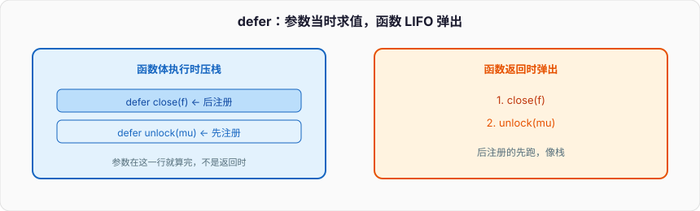

# 函数与错误

> 主线按「基础 → 进阶 → 实战 → 面试连环问」读。这篇是当时的专题整理，细节更全，和主线互补。

## 五、函数

### 1、简单函数

```go
func 函数名 (形参列表) (返回值类型列表) {
	执行语句...
	return + 返回值列表
}
```

例子：

```go
func cal(a int, b int) int {
	return a + b
}
func main() {
	sum := cal(10, 20)
	fmt.Println(sum)
}
```

### 2、函数详解

```go
func cal(a int, b int) (int, int) {
	return a + b, a - b
}
func main() {
	sum, res := cal(10, 20)
	fmt.Println(sum, res)
}
```

### 3、闭包

#### 3.1、定义

闭包是指内部函数捕获并引用外部函数作用域中的变量。使用闭包时，这些外部变量的生命周期会延长，直到闭包不再引用它们为止。Go 的闭包主要通过匿名函数（`func`）实现。

#### 3.2、例子

```go
func getSum() func(int) int {
	var sum int = 0
	return func(num int) int {
		sum += num
		return sum
	}
}

func main() {
	f := getSum()
	fmt.Println(f(1))
	fmt.Println(f(2))
	fmt.Println(f(3))
}
```

#### 3.3、原理

闭包能引用外部变量的原因在于，Go 语言会将这些变量的引用包含在闭包的环境中。闭包在创建时将变量的引用“捕获”在自身的上下文中，而不是将值复制进去。这种特性允许闭包函数在后续的调用中继续访问这些变量的最新值。

#### 3.4、使用场景


### 4、defer关键字



在 Golang 中，`defer` 关键字用于在函数结束时执行一些代码。`defer` 语句的核心特点是无论函数如何结束——正常返回、遇到错误或是发生 `panic`——被 `defer` 的代码都会在函数退出前执行。因此，`defer` 常用于释放资源、关闭文件、解锁互斥锁等清理操作。

#### `defer` 的基本语法和用法

`defer` 语句在函数体内定义，需要跟随一个函数调用。当执行到 `defer` 语句时，Go 会记录该语句并推迟到当前函数返回时再执行。

**语法**：

```go
defer functionName(args)
```

**示例**：

```go
package main

import "fmt"

func main() {
    fmt.Println("Start")
    defer fmt.Println("This is deferred")
    fmt.Println("End")
}
```

**输出**：

```sql
Start
End
This is deferred
```

在这个例子中，`defer fmt.Println("This is deferred")` 被推迟到 `main()` 函数即将结束时执行，所以它最后输出。

#### `defer` 的执行顺序

如果在一个函数中有多个 `defer` 语句，这些 `defer` 调用会按照后进先出的顺序（LIFO）执行。这类似于栈结构的后入先出。

**示例**：

```go
package main

import "fmt"

func main() {
    defer fmt.Println("First")
    defer fmt.Println("Second")
    defer fmt.Println("Third")
}
```

**输出**：

```sql
Third
Second
First
```

`defer` 会按顺序将所有的调用入栈，在函数退出时逆序执行这些 `defer` 语句。

#### `defer` 的常见用途

1. **释放资源**：在操作文件、数据库连接等资源时，`defer` 可以确保它们在函数结束前正确释放。

   ```go
   package main
   
   import (
       "fmt"
       "os"
   )
   
   func main() {
       file, err := os.Open("test.txt")
       if err != nil {
           fmt.Println("Error opening file:", err)
           return
       }
       defer file.Close() // 确保在函数结束时关闭文件
   
       // 读取文件内容
       // ...
   }
   ```

2. **解锁互斥锁**：在多线程程序中使用 `sync.Mutex` 或 `sync.RWMutex` 时，可以使用 `defer` 来确保锁在操作完成后正确解锁。

   ```go
   var mu sync.Mutex
   
   func criticalSection() {
       mu.Lock()
       defer mu.Unlock() // 确保在函数结束前解锁
       
       // 执行一些需要锁保护的操作
   }
   ```

3. **捕获并处理异常**：在 Go 中，`defer` 配合 `recover` 可以捕获 `panic` 并处理，避免程序崩溃。

   ```go
   func safeDivision(a, b int) {
       defer func() {
           if r := recover(); r != nil {
               fmt.Println("Recovered from panic:", r)
           }
       }()
       
       fmt.Println("Result:", a/b) // 若 b 为 0，会引发 panic
   }
   ```

#### `defer` 的工作原理与参数评估

`defer` 语句会在它定义时计算参数值，但会推迟执行实际的函数调用。这意味着 `defer` 语句捕获的是当前的参数值。

**示例**：

```go
package main

import "fmt"

func printValue(val int) {
    fmt.Println("Deferred value:", val)
}

func main() {
    x := 10
    defer printValue(x) // 此时 x 的值是 10
    x = 20
    fmt.Println("Updated value:", x)
}
```

**输出**：

```yaml
Updated value: 20
Deferred value: 10
```

尽管 `x` 在 `defer` 语句之后被更新为 20，但 `defer` 捕获的是当时的值（10），所以 `printValue(10)` 被推迟执行。

#### `defer` 在返回值中的应用

在有命名返回值的函数中，`defer` 可以修改返回值，因为 `defer` 语句会在返回前执行。

**示例**：

```go
package main

import "fmt"

func modifyReturnValue() (result int) {
    defer func() {
        result += 10 // 修改命名返回值
    }()
    return 5
}

func main() {
    fmt.Println(modifyReturnValue()) // 输出: 15
}
```

在此例中，`result` 是命名返回值，函数返回值会在 `defer` 执行时被修改。

#### 注意事项

1. **性能**：`defer` 虽然方便，但在高性能需求的代码中需谨慎使用。因为 `defer` 的实现相对开销较高，尤其在大量循环中使用时可能会影响性能。
2. **不适合实时性要求的操作**：由于 `defer` 的延迟执行特点，不适合对实时性要求高的操作场景。
3. **参数捕获机制**：`defer` 在定义时捕获的参数可能与最终执行时的上下文不同，需注意避免误用。

#### 总结

- `defer` 用于推迟代码执行至函数退出前，适合资源管理、异常处理等场景。
- `defer` 语句遵循后进先出顺序执行。
- 其参数在定义时评估，实际调用在函数退出前。

### 5、系统函数

#### 5.1、字符串相关函数

##### 5.1.1、字符串遍历

1. `for - range`

```go
func main() {
	str := "hello golang你好"
	for i, value := range str {
		fmt.Printf("下标：%d, 值：%c \n", i, value)
	}
}
```

2. 切片：`r := []rune(str)`

```go
func main() {
	str := "你好 Golang"
	r := []rune(str)
	for i := 0; i < len(r); i++ {
		fmt.Printf("%c \n", r[i])
	}
}
```

##### 5.1.2、字符串转整数

```go
n, err := strconv.Atoi("66")
```

##### 5.1.3、整数转字符串

```go
str = strconv.Itoa(8888)
```

##### 5.1.4、查找子串是否在指定的字符串中

```go
strings.Contains("fadshjkfhakj", "fa")

例子：
flags := strings.Contains("fadshjkfhakj", "fdaa")
fmt.Println(flags)
```

##### 5.1.5、统计一个字符串有几个指定的子串

```go
strings.Count("fdafadgadf","dfa")

例子：
count := string.Count("fdafag","a")
fmt.Println(count)
```

##### 5.1.6、不区分大小写的字符串比较

```go
strings.EqualFold("hello", "HELLO")

例子：
flags := strings.EqualFold("hello", "HELLO")
fmt.Println(flags)
```

##### 5.1.7、返回子串在字符串第一次出现的索引值，如果没有返回-1

```go
strings.Index("fdagagagag","ag")

例子：
index := strings.Index("fdagagagag","ag")
fmt.Println(index)
```

##### 5.1.8、字符串的替换

```go
strings.Replace("fzdfadgadgaga", "ga", "qint", n)

例子：
str := strings.Replace("fzdfadgadgaga", "ga", "qint", -1) // 全部替换
str := strings.Replace("fzdfadgadgaga", "ga", "qint", 2) // 替换2个
fmt.Println(str)
```

##### 5.1.9、按照指定的某个字符，为分割标识，将一个字符串拆分成字符串数组

```go
strings.Split("go-python-golang", "-")
例子：
arr := strings.Split("go-python-golang", "-")
```

##### 5.1.10、大小写切换

```go
strings.ToLower("GO")  // to 小写
strings.ToUpper("go")  // to 大写
```

##### 5.1.11、将字符串左右两边的空格去掉

```go
strings.TrimSpace("   go java cpp    ")

例子：
str := strings.TrimSpace("   go java cpp    ")  // 不会去掉字符串中间的空格
fmt.Println(str)
```

##### 5.1.12、将左右指定的字符去掉

```go
strings.Trim("--golang--", "-")

例子：
str := strings.Trim("--golang--", "-")
fmt.Println(str)
```

##### 5.1.13、判断字符串是否以指定的字符串开头

```go
strings.HasPrefix("https://www.aqjszz.com/docs", "https")

例子
flags := strings.HasPrefix("https://www.aqjszz.com/docs", "https")
fmt.Println(flags)
```

##### 5.1.14、判断字符串是否以指定的字符串结尾

```go
strings.HasSuffix("fadf.png", "jpg")
```

#### 5.2、日期和时间相关函数

```go
now := time.Now()
fmt.Println(now.Format("2006-01-02 15:04:05"))
```

#### 5.3、内置函数

##### 5.3.1、len

`len` 用于获取容器类型的长度或大小。它适用于多种数据结构，包括数组、切片、字符串、映射（map）和通道（channel）。

**语法**：

```go
len(v interface{}) int
```

- **数组**：返回数组的长度。
- **切片**：返回切片当前包含的元素个数，而不是底层数组的容量。
- **字符串**：返回字符串的字节数（注意：对于包含非 ASCII 字符的字符串，字节数可能不等于字符数）。
- **映射（map）**：返回映射中的键值对数量。
- **通道（channel）**：返回通道中排队等待接收的元素数量（适用于缓冲通道）。

**示例**：

```go
package main

import "fmt"

func main() {
    arr := [5]int{1, 2, 3, 4, 5}
    slice := []int{1, 2, 3}
    str := "hello"
    m := map[string]int{"one": 1, "two": 2}
    ch := make(chan int, 5)
    ch <- 1
    ch <- 2

    fmt.Println("数组长度:", len(arr))   // 输出: 5
    fmt.Println("切片长度:", len(slice)) // 输出: 3
    fmt.Println("字符串长度:", len(str)) // 输出: 5
    fmt.Println("映射长度:", len(m))     // 输出: 2
    fmt.Println("通道长度:", len(ch))    // 输出: 2
}
```

##### 5.3.2、new

`new` 用于分配内存，但只会返回类型的指针，并不会进行初始化。它适合用于一些简单的类型，例如数值类型、结构体等。`new` 返回的是指向类型的零值的指针。

**语法**：

```go
new(Type) *Type
```

- **用法**：`new(T)` 会分配一个 T 类型的内存空间并返回指针，指针指向的值是类型 T 的零值。
- `new` 主要用于需要一个指针类型而不需要额外初始化的场景，适合少量分配和直接访问的情况。

**示例**：

```go
package main

import "fmt"

func main() {
    p := new(int)     // 分配一个 int 类型的内存，初始值为 0
    *p = 10           // 修改指针指向的值
    fmt.Println(*p)   // 输出: 10

    s := new([]int)   // 分配一个指向空切片的指针
    fmt.Println(s)    // 输出: &[]
}
```

**注意**：`new` 分配的只是内存，没有初始化。对于结构体类型 `new(T)` 创建的指针等价于 `&T{}`。

##### 5.3.3、make

`make` 用于初始化和分配引用类型（即：切片、映射和通道）的内存空间。`make` 会返回一个初始化后的值，而不是指针。

**语法**：

```go
make(t Type, size ...IntegerType) Type
```

- **切片（slice）**：`make([]T, len, cap)` 创建一个具有指定长度和容量的切片。
- **映射（map）**：`make(map[K]V, hint)` 创建一个指定键值对数量（容量提示）的映射。
- **通道（channel）**：`make(chan T, buffer)` 创建一个带缓冲区的通道。

**示例**：

```go
package main

import "fmt"

func main() {
    // 创建一个长度为 5 的整数切片
    slice := make([]int, 5, 10)
    fmt.Println("切片长度:", len(slice))  // 输出: 5
    fmt.Println("切片容量:", cap(slice))  // 输出: 10

    // 创建一个映射
    m := make(map[string]int)
    m["foo"] = 42
    fmt.Println("映射:", m)               // 输出: map[foo:42]

    // 创建一个缓冲区大小为 3 的通道
    ch := make(chan int, 3)
    ch <- 1
    ch <- 2
    fmt.Println("通道长度:", len(ch))     // 输出: 2
}
```

**注意**：`make` 仅用于这三种类型，因为它不仅仅是分配内存，还初始化底层数据结构的相关信息。

##### 总结对比

| 函数   | 主要用途                           | 返回值            | 适用类型                       |
| ------ | ---------------------------------- | ----------------- | ------------------------------ |
| `len`  | 获取长度或大小                     | int               | 数组、切片、字符串、映射、通道 |
| `new`  | 分配内存并返回指向零值的指针       | *T（类型的指针）  | 值类型（基本类型、结构体等）   |
| `make` | 分配并初始化内存，返回初始化后的值 | T（初始化后的值） | 切片、映射、通道               |

## 六、错误处理

### 6.1、错误捕获机制

```go
defer + recover
```


例子：

```go
func main() {
	test()
	fmt.Println("main end")
}

func test() {
	defer func() {
		err := recover()
		if err != nil {
			fmt.Println("err = ", err)
		}
	}()
	num1 := 10
	num2 := 0
	res := num1 / num2
	fmt.Println(res)
}

输出：
err =  runtime error: integer divide by zero
main end
```

### 6.2、自定义错误

需要调用errors包下的New函数：

func [New](https://github.com/golang/go/blob/master/src/errors/errors.go?name=release#9)

```go
func New(text string) error
```

使用字符串创建一个错误,请类比fmt包的Errorf方法，差不多可以认为是New(fmt.Sprintf(...))。

例子：

```go
func main() {
	err := test()
	if err != nil {
		fmt.Println("err = ", err)
	}
	fmt.Println("main end")
}

func test() (err error) {
	num1 := 10
	num2 := 0
	if num2 == 0 {
		return errors.New("除数不能为0")
	} else {
		res := num1 / num2
		println("num1/num2 = ", res)
		fmt.Println(res)
		return nil
	}
}

输出：
err =  除数不能为0
main end
```

