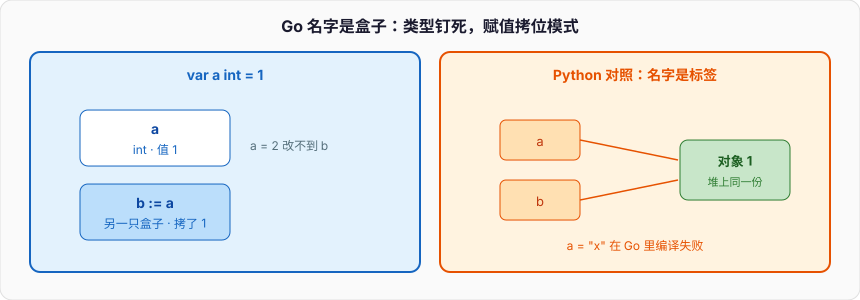

# Go入门

C++ 写 `int a = 1;`，编译器在当前栈帧开一块固定宽度的存储，把 `1` 写进去。Go 的 `var a int = 1` 同理：名字对应一块盒子，类型钉在编译期，盒子里永远是那个类型的位模式。Python 写 `a = 1`，做的事情完全不同——堆上找（或 intern）一个 `int` 对象，再把名字 `a` 绑到这个对象上。

```go
package main

import "fmt"

func main() {
	var a int = 1
	fmt.Printf("%T %d %p\n", a, a, &a) // int 1 0xc0000...
	a = 2                              // 往同一个盒子里写新值
	// a = "x"                          // 编译失败：不能把 string 塞进 int 盒子
}
```

`a` 是装 `int` 的盒子，不是标签。改的是盒子里的值，不是换绑到另一种对象。后面所有坑都从这个模型长出来：赋值拷贝、零值、没有隐式转换、`error` 是值。



Python 的 `a = 1; a = "x"` 合法，因为名字不锁类型。C++ / Go 直接编译失败。Go 比 C++ 更狠的地方有两处：一是**没有整数到浮点、没有 `int32` 到 `int` 的隐式转换**，显式写 `int(x)`；二是失败不用异常当控制流，`error` 是普通返回值，调用方必须看见它。

```go
var n int32 = 1
var m int = int(n) // 必须显式转换，即使底层都是整数
_ = m

f, err := os.Open("config.yaml")
if err != nil {
	return err
}
defer f.Close()
```

---

## 一、模块与 go.mod

### 1、一个目录、一个包、一份 go.mod

Go 的编译单元是 **package**，不是单个 `.go` 文件。同一个目录下所有 `.go` 文件必须声明同一个 `package` 名，它们共享顶层声明，像被粘成一个大文件。跨目录才是另一个包。模块（module）是包的版本化集合，根上放 `go.mod`：

```
example.com/demo
├── go.mod
├── main.go
└── internal/conf/conf.go
```

```
module example.com/demo

go 1.22

require github.com/jackc/pgx/v5 v5.5.0
```

`module` 行是这个仓库对外的导入路径前缀。别人 `import "example.com/demo/internal/conf"` 时，那段字符串必须对得上。`go 1.22` 是语言版本，决定你能用哪些语法（range-over-int、loopvar 语义都卡在这里）。

C++ 的对应物是 CMake 工程 + 头文件包含路径；Python 的对应物是项目根 + `pyproject.toml`。Go 把「导入路径 = 模块路径 + 目录」写成硬规则，没有 `#include` 的文本粘贴，也没有 Python `sys.path` 那种搜索路径魔术。

### 2、常用命令与 import

```
go mod init example.com/demo
go get github.com/jackc/pgx/v5@v5.5.0
go mod tidy    # 按源码实际 import 增删依赖，写 go.sum
go build ./...
go test ./...
go run .
```

`go.sum` 是内容哈希。版本选择用 MVS（Minimal Version Selection），比 Python 的 pip resolver 简单，也比 C++ 各家包管理干净。

```go
package main

import (
	"fmt"
	"os"

	"example.com/demo/internal/conf"

	_ "github.com/jackc/pgx/v5/stdlib" // 空白导入：只为跑 init
)

func main() {
	fmt.Println(os.Args[0], conf.Load())
}
```

- `"fmt"` 是标准库，路径就是包路径；本地包用模块路径拼目录。
- `_ "pkg"` 会编译进二进制、执行 `init`，但不引入名字。数据库 driver、pprof 常用这招。
- `. "fmt"` 把导出名字倒进当前文件命名空间，能写但不该写，和 C++ `using namespace`、Python `from fmt import *` 一类。

循环导入是编译错误。Python 运行时还能先出半成品模块；Go 没有这个口子。

### 3、和头文件 / Python 模块对照

| | C++ | Python | Go |
| --- | --- | --- | --- |
| 编译/加载单元 | `.cpp` + 头文件文本包含 | `.py` 模块对象 | 目录 = 一个 package |
| 依赖声明 | `#include`、CMake | `import`、`pyproject.toml` | `import` + `go.mod` |
| 可见性 | `public` / 匿名 namespace | `_` 约定、不强制 | 首字母大小写，编译器强制 |
| 循环依赖 | ODR / 前向声明硬扛 | 运行时半成品模块 | 编译错误 |
| 入口 | `main` | `if __name__ == "__main__"` | `package main` + `func main()` |

Go 没有头文件，也没有「声明和定义分离」。导出函数的签名就是源码本身。想给别的包用，名字大写；只给本包用，名字小写。第七节会把可见性钉死。

---

## 二、基本类型、零值、短声明

### 1、类型钉在盒子上

Go 的预声明类型是真正的值类型，宽度在编译期确定（`int` / `uint` / `uintptr` 随平台，64 位上是 64 bit）：

```go
var (
	i  int     // 0
	u  uint64  // 0
	f  float64 // 0
	b  bool    // false
	s  string  // ""
	p  *int    // nil
	sl []int   // nil
	m  map[string]int
	fn func()
	x  any // 1.18+ 起是 interface{} 的别名
)
```

没有 C++ 那种未初始化局部变量读起来是 UB，也没有 Python 那种「名字还没绑就 NameError」。声明了就有值，值是**零值**。

```go
type User struct {
	ID   int
	Name string
	OK   bool
}

var u User
fmt.Printf("%#v\n", u) // main.User{ID:0, Name:"", OK:false}
```

零值可用，是 Go 刻意设计。`bytes.Buffer`、`sync.Mutex` 的文档会写「zero value is ready to use」。C++ 靠默认构造，Python 靠 `__init__` 赋默认，Go 用类型的全零位模式。

副作用：`0`、`""`、`false`、`nil` 既是「没赋值」也是合法业务值。JSON 里缺失字段和显式 `"id": 0` 在结构体上看一样。需要区分「没传」时用指针 `*int` 或 `sql.NullInt64`。Python 用 `None` 干这件事；Go 没有内置 optional。

### 2、没有隐式转换

```go
var a int32 = 1
var b int64 = 2
// var c = a + b           // 编译失败
var c = int64(a) + b

type UserID int
func Load(id UserID) {}
var n int = 7
// Load(n)                 // 编译失败
Load(UserID(n))            // 只改类型标签，不改位

var u uint8 = 255
u++
fmt.Println(u)             // 0，静默绕回
```

C++ 会做 integral promotion、`int` 升 `float`。Python 会把 `int` 变成 `float`。Go 两边类型必须相同，算术、赋值、比较都是。`byte` 是 `uint8` 的别名，`rune` 是 `int32` 的别名，别名之间可以混用；`type MyInt int` 是新类型，和 `int` 不能混。这是用类型系统编码业务 ID 的常用手法。

转换不检查范围：`int8(1000)` 静默截断。溢出静默绕回，和 C++ 无符号整数一样，和 Python 任意精度不同。热路径上这是优点；当序号、钱、分页偏移时，这是隐患。需要检查用 `math/bits` 或自己写。

### 3、短声明 `:=`

```go
func load() error {
	x := 1                       // 函数体内声明并推断为 int
	n, err := strconv.Atoi("42") // 至少一个名字是新的
	f, err := os.Open("a.txt")   // f 新、err 旧，合法
	if err != nil {
		return err
	}
	defer f.Close()
	b, err := io.ReadAll(f) // 再次复用 err，b 是新名字
	_, _ = x, n, b
	return err
}

var Global = 1 // 包级用 var，不能 :=
// n, err := strconv.Atoi("1") // 包级语法错误
```

`:=` 是语句，不是表达式，只能出现在函数体内。坑在块作用域：内层 `:=` 会**阴影**外层同名变量。

```go
func shadow() error {
	var err error
	if true {
		n, err := strconv.Atoi("x") // 内层新 err，外层 err 仍是 nil
		_ = n
		if err != nil {
			return nil // 错：只判断了内层
		}
	}
	return err
}
```

C++ 的内层 `{ int err; }` 也会挡外层；Python 没有块级作用域，`if` 里赋的名字就是外层的。Go 的 `{ }` 是真正的块作用域。外层已经有 `err` 时，内层尽量 `=` 而不是 `:=`。

### 4、指针是盒子的地址

```go
func bump(p *int) {
	*p++
}

func main() {
	x := 1
	bump(&x)
	fmt.Println(x) // 2
}
```

Go 有指针，没有指针运算，没有 `->`（一律 `.`，编译器对 `p.Field` 自动解引用）。没有 C++ 的 `int&`。想让调用方看到修改，就传指针。

传值是默认。结构体当参数会拷贝整个结构体。小结构体直接传值更清楚；大结构体、要修改、要表达「可空」，才用指针。

Python 没有这层选择：一律传对象引用。C++ 有值 / 指针 / 引用三套。Go 收成「值 + 指针」两套，规则更少，心智更接近 C。

---

## 三、string：只读字节，range 跑的是 rune

### 1、`len` 是字节数

```go
s := "中"
fmt.Println(len(s))                   // 3，UTF-8 三字节
fmt.Println([]byte(s))                // [228 184 173]
fmt.Printf("%T %d\n", s[0], s[0])     // 对 "Go中"：uint8 71
// s[0] = 'g'                          // 编译失败：string 不可变
```

Go 的 `string` 是只读的字节序列，内部是 `ptr + len`，不带容量。字面量默认 UTF-8，但这是约定，类型系统不强制内容合法。`len(s)`、`s[i]` 按字节。`s[i]` 的类型是 `byte`（即 `uint8`），不是长度为 1 的 string。

C++ 的 `std::string` 可变、按字节；`std::string_view` 更接近 Go string 的「只读视图」，但 C++ 不保证 UTF-8。Python 3 的 `str` 是码点序列，`len("中") == 1`。三个语言的 `len` 不可互换。

不可变带来的实际后果：拼接造新 string。循环里 `s += chunk` 是 O(n²) 拷贝。用 `strings.Builder`：

```go
var b strings.Builder
b.Grow(64)
for i := 0; i < 10; i++ {
	b.WriteString(strconv.Itoa(i))
}
out := b.String()
_ = out
```

### 2、`range` 迭代的是 rune，下标仍是字节偏移

```go
s := "Go中文"
for i, r := range s {
	fmt.Printf("i=%d r=%q U+%04X\n", i, r, r)
}
// i=0 'G'；i=1 'o'；i=2 '中'；i=5 '文'  ← 下标从 2 跳到 5
```

`r` 的类型是 `rune`（`int32`），一个 Unicode 码点。非法 UTF-8 字节会被替换成 `U+FFFD`，`i` 前进 1 字节。这是 range 的规则，不是可选项。

按码点切片不能直接 `s[1:2]`：那是按字节切，可能切在 rune 中间。要按码点走，先转 `[]rune`，或用 `unicode/utf8`。

```go
s := "中文"
fmt.Println(s[:1])          // 切碎的非法 UTF-8
fmt.Println(string([]rune(s)[:1])) // "中"
```

`[]rune(s)`、`string(rs)`、`[]byte(s)`、`string(b)` 在语言语义上都是拷贝。编译器对「没有人再改这块内存」的场景会优化掉拷贝，不要依赖。网络包、checksum 用 `[]byte`；给人看的文本用 `string`，边界上显式转换。

单引号是 **rune 字面量**：`'中'` 的类型是 `rune`。双引号是 string。反引号是 raw string，`\n` 就是两个字符。C++ 的 `'a'` 是 `char` / `int`，Python 没有字符类型。比较 string 用 `==`，比的是字节内容，和 C++ 一类，和 Python `str` 比码点不同。

---

## 四、控制流

### 1、只有 `for`，没有 `while`

```go
for i := 0; i < 3; i++ { // 经典三段
	fmt.Println(i)
}
n := 3
for n > 0 { // 当 while
	n--
}
for { // 无限循环
	break
}

if err := g(); err != nil { // if 可带短语句，作用域是 if/else 整块
	return err
}
```

没有 `while`、没有 `do while`。条件两边不需要括号，主体必须有花括号。C++17 的 `if (int n = ...; n)` 同类；Python 没有这个结构。`break` / `continue` 可以带标签跳出多层循环。`goto` 存在，但不能跳过变量声明，实际几乎只见于生成代码。

### 2、`switch` 自动 break

```go
switch code {
case 200, 201, 204:
	fmt.Println("ok")
case 400:
	fmt.Println("bad request")
default:
	fmt.Println("other")
}

switch { // 无表达式 = switch true，替代 if-else 链
case n < 0:
	fmt.Println("neg")
case n == 0:
	fmt.Println("zero")
default:
	fmt.Println("pos")
}
```

每个 `case` 结束自动 break，不会落入下一个 case。想穿透写 `fallthrough`，它立即进入下一个 case 体，**不重新判断条件**。C++ / C 的 switch 默认穿透，漏写 `break` 是经典 bug；Go 把默认反过来。`case` 不限于整数常量，表达式、字符串都可以。`switch v := x.(type)` 是类型开关，接口篇再写。Python 3.10 的 `match` 是模式匹配，不要把 Go 的 switch 想成 match。

### 3、`for range` 与 1.22 loopvar

```go
xs := []int{10, 20, 30}
for i, v := range xs { // i 下标，v 是元素的拷贝
	fmt.Println(i, v)
}
for i := range xs { // 只要下标
}
for _, v := range xs { // 只要值
	_ = v
}
for i := range 3 { // 1.22：0, 1, 2
	fmt.Println(i)
}
```

改 `v` 不会改切片里的值，要改用 `xs[i] = ...`。`range` map 得到 `k, v`，顺序故意随机（下一篇）。`range` string 得到字节下标和 rune，上一节已经写过。

更关键的是 **loopvar 语义**。1.21 及以前，循环变量在整个循环共用一个盒子，闭包捕获的是这个盒子。1.22 起，每次迭代是新变量：

```go
funcs := make([]func(), 0, 3)
for i := 0; i < 3; i++ {
	funcs = append(funcs, func() { fmt.Println(i) })
}
for _, f := range funcs {
	f()
}
// Go 1.21：3 3 3
// Go 1.22：0 1 2
```

`go.mod` 里 `go 1.22`（或更高）才启用新语义；语言版本按模块的 `go` 行走，不是按你机器上 `go version` 随便升。旧代码依赖「捕获同一个 `i`」会在升级语言版本后行为变化。迁移时对照用显式 `i := i`。

C++ 的 `for (int i = 0; ...)` 每次也是同一颗 `i`。Python 的 `for i in ...` 是同一个名字反复换绑，闭包延迟绑定那一坑和 Go 1.21 同类。Go 1.22 把这个坑填了，写新代码按新语义想。

`range` 期间不要假设可以安全地增删正在 range 的切片中间元素——追加可能扩容，下标语义会乱。细节放切片与 Map 篇。

---

## 五、函数：多返回值，error 是值

### 1、多返回值不是元组

```go
func div(a, b int) (int, error) {
	if b == 0 {
		return 0, fmt.Errorf("div by zero")
	}
	return a / b, nil
}

n, err := div(10, 2)
if err != nil {
	return err
}

data, err := os.ReadFile("a.txt")
if err != nil {
	return fmt.Errorf("read a.txt: %w", err) // 1.13+ 包装，errors.Is / As 能沿着链找
}
```

返回值是语言级的，不是 Python 那种隐式元组，也不是 C++17 结构化绑定那一层包装。不想接的用 `_` 丢掉。约定：**最后一个返回值是 `error`**，成功时为 `nil`。先判断 `err`，再碰其它返回值。失败时其它返回值通常是零值，但 `io.Reader.Read` 这类「部分结果」要按文档用。1.21 的 `errors.Join` 一次返回多个 error，`Is` / `As` 会走进去。

### 2、error 是值，不是异常控制流

`error` 的定义就一行：

```go
type error interface {
	Error() string
}
```

任何有 `Error() string` 的类型都是 `error`。接口篇会展开「隐式满足」。这里只钉三件事：

1. `err == nil` 是成功。不要用 `err.Error() == "..."` 比字符串。
2. 编译器**不强制**检查 `error`，但 `go vet`、linter、代码评审会。丢掉时显式写 `_ = err`。
3. `panic` / `recover` 只用于不可恢复（下标越界、类型断言失败）。业务失败走 `error`。这和 C++ 异常、Python `raise` 的默认路径相反。

Python 的 `try/except` 是正常控制流；C++ 的异常是非局部跳转。Go 把失败放进返回值，调用链每一层都看得见。代价是 `if err != nil` 铺满屏幕；收益是控制流直。`defer` 补的是「函数离开时一定要做的事」，不是 catch。

### 3、命名返回值

```go
func readConfig(path string) (cfg Config, err error) {
	f, err := os.Open(path)
	if err != nil {
		return // 返回零值 cfg 和已经赋过的 err
	}
	defer f.Close()
	err = json.NewDecoder(f).Decode(&cfg)
	return
}
```

返回值被当成函数入口处声明的变量，零值初始化。裸 `return` 把它们交出去。`defer` 可以改命名返回值——这是故意的，用来包装 error：

```go
func wrap() (err error) {
	defer func() {
		if err != nil {
			err = fmt.Errorf("wrap: %w", err)
		}
	}()
	return os.ErrNotExist
}
```

可读性差的时候不要用裸 return。公开 API 的错误路径写 `return Config{}, err` 更直。函数与方法篇会把 defer 和命名返回值的求值顺序再钉一次。

---

## 六、defer：函数结束时 LIFO，不是词法块

### 1、注册在运行到那一行，执行在函数返回

```go
func f() {
	fmt.Println("A")
	defer fmt.Println("B")
	defer fmt.Println("C")
	fmt.Println("D")
}
// 输出：A D C B
```

`defer` 把调用登记进当前函数的 defer 链表，**函数返回时**（包括 panic）按后进先出执行。不是离开 `{ }` 就跑。C++ 的 RAII / `std::unique_ptr` 是离开作用域析构；Python 的 `with` 是离开 `with` 块调 `__exit__`。Go 的资源释放按函数边界，不是按块边界。

循环里 `defer` 要关的资源会堆到函数结束，文件描述符先被占满。抽成函数，让函数结束把账结掉。`Close` 的 error 在 defer 里容易被丢掉，严谨写法用命名返回值接住：

```go
func slurp(path string) (err error) {
	f, err := os.Open(path)
	if err != nil {
		return err
	}
	defer func() {
		if cerr := f.Close(); err == nil {
			err = cerr
		}
	}()
	_, err = io.Copy(io.Discard, f)
	return err
}
```

### 2、参数立刻求值，调用延后

```go
func deferArg() {
	x := 1
	defer fmt.Println("x =", x) // 登记时就把 x 的当前值 1 拷进实参
	x = 2
}
// 打印 x = 1

func deferClosure() {
	x := 1
	defer func() { fmt.Println("x =", x) }() // 闭包读的是变量 x，返回时是 2
	x = 2
}
```

`defer f(args)` 的 `args` 在执行到 `defer` 那一行就求值。真正的 `f(...)` 等到函数返回。想延后读变量，包一层闭包。

`defer mu.Unlock()` 在 `Lock()` 成功之后立刻登记，参数（接收者 `mu`）当时就定了，函数结束再 Unlock。这和 C++ 的 `lock_guard` 析构时机不同：C++ 是块结束，Go 是函数结束。打开的文件、锁、`resp.Body` 一律 defer 关掉。

---

## 七、package、可见性、init

### 1、可见性靠大小写

```go
package conf

type Config struct { // 导出
	Host string // 导出字段
	port int    // 非导出，只有本包能碰
}

func Load() Config { return Config{Host: "localhost", port: 8080} }
func parse() {} // 非导出
```

规则就一条：**首字母大写 = 对包外可见**。类型、函数、变量、结构体字段、方法、常量，全部适用。没有 `protected`，没有 Python 那种单下划线约定——编译器按名字强制。

```go
c := conf.Load()
fmt.Println(c.Host)
// fmt.Println(c.port) // 编译失败
// conf.parse()        // 编译失败
```

C++ 的 `public:` 是类级别；Go 的可见性是**包级别**。同一个目录的两个文件属于同一包，小写名字彼此可见。测试文件写成 `package conf` 能测到小写函数，写成 `package conf_test` 就只能当外部用户。

`internal/` 目录约定：导入路径含 `internal` 的包，只允许父目录树里的代码导入。导入路径是字符串，限定符默认是路径最后一段，冲突时起别名（`mrand "math/rand/v2"`）。包名应当短、小写。`main` 产生可执行文件，必须有 `func main()`。一个目录只允许一个 package 名（测试的 `xxx_test` 除外）。导入路径已经是 API 的一部分，改目录等于改公开名字。

### 2、init：包初始化，你不能调用它

```go
package conf

var defaultPort int

func init() { defaultPort = 8080 }
func init() { /* 同一个包可以有多个 init，按文件名再按出现顺序 */ }
```

初始化顺序：先按依赖深度优先初始化导入的包（每个包一次）；包内先按文件名排序，再求值包级变量，再跑 `init`；最后跑 `main.main`。

你不能调用 `init`。空白导入 `_ "pkg"` 就是为了让这个包的 `init` 跑起来。`database/sql` 的 driver 靠这个注册自己。

C++ 的静态初始化跨翻译单元顺序是未定义的。Go 按导入图给出确定顺序，但**不要在 init 里连网络、读会失败的配置**——失败只能 `panic`，`init` 没有 `error` 返回值。能放到 `main` 里显式调用的，就不要藏进 `init`。

Python 的模块级代码在第一次 import 时执行，等价物更接近「整个文件都是 init」。Go 把可执行的包级代码收口到变量初始化和 `init`。

### 3、程序入口

```go
func main() {
	if err := run(); err != nil {
		fmt.Fprintln(os.Stderr, err)
		os.Exit(1)
	}
}

func run() error {
	f, err := os.Open("config.yaml")
	if err != nil {
		return err
	}
	defer f.Close()
	return nil
}
```

`func main()` 没有参数、没有返回值。命令行参数走 `os.Args`，退出码走 `os.Exit`。`os.Exit` **不会跑 defer**。需要既跑 defer 又设退出码：把真正的逻辑放到 `run() error`，`main` 只负责翻译成退出码。

C++ 的 `int main` 用返回值当退出码；Python 的 `sys.exit` 抛 `SystemExit`。Go 把「错误」和「进程退出码」拆开：库函数返回 `error`，`main` 决定怎么死。

---

## 八、赋值是拷贝，比较看类型

```go
type Point struct{ X, Y int }

a := Point{1, 2}
b := a
b.X = 9
fmt.Println(a.X, b.X) // 1 9
```

`b := a` 拷贝整个结构体。两个盒子。C++ 默认也是拷贝；Python 的 `b = a` 是两个名字指向同一个对象。Go 和 C++ 站一边。

切片、map、channel、指针、函数值，盒子里装的是**头**或地址。拷贝头不会拷贝底层数据。`b := a; b[0] = 9` 两个 slice 看到同一块数组——这是下一篇的切入点。赋值永远拷贝盒子里的位，至于那些位是「值本身」还是「指向别处的指针」，由类型决定。

```go
x := 1
p := &x
q := p // 拷贝指针，仍指向 x
*q = 2
fmt.Println(x, *p) // 2 2
```

可比较类型才能用 `==`：布尔、数值、string、指针、channel、接口（动态类型也可比时）、数组（元素可比时）、结构体（字段都可比时）。切片、map、函数不能直接 `==`（只能和 `nil` 比）。

```go
fmt.Println([2]int{1, 2} == [2]int{1, 2}) // true
fmt.Println(Point{1, 2} == Point{1, 2})   // true
// []int{1} == []int{1}                   // 编译失败
var s []int
fmt.Println(s == nil) // true
```

Python 的 `==` 走 `__eq__`，`is` 走身份。C++ 内置类型比位，class 看你有没有重载。Go 没有运算符重载：结构体逐字段比，接口比「动态类型相同且动态值可比较且相等」。接口里塞不可比的切片，运行时 panic。接口篇再写。

---

## 九、一块能跑的对照实验

保存成 `intro.go`，`go run intro.go`：

```go
package main

import (
	"errors"
	"fmt"
	"os"
)

type userID int

func div(a, b int) (int, error) {
	if b == 0 {
		return 0, errors.New("div by zero")
	}
	return a / b, nil
}

func main() {
	var a int = 1
	fmt.Printf("%T %d\n", a, a)

	var s string
	var n int
	var p *int
	fmt.Printf("zero %q %d nilp=%v\n", s, n, p == nil)
	fmt.Println(int(int32(1)), userID(7))

	zh := "中"
	fmt.Println("len", len(zh))
	for i, r := range zh {
		fmt.Printf("i=%d r=%q\n", i, r)
	}

	switch code := 201; code {
	case 200, 201, 204:
		fmt.Println("ok-ish")
	}

	n, err := div(10, 2)
	fmt.Println("10/2", n, err)
	_, err = div(1, 0)
	fmt.Println("1/0", err)

	v := 1
	defer fmt.Println("defer arg", v)
	defer func() { fmt.Println("defer closure", v) }()
	v = 2

	err = nil
	if n, err := div(1, 1); err == nil {
		fmt.Println("inner", n, err)
	}
	fmt.Println("outer err", err) // 仍是 nil，内层 := 阴影了外层

	type point struct{ X int }
	p1 := point{1}
	p2 := p1 // 拷贝
	p2.X = 9
	fmt.Println(p1.X, p2.X) // 1 9
	fmt.Println("args0", os.Args[0])
}
```

跑完对照：`a` 的类型不会因为赋值变成别的东西；没赋值的变量是零值不是垃圾；`int32` 必须显式转成 `int`；`len("中")` 是 3；switch 不会落到 default；`err` 是值；defer 先打印闭包的 2 再打印参数的 1（LIFO，闭包后登记先执行）；内层 `:=` 的 `err` 挡不住外层；结构体赋值是拷贝。

这些现象全部来自同一件事：名字是盒子，类型钉死，拷贝的是盒子里的位，失败是值，清理按函数边界走。

```go
x := 1
fmt.Printf("%T\n", x)
// x = "hello" // 编译失败，名字不换类型
```

静态类型是「类型跟着名字走，盒子不改尺寸」。Python 入门篇的结论反过来：那边类型跟着对象走，名字不锁类型。两边都自洽，混着用的时候出 bug 的原因几乎都是拿错了那一套心智。

下一篇从 `b := a; b[0] = 9` 开始：切片头是盒子，底层数组不是。Map 是哈希表，赋值拷的是指针，并发读写会直接 panic。
