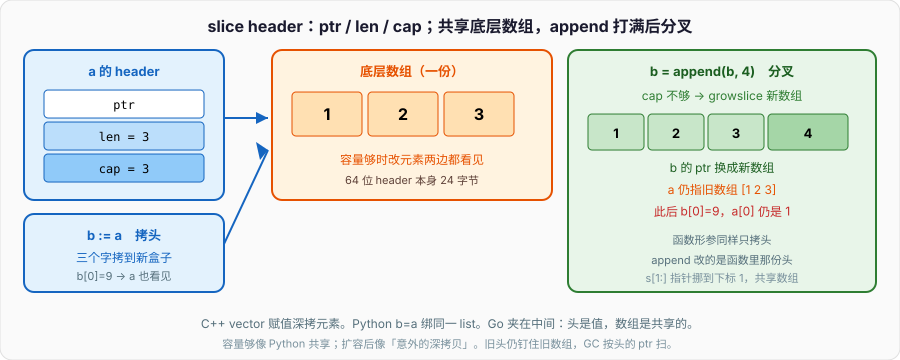
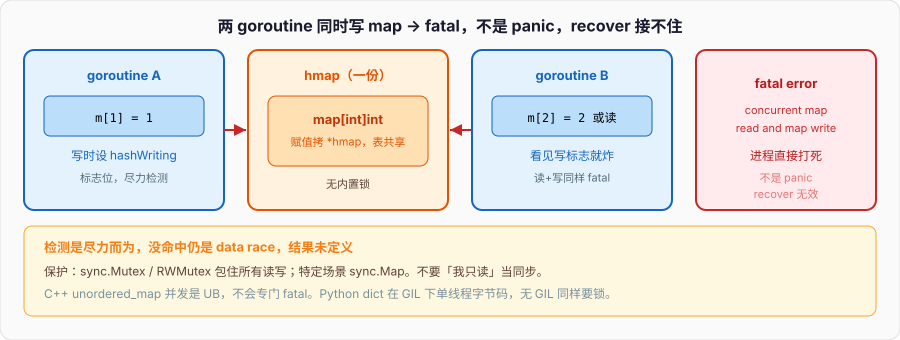

# 切片与Map

```go
a := []int{1, 2, 3}
b := a
b[0] = 9
fmt.Println(a[0]) // 9
```

`b := a` 拷的是 slice header：一个指针、一个 len、一个 cap。底层数组只有一份。`b[0] = 9` 改的是那份数组，所以 `a` 也看见 9。上一篇结尾把这件事留在这里。

然后 append 把容量打满，runtime 另起一块数组，把旧元素拷过去。从此 `a` 和 `b` 分叉：

```go
a := []int{1, 2, 3} // len=3, cap=3
b := a
b = append(b, 4)    // 容量不够，新数组
b[0] = 9
fmt.Println(a[0], b[0]) // 1 9
fmt.Println(a, b)       // [1 2 3] [9 2 3 4]
```

C++ 的 `std::vector` 赋值是深拷贝（拷元素）；Python 的 `b = a` 两个名字绑同一个 list。Go 的切片夹在中间：头是值，数组是共享的。容量够时像 Python 的共享；扩容后像「意外的深拷贝」。下面按这个模型把切片和 map 钉死。



---

## 一、slice header：三个字的盒子

### 1、ptr / len / cap

切片值本身是一个很小的结构体，64 位上 24 字节。runtime 里就是这三项：

```go
type slice struct {
	array unsafe.Pointer
	len   int
	cap   int
}
```

- `array`：指向底层数组里切片看见的第一个元素。
- `len`：从那里起，当前能用 `s[i]` 碰到的元素个数。`len(s)` 读的就是它。
- `cap`：从那里起，底层数组还剩多少格子。`cap(s)` 读的就是它。`append` 先看 cap，不够才换数组。

`reflect.SliceHeader` 曾经把这三项暴露出来，1.20 起废弃，改走 `unsafe.Slice` / `unsafe.SliceData`。日常代码碰 header 用 `len` / `cap` / 下标就够，不要自己拼这个结构体。

```go
s := make([]int, 2, 5)
fmt.Println(len(s), cap(s), s) // 2 5 [0 0]
s[0], s[1] = 7, 8
// s[2] = 9                    // panic: index out of range
```

`make([]T, n)` 等价 `make([]T, n, n)`。`make([]T, n, m)` 要求 `n <= m`，否则编译失败（常量）或运行时 panic（变量）。len 个元素是零值，cap-len 那段在，但你碰不到，除非 append 或再切一刀。

### 2、赋值拷头，不拷数组

```go
s := []int{1, 2, 3}
t := s
t[1] = 20
fmt.Println(s) // [1 20 3]

u := s[1:]
u[0] = 99
fmt.Println(s, u) // [1 99 3] [99 3]
```

`t := s` 三个字拷到新盒子。两个 header 的 `array` 指向同一块。`s[1:]` 造一个新 header：指针挪到原来的下标 1，len=2，cap=2。改 `u[0]` 就是改 `s[1]`。

传给函数同样拷头：

```go
func set0(s []int) {
	s[0] = 9          // 调用方看见
	s = append(s, 1)  // 改的是函数里那份头，调用方不一定看见
}

func main() {
	a := []int{1, 2, 3} // cap=3
	set0(a)
	fmt.Println(a) // [9 2 3]，没有 1
}
```

`s[0] = 9` 走指针，落到共享数组。`append` 返回的新头赋给函数里的 `s`，外面的 `a` 还是旧头。这是切片当参数最常见的坑：改元素可见，扩容后的头不可见。要让调用方拿到新头，就返回切片，或传 `*[]int`。

C++ 的 `void f(std::vector<int> s)` 拷整个 vector；`void f(std::vector<int>& s)` 才共享。Python 的 `def f(s): s.append(1)` 直接改同一个 list。Go 默认既不是深拷贝也不是引用，是「拷视图」。

### 3、从数组切出来

```go
arr := [5]int{0, 1, 2, 3, 4}
s := arr[1:4] // len=3, cap=4，指向 arr[1]
s[0] = 9
fmt.Println(arr) // [0 9 2 3 4]
```

数组是值，切片是视图。`arr[1:4]` 没有拷元素，header 指进 `arr`。`s` 活着，`arr` 就不能被当成「已经互不相干的副本」。函数返回 `arr[:]` 等于把栈上数组逃逸到堆——编译器会处理，但语义上你交出的是整块数组的视图。

字面量 `[]int{1, 2, 3}` 先在某处造一个匿名数组，再切出 len=cap=3 的切片。所以开头那段 `a := []int{1, 2, 3}; b := a` 共享的就是这个匿名数组。

---

## 二、append 与扩容

### 1、append 返回新头

`append` 的签名是：

```go
func append(slice []Type, elems ...Type) []Type
```

它不原地改你手里的变量。它返回一个 header。容量够：指针通常不变，len+1。容量不够：新数组，指针变。两种情况都要接住：

```go
s := []int{1, 2}
s = append(s, 3)
s = append(s, 4, 5, 6)
s = append(s, []int{7, 8}...) // ... 把切片打散成变参
```

丢掉返回值，等于丢掉可能已经换掉的数组。静态检查过不了的是少数；更多是写成 `append(s, x)` 当语句，编译失败，因为 `append` 的结果必须用。

### 2、容量够：原地写，共享数组

```go
s := make([]int, 0, 4)
s = append(s, 1, 2)
t := s
t = append(t, 3) // cap 还剩 2，不换数组
fmt.Println(s, t) // [1 2] [1 2 3]
t[0] = 9
fmt.Println(s, t) // [9 2] [9 2 3]
```

`s` 的 len 仍是 2，但底层数组第 0 个已经是 9，第 2 个已经是 3。`s` 再 append 一次，会把那个 3 盖掉：

```go
s = append(s, 8)
fmt.Println(s, t) // [9 2 8] [9 2 8]
```

两个 header 指向同一块，len 不同，append 互相践踏。这是共享底层数组最阴的形态：看起来各切各的，append 却在改别人的「后面」。

### 3、容量不够：新数组，分叉

```go
s := []int{1, 2, 3} // cap=3
t := append(s, 4)   // 新数组
t[0] = 9
fmt.Println(s, t) // [1 2 3] [9 2 3 4]
```

`t` 和 `s` 从此无关。下一次再从 `s` append，又是另一块。不要写「append 一定共享」或「append 一定拷贝」——只看这一次 cap 够不够。

```go
func grow(s []int) []int {
	return append(s, 0)
}

a := make([]int, 1, 2)
b := grow(a) // cap 够，b 和 a 共享
c := grow(a) // 还是这块，b[1] 被盖成 0
```

同一份切片拿去两次「在尾部加一个」且不接调用方自己的头，第二次会覆盖第一次写进去的元素。函数返回切片时，调用方必须当「这可能是新数组，也可能是旧数组」处理。

### 4、扩容策略

Go 1.18 起不再是「<1024 翻倍，之后 +25%」那条简单规则。现在大致是：

- 目标长度已经大于 2 倍旧 cap：直接涨到目标长度。
- 旧 cap < 256：翻倍。
- 再往上：每次加 `(oldcap + 3*256) / 4`，平滑地从 2× 过渡到约 1.25×，避免一次从 1024 跳到 2048 那种陡坎。

具体数字随版本微调，**不要写代码依赖 cap 一定是某个值**。测试里断言 `cap(s) == 8` 会在升级编译器时碎。

```go
s := make([]int, 0, 1)
for i := 0; i < 20; i++ {
	s = append(s, i)
	fmt.Println(len(s), cap(s))
}
```

自己跑一遍看曲线。生产代码要稳：`make([]T, 0, n)` 把 n 估够，少扩容，少拷贝，少分叉。

元素大小也参与决策。runtime 会按类型对齐、内存大小类取整，所以 `[]int` 和 `[]byte` 同样 len 增长，cap 不一定相同。还有：扩容是把**旧切片 len 个元素**拷到新数组，不是把旧 cap 全部拷走。旧数组如果还有别的 header 指着，继续活；没人指着，等 GC。

### 5、必须接住返回值

```go
func appendAll(dst []byte, parts ...[]byte) []byte {
	n := 0
	for _, p := range parts {
		n += len(p)
	}
	dst = slices.Grow(dst, n) // 1.21，保证一次扩容
	for _, p := range parts {
		dst = append(dst, p...)
	}
	return dst
}
```

1.21 的 `slices.Grow(s, n)` 保证 cap 至少 `len(s)+n`，不够就一次分配。循环里反复 `append` 不预估，最坏一次次拷。C++ 写 `v.reserve(n)`；Python 的 list 总体也是 over-allocate，但你很少手动 reserve。Go 把预分配暴露成 `make` 的第三个参数和 `slices.Grow`。

---

## 三、nil vs empty

### 1、两个都是 len=0，不是同一个值

```go
var a []int            // nil：ptr=nil, len=0, cap=0
b := []int{}           // empty：ptr 非 nil（指向零长数组）, len=0, cap=0
c := make([]int, 0)    // 同 empty
fmt.Println(a == nil)  // true
fmt.Println(b == nil)  // false
fmt.Println(len(a), len(b), cap(a), cap(b)) // 0 0 0 0
```

`len` / `cap` / `range` / `append` 对两者行为一样。`== nil` 能分开。JSON 也分开：

```go
json.Marshal(a) // null
json.Marshal(b) // []
```

API 吐 `null` 还是 `[]`，经常就是这里。要稳定吐空数组，用 `b := make([]T, 0)` 或 `b := []T{}`，不要用 var。反过来，内部累加器用 `var buf []byte` 完全合法，append 会从 nil 长出来。

切片不能和另一个切片比 `==`（只能和 `nil` 比）。比内容用 `slices.Equal`（1.21）。

### 2、append / range 吃 nil

```go
var s []int
s = append(s, 1)       // 合法，等于从零造一个
for i, v := range s {  // 零次循环，不 panic
	_, _ = i, v
}
fmt.Println(len(s), s[0]) // 1 和 1；没 append 之前 s[0] 会 panic
```

`s[0]` 在 len=0 时一律 panic，不管 nil 还是 empty。`for i := 0; i < len(s); i++` 对 nil 安全，因为 `len(nil)==0`。

### 3、`clear` 和截断

```go
s := []int{1, 2, 3, 4}
clear(s)          // 1.21：元素置零，len/cap 不变 → [0 0 0 0]
s = s[:0]         // 截断：len=0，cap 仍 4，底层数组还在
s = append(s, 9)  // 复用那块数组
```

`clear(s)` 不释放 backing array，也不改 len。想让 GC 收回大底层数组，得把 header 换成新的：`s = nil` 或 `s = slices.Clip(s)` 之后再看有没有别的引用。截成 `s[:0]` 只是把 len 归零，cap 仍咬着整块内存。

---

## 四、三索引切片

### 1、左闭右开

```go
s := []int{0, 1, 2, 3, 4}
fmt.Println(s[1:3])    // [1 2]  len=2, cap=4（到原 cap 末尾）
fmt.Println(s[:3])     // [0 1 2]
fmt.Println(s[3:])     // [3 4]
fmt.Println(s[:])      // 整段，头拷了一份
```

缺省 low=0，缺省 high=len(s)，**不是 cap**。`s[:]` 的 cap 仍是原来的 cap。下标规则：`0 <= low <= high <= cap(s)`。`high > len(s)` 但 `high <= cap(s)` 合法，等于把隐藏的容量露出来：

```go
s := make([]int, 2, 5)
t := s[:5] // len=5, 后三个是零值
fmt.Println(t)
```

`s[:6]` 超出 cap，panic。Python 的 `a[1:3]` 越界会夹紧；C++ 的 iterator 越界是 UB。Go 直接炸。

### 2、`s[low:high:max]`

第三个索引钉死新切片的 cap：`cap = max - low`。要求 `low <= high <= max <= cap(s)`。

```go
arr := [5]int{0, 1, 2, 3, 4}
s := arr[1:3:3] // len=2, cap=2
s = append(s, 9)
fmt.Println(arr, s) // [0 1 2 3 4] [1 2 9]
```

没有第三索引时 `arr[1:3]` 的 cap=4，append 会写进 `arr[3]`。加上 `:3`，cap 被砍到 2，append 只能换新数组，`arr` 完好。这就是三索引存在的理由：**切断容量，阻止 append 踩到原数组后面的元素**。

```go
func firstTwo(s []int) []int {
	return s[0:2:2] // 调用方怎么 append 都进不了 s[2:]
}
```

子切片当返回值交出去，若不想让调用方改到你剩下的数据，用三索引或先 `slices.Clone`。

### 3、`slices.Clip` / `Clone`

```go
s := make([]int, 2, 10)
s[0], s[1] = 1, 2
c := slices.Clip(s)   // 1.21：等价 s[:len(s):len(s)]，cap 收到 len
d := slices.Clone(s)  // 新数组，len=cap=2
```

`Clip` 不拷贝，只改 cap。`Clone` 拷 len 个元素到新 backing array。小切片咬着超大数组不放，是常见内存泄漏：

```go
big, _ := io.ReadAll(resp.Body) // 几 MB
small := big[:10]               // header 仍指向那几 MB
small = slices.Clone(small)     // 只带走 10 字节，big 才能被回收
```

C++ 的 `vector::shrink_to_fit` 是请求；Python 切片 `a[:10]` **拷贝**出新 list。Go 默认不拷，泄漏从这里来。

---

## 五、copy、make、字面量

### 1、`copy` 按较短的那个

```go
func copy(dst, src []Type) int
```

拷 `min(len(dst), len(src))` 个元素，返回实际拷了几个。dst 和 src 可以重叠，行为按「像用了临时缓冲」定义，安全。

```go
a := []int{1, 2, 3, 4}
copy(a[1:], a) // [1 1 2 3]
b := make([]int, 2)
n := copy(b, a)
fmt.Println(n, b) // 2 [1 2]
```

`copy` 不扩容。dst 的 len 是上限。从短 dst 拷不进更多元素。字符串也能当 src：`copy(buf, "hello")`，按字节。

和 `append` 的分工：`copy` 覆盖已有 len，`append` 延长 len。把一个切片真正独立出来：

```go
func isolate(s []int) []int {
	out := make([]int, len(s))
	copy(out, s)
	return out
}
```

`slices.Clone` 就是这个。`append([]int(nil), s...)` 也能干，但可读性差，且在 s 为 nil 时结果仍是 nil——`Clone` 对 nil 返回 nil，对 empty 返回 empty。

### 2、make 预分配

```go
s := make([]int, n)     // len=n, cap=n，元素零值
s := make([]int, 0, n)  // len=0, cap=n，随后 append
s := make([]int, n, m)  // n<=m
```

已知最终长度，用第一种，下标写。只知道上限、元素陆续来，用第二种。不要 `var s []int` 再循环 append 一万次还不估 cap，中间多次换数组。

`new([]int)` 返回 `*[]int`，指向一个 nil 切片，几乎没人这么用。切片用 `make` 或字面量。

### 3、字面量 vs 数组字面量

```go
s := []int{1, 2, 3}     // 切片，len=cap=3
a := [3]int{1, 2, 3}    // 数组
b := [...]int{1, 2, 3}  // 数组，长度由编译器数
p := &[...]int{1, 2, 3} // 指向匿名数组的指针，有时当轻量切片用
```

`[...]` 只能用于数组。切片没有固定长度这个维度，长度是 header 里的运行时字段。

---

## 六、数组是值

### 1、`[n]T` 整个拷贝

```go
var a [3]int
b := a
b[0] = 9
fmt.Println(a[0], b[0]) // 0 9
```

数组长度是类型的一部分：`[3]int` 和 `[4]int` 不是同一类型，也不能赋给 `[]int`（要切：`a[:]`）。传数组进函数拷整个数组。C++ 的 `std::array<int,3>` 同类；C 的数组参数退化成指针，Go 不退化。

大数组不要当参数、当返回值、当 map 的值到处飞。要共享就传指针或立刻切成切片。

### 2、`range` 数组仍拷元素

```go
a := [3]int{1, 2, 3}
for i, v := range a {
	v = 0
	a[i] += 10
}
fmt.Println(a) // [11 12 13]
```

`v` 是拷贝，和切片相同。`range &a` 或 `range a[:]` 避免把数组本身拷进 range 的内部副本——对大数组有意义。1.22 起 loopvar 每次迭代新 `v`，但 `v` 仍然是元素拷贝，不是引用。

### 3、切片的切片

```go
m := [][]int{
	{1, 2},
	{3, 4, 5},
}
m[0][0] = 9
row := m[1]
row = append(row, 6)
fmt.Println(m[1], row) // 看 cap：够则 m[1] 被改 len 对不上；不够则分叉
```

外层是切片，元素是切片 header。`m[0][0]` 改内层数组。`append(m[1], 6)` 的新头必须写回 `m[1] = append(m[1], 6)`，否则外层 header 的 len 不变。二维切片不是连续矩阵；要连续用一维 + 自己算下标，或数组 `[n][m]T`。

---

## 七、string 与 `[]byte`

### 1、转换是拷贝

```go
s := "Go中"
b := []byte(s)    // 拷贝字节
b[0] = 'g'
fmt.Println(s, string(b)) // Go中 go中

r := []rune(s)    // 按码点拷
r[2] = '文'
fmt.Println(string(r))
```

`string` 内部是 `ptr + len`，没有 cap，只读。转 `[]byte` / `[]rune` 语义上必拷，这样改 `b` 不影响 `s`。反向 `string(b)` 同样拷，免得后面改 `b` 把已存在的 string 改掉——string 的不可变靠拷贝保住。

编译器在「转换后原值不再被改、或转换结果立刻只读使用」时可能优化掉拷贝。这是优化，不是保证。checksum、网络 buffer 上不要赌零拷贝。

`s[i]` 的类型是 `byte`。`range s` 给出的是 rune。上一篇写过：`len("中")==3`。这里补一句和切片的关系：`s[1:3]` 按字节切，可能切在 rune 中间，结果不是合法 UTF-8，但类型上仍是 string。

### 2、零拷贝的口子

```go
import "unsafe"

func byteToString(b []byte) string {
	return unsafe.String(unsafe.SliceData(b), len(b)) // 1.20
}
```

`b` 随后再改，这个 string 的内容就变了，破坏不可变约定，race detector 也不一定救你。只在生命周期你能证明「再没有人写这块」时用，例如从 mmap 出来的只读页。常规代码走 `string(b)`。

`[]byte(s)` 的对称是 `unsafe.Slice(unsafe.StringData(s), len(s))`。写这块内存是未定义行为。

### 3、拼接不要 `+=` 循环

```go
var b strings.Builder
b.Grow(n)
b.WriteString(s)
b.WriteByte('\n')
out := b.String()
```

`[]byte` 缓冲用 `bytes.Buffer` 或直接 `[]byte` + append。`bytes.Clone`（1.20）拷一份独立 backing。热路径上 `string` ↔ `[]byte` 的来回拷会在 profile 里排到前面，能留 `[]byte` 就留。

---

## 八、map：指针盒子 + 哈希表

### 1、make 之后才能写

map 的变量里装的是指向 `hmap` 的指针。赋值拷这个指针，底层表共享。零值是 `nil`：

```go
var m map[string]int
fmt.Println(m == nil, len(m)) // true 0
fmt.Println(m["a"])           // 0，读 nil map 合法，得零值
// m["a"] = 1                  // panic: assignment to entry in nil map

m = make(map[string]int)
m["a"] = 1

n := map[string]int{"a": 1, "b": 2}
```

`make(map[K]V, hint)` 的 hint 是容量提示，不是上限，也不是 len。估对 hint 少 resize。1.21 的 `clear(m)` 删光所有键，backing 留下复用；`m = nil` 丢掉表本身。

Python 的 `{}` 立刻能写；C++ 的 `std::unordered_map` 默认构造也能写。Go 的 nil map 读像空 map，写炸。函数里累加器一上来 `make`，或文档写明「调用方传入的 map 必须非 nil」。

### 2、读零值，comma-ok

```go
v := m["missing"]     // 0，分不清「没有」和「存了 0」
v, ok := m["missing"] // 0, false
v, ok = m["a"]        // 1, true
delete(m, "a")        // 没有这个键也不 panic
delete(m, "a")
```

需要区分「没存」和「零值」就用 comma-ok。`len(m)` 是键值对个数。`delete` 对 nil map 是空操作。

值为切片、map、指针时，零值是 `nil`。取出来改再存回去：

```go
m := map[string][]int{}
m["a"] = append(m["a"], 1) // 取 nil 切片，append，写回
```

漏写回，append 的新头就丢了。和切片当参数是同一个坑。

### 3、元素不可取地址

```go
m := map[string]int{"a": 1}
// p := &m["a"] // 编译失败：cannot take address of map element
```

哈希表会在增长时搬桶、把键值挪到新内存。如果允许 `&m["a"]`，指针会在下一次 insert 后悬空。要改复杂值：拷出来改完写回，或把值改成指针：

```go
type stats struct{ N int }
m := map[string]*stats{"a": {N: 1}}
m["a"].N++ // 指针本身在 map 里，解引用落到堆上的 stats，合法
```

C++ 的 `unordered_map` 在 rehash 后 iterator / reference 失效，标准写明了；Go 直接禁止取地址，把失效从运行时挪到编译期。Python 的 `d['a']` 拿出的是对象引用，对象本身不因 dict 扩容搬家。

### 4、遍历顺序故意随机

```go
m := map[string]int{"a": 1, "b": 2, "c": 3}
for k, v := range m {
	fmt.Println(k, v)
}
```

每次 range 从随机桶、随机偏移起走。这是语言故意的：防止你依赖插入顺序，也防止把哈希实现细节变成 API。测试里 `reflect.DeepEqual` 两个 map 可以，因为比的是键值集合；把 range 的输出拼成字符串再断言，会 flaky。

要稳定输出：把键收进切片，`slices.Sort(keys)`，再按下标取。Go 1.21 没有 `maps.Keys` 的迭代器版本（那是 1.23），自己 range 收键即可。

```go
keys := make([]string, 0, len(m))
for k := range m {
	keys = append(keys, k)
}
slices.Sort(keys)
```

range 期间**不要增删当前 map 的键**。删已经遍历过的、加尚未走到的，规范说是不确定的。需要过滤就先记一份要删的键。

### 5、并发读写直接 fatal

```go
m := map[int]int{}
go func() {
	for {
		m[1] = 1
	}
}()
for {
	_ = m[1]
}
```

fatal error: `concurrent map read and map write`。不是 panic，是 runtime 直接把进程打死，`recover` 接不住。检测是尽力而为：写时设一个标志，读时看见就炸；没有数据竞争检测那么严，但够把测试跑炸。



map 不自带锁。并发用：

- `sync.Mutex` / `RWMutex` 包一层。
- `sync.Map`，适合「写少读多、键稳定」或「键互不相干」。不是更快的 map，是另一种语义。
- 分片 map：自己按 key hash 到 N 把锁。

C++ 的 `std::unordered_map` 同样不是线程安全的，数据竞争是 UB，不一定炸。Python 的 dict 在多线程下由 GIL 护一部分，但不是并发数据结构的承诺。Go 选择「查到就死」，比静默损坏更早暴露。

只读共享（初始化完再也不写）可以多 goroutine 读。一旦有人写，所有读写都要同步。

### 6、键必须可比较

```go
var _ map[int]int
var _ map[string]int
var _ map[[2]int]int
// var _ map[[]int]int       // 编译失败
// var _ map[map[int]int]int // 编译失败
// var _ map[func()]int      // 编译失败
```

规则和 `==` 能用的类型一致：布尔、数值、string、指针、channel、数组（元素可比）、结构体（字段都可比）、接口（运行时动态值还得可比）。切片、map、函数不行。

用切片当键：先变成 string（如 `strings.Join`）或自己哈希。浮点能当键，但 `NaN != NaN`，放进去的 `NaN` 用普通查找拿不回来，不要用。

结构体当键比的是全部字段。改字段等于换键，map 里还是旧的那份拷贝。

### 7、赋值共享表，函数里能加键

```go
func add(m map[string]int) {
	m["x"] = 1
}

func main() {
	m := map[string]int{}
	add(m)
	fmt.Println(m["x"]) // 1
}
```

拷的是指针，函数里插键，调用方看见。和切片不同：切片 append 可能换数组（头变了），map 增长换的是内部桶，指针盒子里那份 `*hmap` 通常还是同一个（增长时 `hmap` 自己改字段）。所以 `m = make(...)` 这种**换指针**的操作不会传回调用方，插键会。

```go
func replace(m map[string]int) {
	m = make(map[string]int) // 调用方的 m 不变
	m["y"] = 2
}
```

`maps.Clone`（1.21）浅拷：新表，键值按类型拷。值是指针或切片头，仍共享底层。`maps.Copy(dst, src)` 覆盖写入。`maps.Equal` 比两个 map 的键值。`maps.DeleteFunc` 按谓词删。

---

## 九、对照 C++ vector / Python list

### 1、一张表

| | C++ `vector<T>` | Python `list` | Go `[]T` |
| --- | --- | --- | --- |
| 赋值 `b=a` | 拷元素（深拷容器） | 两个名字同一对象 | 拷 header，共享数组 |
| 下标改元素 | 影响自己 | 影响同一 list | 影响共享数组 |
| 扩容 | 自己的新 buffer，iterator 失效 | 自己的新 buffer，对象身份不变 | 新数组，**旧 header 仍指旧数组** |
| 空 | `empty()`，`data()` 可能非空 | `[]` 是对象 | nil 和 `[]` 两套 |
| 预分配 | `reserve` | 很少手动 | `make(..., cap)` / `slices.Grow` |
| 切片 | iterator / span | `a[1:3]` **拷贝** | `s[1:3]` **视图** |
| 并发 | 不保护，UB | GIL 下部分安全 | 不保护；map 会 fatal |

Python 切片拷贝，所以 `b = a[1:3]; b[0] = 9` 不动 `a`。Go 反过来。从 Python 转过来的人在这里出血。

C++ `vector` 扩容后旧 iterator / reference / pointer 失效，用它们是 UB。Go 的旧切片头仍然合法，只是指向旧数组——逻辑 bug，不是悬空指针。两种失效，查起来不一样。

### 2、map 对照

| | C++ `unordered_map` | Python `dict` | Go `map[K]V` |
| --- | --- | --- | --- |
| 零值 | 空表，可写 | 必须 `{}` 才有对象 | nil，可读不可写 |
| 缺键 | `[]` 会插入零值 | `d[k]` KeyError，`get` 给默认 | 读得零值，写则插入 |
| 元素地址 | rehash 后失效 | 值是对象引用 | 编译期禁止取地址 |
| 遍历顺序 | 未指定 | 3.7+ 插入序 | 故意随机 |
| 并发 | UB | 不保证 | 读写检测 fatal |

Go 的缺键读取不插入。C++ `m[k]` 会 insert，所以 const map 不能用 `[]`。这个差异在「只是想看看有没有」的路径上会让 C++ 程序员多造出一堆零值键。Go 用 `v, ok := m[k]`。

---

## 十、一块能跑的对照实验

保存成 `slice_map.go`，`go run slice_map.go`：

```go
package main

import (
	"encoding/json"
	"fmt"
	"slices"
)

func mutate(s []int) {
	s[0] = 9
	s = append(s, 7)
}

func main() {
	a := []int{1, 2, 3}
	b := a
	b[0] = 9
	fmt.Println("share", a, b) // [9 2 3] [9 2 3]

	c := append(b, 4)
	c[1] = 8
	fmt.Println("fork", a, c) // [9 2 3] [9 8 3 4]

	s := make([]int, 2, 4)
	s[0], s[1] = 1, 2
	t := s
	t = append(t, 3)
	fmt.Println("same backing", s, t, cap(s), cap(t))

	arr := [5]int{0, 1, 2, 3, 4}
	u := arr[1:3:3]
	u = append(u, 99)
	fmt.Println("3-index", arr, u)

	var n []int
	e := []int{}
	nb, _ := json.Marshal(n)
	eb, _ := json.Marshal(e)
	fmt.Println("json", string(nb), string(eb), n == nil, e == nil)

	src := []int{1, 2, 3}
	dst := make([]int, 2)
	fmt.Println("copy", copy(dst, src), dst)

	small := slices.Clone(arr[:2])
	fmt.Println("clone", small, cap(small))

	x := []int{1, 2, 3}
	mutate(x)
	fmt.Println("mutate", x) // [9 2 3]，7 没回来

	str := "Go"
	bs := []byte(str)
	bs[0] = 'g'
	fmt.Println("str", str, string(bs))

	var m map[string]int
	fmt.Println("nil map get", m["a"], len(m))
	m = make(map[string]int)
	m["a"] = 1
	m["b"] = 2
	v, ok := m["z"]
	fmt.Println("comma-ok", v, ok)
	add := func(mm map[string]int) { mm["c"] = 3 }
	add(m)
	fmt.Println("map after add", m)

	for k := range m {
		fmt.Println("range key", k)
		break
	}
}
```

对照：`b := a; b[0]=9` 共享；`append` 超 cap 分叉；cap 够时 append 写进同一块，原切片 len 不变但底层已被改；三索引挡住对 `arr` 的踩踏；nil 切片 JSON 是 `null`，empty 是 `[]`；`copy` 不扩容；`mutate` 改得了下标带不回 append 的头；`[]byte(str)` 拷贝，原 string 不动；nil map 读零值；map 传进函数插键可见；range 的第一把键哪次运行都不必相同。

切片头是盒子，底层数组不是。map 盒子里是指针，表在别处，元素搬迁所以不能取地址，并发写就地处死。下一篇从 `(t T)` 和 `(t *T)` 开始：接收者也是拷贝，只是拷值还是拷地址，你得写在签名上。
