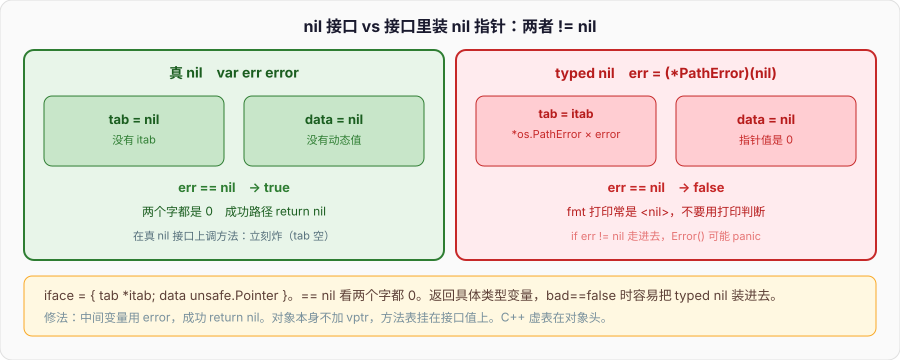

# 接口

```go
type timeout struct{}

func (timeout) Error() string { return "timeout" }

func main() {
	var err error = timeout{}
	fmt.Println(err) // timeout
}
```

`timeout` 没写 `implements error`，没继承任何东西，却能赋给 `error`。因为 `error` 只要求 `Error() string`，`timeout` 有这个方法，编译器在赋值那一行检查方法集，过了就过了。实现方不 import 接口所在的包也能满足它——标准库的 `error` 就是这么被满世界实现的。

C++ 要公开继承一个带 `virtual` 的基类，对象带 vptr，没继承就不能当那个类型用。Python 3 的 `Protocol` 是结构化的，和 Go 更近，但检查默认在类型检查器，运行时鸭子类型仍可能炸。Go 把结构化匹配做进编译器：赋值、传参、返回的那一刻，方法集对不上就是编译错误。

下面把隐式满足、iface 的 tab/data、nil 接口和「接口里装着 nil 指针」、类型断言、小接口、`error` 这条线钉完。方法集的归属上一篇写过，这里直接用。

---

## 一、隐式满足

### 1、方法集对上就算

```go
type Reader interface {
	Read(p []byte) (n int, error)
}

type file struct{}

func (file) Read(p []byte) (int, error) { return 0, io.EOF }

func slurp(r Reader) {}

func main() {
	var f file
	slurp(f)
	slurp(&f) // *file 的方法集包含 file 的值方法
}
```

没有 `class file : public Reader`。`file` 甚至可以在另一个模块，从来没见过 `Reader` 这个名字。只要方法名、参数、返回值对得上（名字要完全相同，包括导出与否），赋值合法。多出来的方法无所谓；少一个，编译失败。

```go
type ReadCloser interface {
	Read(p []byte) (int, error)
	Close() error
}

// slurpCloser(f) // 编译失败：file 没有 Close
```

签名必须逐位匹配。`Read([]byte) int` 少了 `error` 就不算。接收者是值还是指针，走上一篇的方法集规则：`T` 只有值方法，`*T` 有值方法加指针方法。接口保存的是动态值的一份拷贝（或指针），不会回头去取原变量的地址来补指针方法。

```go
type setter interface{ Set(int) }

type n int

func (p *n) Set(v int) { *p = n(v) }

var x n
// var s setter = x  // 编译失败
var s setter = &x    // 可以
s.Set(7)
fmt.Println(x) // 7
```

### 2、空接口 `any`

```go
var x any
x = 1
x = "hi"
x = []int{1, 2}
```

`any` 是 1.18 起 `interface{}` 的别名。方法列表为空，一切类型的方法集都是它的超集，所以一切值都能赋进去。盒子里仍然有动态类型和动态值，不是 Python 那种「名字不锁类型」——`x` 的静态类型永远是 `any`，要用里面的东西得断言或 type switch。

空接口当参数等于放弃编译期检查。`fmt.Println` 的实参是 `...any`，这是它能打印一切的原因，也是它内部必须反射的原因。业务 API 少用 `any`，用真正有方法的小接口。

### 3、接口值可赋 nil，实现类型彼此不相干

```go
var r io.Reader
fmt.Println(r == nil) // true
r = os.Stdin
r = strings.NewReader("x")
// r = 1 // 编译失败：int 没有 Read
```

两个实现类型之间没有关系。`*os.File` 和 `*strings.Reader` 不能互相赋值，它们只是都满足 `io.Reader`。没有公共基类，没有 downcast 到「兄弟」。要还原具体类型，用类型断言，见第四节。

接口本身是值。赋给接口是拷贝动态值（小值直接拷，大值在堆上再让 data 指向它）。改原变量不一定改接口里那份：

```go
type counter struct{ n int }

func (c counter) N() int { return c.n }

var i interface{ N() int } = counter{1}
// i 里是拷贝，外面再改原值跟它无关
```

指针赋进去拷的是指针，两边看到同一份。

---

## 二、iface：tab 和 data

### 1、两个字

非空接口的运行时表示是 `iface`：

```go
type iface struct {
	tab  *itab
	data unsafe.Pointer
}
```

- `tab`（`itab`）：这份**动态类型**对这份**接口类型**的方法表，加上动态类型的类型信息。
- `data`：指向动态值。小值会被装箱到堆上再让 data 指过去（逃逸分析能证明生命周期时才堆分配；具体由编译器决定）。

空接口是 `eface`，没有方法表，两项是 `rtype` + `data`。`any` 走 `eface`。

```go
var r io.Reader = bytes.NewBufferString("hi")
```

赋值发生时，编译器（或运行时，对未导出 / 不便静态化的路径）构造 `itab`：左边要的 `Read` 填成 `*bytes.Buffer.Read`。调用 `r.Read(p)` 走 `tab` 里的函数指针，把 `data` 当接收者传进去。和 C++ 虚调用同类：间接跳。不同的是 itab 按「接口类型 × 动态类型」缓存，不是对象头上那张虚表——对象本身不知道自己实现了哪些接口。

这就是隐式满足能成立的硬件原因：实现类型不带 vptr，方法表挂在接口值上。一个 `*bytes.Buffer` 可以同时赋给 `io.Reader`、`io.Writer`、`fmt.Stringer`，每份接口值各有一张 itab，对象内存布局不变。C++ 多继承 / 多接口要调整 `this`、对象里多张虚表指针。Go 的对象干净，接口值更胖（两个字）。

### 2、调用约定

```go
type Speaker interface{ Speak() }

type dog struct{ name string }

func (d dog) Speak() { fmt.Println(d.name) }

func main() {
	var s Speaker = dog{name: "n"}
	s.Speak()
}
```

`s.Speak()` 不是静态调用 `dog.Speak`。它取出 `s.tab` 里 `Speak` 的实现指针，取出 `s.data`，调用。动态类型在运行时才知道。编译器对「接口的具体类型在局部能看穿」的路径会 devirtualize，那是优化，语义仍是接口调用。

方法集里的方法顺序按名字排序进 itab，和你在接口字面量里写的顺序无关。两个接口方法列表相同（名字+签名），即使字面量写法不同，itab 也能复用。

### 3、接口持有值的拷贝

```go
type P struct{ n int }

func (p P) V() int  { return p.n }
func (p *P) M() int { p.n++; return p.n }

func main() {
	p := P{n: 1}
	var i interface{ V() int } = p // 拷贝 p
	p.n = 9
	fmt.Println(i.V()) // 1

	var j interface{ M() int } = &p // 拷指针
	p.n = 3
	fmt.Println(j.M()) // 4
}
```

值放进接口以后，原变量和接口里那份分家。指针放进去，共享。上一篇「值接收者拷结构体」在接口边界上再出现一次：接口是又一次赋值。

不可比较的动态值（切片、map、函数）放进接口后，对这个接口值做 `==` 会 **panic**：

```go
var x any = []int{1}
var y any = []int{1}
// fmt.Println(x == y) // panic: comparing uncomparable type []int
fmt.Println(x == nil)  // false，可以和 nil 比
```

接口的 `==`：先比动态类型（tab / rtype），再比动态值。两边都是 nil 接口则相等。一边 nil 一边非 nil 则不等。动态类型相同且动态值可比较，比动态值；动态值不可比较，panic。不要拿装着切片的 `any` 当 map 的键。

---

## 三、nil 接口 vs 接口装着 nil 指针

### 1、两个 nil 不是一回事



```go
var err error            // tab=nil, data=nil
fmt.Println(err == nil)  // true

var p *os.PathError = nil
err = p                  // tab=*os.PathError 的 itab，data=nil
fmt.Println(err == nil)  // false
fmt.Println(err)         // <nil>，打印看着像 nil
if err != nil {
	fmt.Println("not nil") // 走进来
}
```

`error` 是接口。`var err error` 是真 nil：两个字都是 0。把一个 **类型钉死了的 nil 指针**赋进去，tab 有了类型信息，data 是 0。`== nil` 看的是两个字都 0，于是 `err == nil` 为 false。调用 `err.Error()` 会把 nil 指针当接收者传进 `*PathError.Error`，里面若没防 nil，panic。

这是 Go 里最贵的那类 bug。函数写成：

```go
func load() error {
	var err *os.PathError
	if bad {
		err = &os.PathError{Op: "open", Path: "x", Err: os.ErrNotExist}
	}
	return err // bad==false 时返回的是 (*os.PathError)(nil)，不是 nil error
}
```

调用方 `if err != nil` 永远真。修法：返回值用接口类型的 nil：

```go
func load() error {
	if bad {
		return &os.PathError{Op: "open", Path: "x", Err: os.ErrNotExist}
	}
	return nil
}
```

或者内部变量就用 `error`，不要用具体指针类型再隐式转接口。

### 2、怎么查

```go
fmt.Printf("%T %#v\n", err, err)
fmt.Println(err == nil)
```

`%T` 打动态类型。nil 接口打 `<nil>`；装着 nil 指针打 `*os.PathError`。`fmt` 打印接口时走的是动态值的 `Error` / `String`，nil 指针方法若返回 `"<nil>"`，屏幕上和真 nil 几乎一样，**不要用打印结果判断**。

反射：

```go
fmt.Println(reflect.ValueOf(err).Kind())       // 对真 nil 的 error 会是 Invalid
v := reflect.ValueOf(err)
if v.IsValid() && v.Kind() == reflect.Ptr && v.IsNil() {
	fmt.Println("typed nil inside")
}
```

日常代码少靠反射。约定：返回 `error` 的函数，失败返回具体值，成功 `return nil`，中间变量类型就是 `error`。

### 3、nil 接口上调方法

```go
var r io.Reader
// r.Read(nil) // panic: nil pointer dereference（iface.tab 是 nil，没有函数指针）
```

真 nil 接口调用立刻炸。装着 nil 指针的接口调用能进方法体，接不接得住看实现。写方法时指针接收者要不要防 nil，是实现者的契约：`(*bytes.Buffer)` 的很多方法对 nil 会 panic，`(*os.File).Close` 对 nil 是 nop。

C++ 的 `T* p = nullptr; p->foo()` 一律 UB / 崩溃，没有「指针类型已知但值为空」和「指针本身不存在」的两层。Python 的 `None.foo()` 是 `AttributeError`。Go 把接口的 nil 和动态值的 nil 拆开，所以多出这一层。

---

## 四、类型断言与 type switch

### 1、`x.(T)`

```go
var r io.Reader = strings.NewReader("hi")

s := r.(*strings.Reader) // 动态类型必须恰好是 *strings.Reader
n, _ := s.Read([]byte{0})
_ = n

v, ok := r.(*bytes.Buffer)
fmt.Println(v, ok) // nil false
```

`x.(T)` 在 `x` 的动态类型是 `T` 时抽出动态值。`T` 可以是具体类型，也可以是另一个接口类型（问的是动态值是否也满足那个接口）。

单值形式失败会 **panic**。comma-ok 形式失败返回 `T` 的零值和 `false`，不 panic。生产代码用 comma-ok，除非你认为失败就是程序 bug。

```go
var x any = 1
n := x.(int)        // 1
// s := x.(string)  // panic: interface conversion
s, ok := x.(string)
fmt.Println(s, ok)  // "" false
```

断言到接口：

```go
var r io.Reader = bytes.NewBufferString("x")
w, ok := r.(io.Writer) // *bytes.Buffer 也满足 Writer
fmt.Println(ok)        // true
w.Write([]byte("y"))
```

这不是把 Reader 转成 Writer 的强制转换，是问动态值的方法集是否包含 Writer。成功则新接口值的 tab 换成 Writer 的 itab，data 仍指向同一份动态值。

### 2、type switch

```go
func dump(x any) {
	switch v := x.(type) {
	case nil:
		fmt.Println("nil")
	case int:
		fmt.Println("int", v)
	case string:
		fmt.Println("string", v)
	case io.Reader:
		fmt.Println("reader", v)
	default:
		fmt.Printf("other %T\n", v)
	}
}
```

`case` 按顺序匹配动态类型。`case nil` 匹配真 nil 接口。匹配接口 case 时，问的是是否满足，不是动态类型恰好等于那个接口。更具体的具体类型 case 要写在接口 case 前面，否则会被接口先接住。

`v` 在每个 case 里是那个分支的类型。没有 fallthrough。C++ 的 `dynamic_cast` 一次问一种；Python 的 `match` / `isinstance` 树更灵活，也更慢。Go 的 type switch 是编译器生成的对动态类型的分派，常见路径很快。

不要用 type switch 替代方法。类型每加一种实现就改一处 switch，等于把开放集合做成封闭集合。那是接口本该消掉的分支。type switch 适合「这一层必须知道具体类型」：解码、错误分类、调试。

### 3、断言失败不是 error

```go
v, ok := x.(T)
if !ok {
	return fmt.Errorf("want %T, got %T", *new(T), x)
}
```

类型断言失败不是 `error` 值，是 `ok==false` 或 panic。不要写成 `if err := x.(error); err != nil`——那是另一套。从 `any` 还原，先 ok 再当值用。

`errors.As` 沿 error 链做类型断言，见第六节。手写 `err.(*MyError)` 穿不透 `fmt.Errorf("%w", err)` 包过的链。

---

## 五、小接口

### 1、一个方法往往够

```go
type Reader interface {
	Read(p []byte) (n int, error)
}

type Writer interface {
	Write(p []byte) (n int, error)
}

type Closer interface {
	Close() error
}

type ReadCloser interface {
	Reader
	Closer
}
```

标准库的 `io` 是样板：接口按能力拆，再组。`io.Copy` 只要 `Reader` + `Writer`，不要求 `Close`。调用方传 `*os.File`、`*bytes.Buffer`、自定义类型都成，因为各自碰巧有这些方法。

接口嵌套是方法列表的并，不是继承。`ReadCloser` 的方法集 = `Read` + `Close`。满足 `ReadCloser` 的值一定满足 `Reader`，反过来不一定。赋值方向：小的（方法少的）更宽，大的更窄。

```go
var rc io.ReadCloser = io.NopCloser(strings.NewReader("x"))
var r io.Reader = rc // 可以：方法集更大的赋给更小的
// rc = r            // 编译失败
```

C++ 抽象基类往往一张大接口虚函数一堆。Python 的 ABC 也常一次列完。Go 的习惯是接口小、在**使用方**定义，不在实现方定义。实现方提供具体类型和方法；使用方说「我要 Read」。依赖倒置写进语言。

### 2、在使用方定义

```go
// package store，实现方，不知道 Handler
type FileStore struct{}

func (FileStore) Get(k string) ([]byte, error) { return nil, nil }

// package httpapi，使用方
type getter interface {
	Get(k string) ([]byte, error)
}

func handle(g getter) {}
```

`getter` 不导出也行，测试时塞一个假实现。实现方 `FileStore` 从不 import `httpapi`。循环依赖少了，mock 不用公共接口仓库。

接口太大，实现成本和测试成本一起涨。需要三个方法就写三个，不要预先放 `Reset` / `Flush` / `Name`「以防万一」。多了的方法，实现方每一个都要写，假实现每一个都要填。

### 3、接口的零值、比较、当键

```go
var r io.Reader
fmt.Println(r == nil)

var a, b io.Reader = os.Stdin, os.Stdin
fmt.Println(a == b) // true：同一指针，动态类型相同且指针相等
```

动态值是指针、channel 这类可比较且相等的，接口相等。动态值是切片，比接口就 panic。用接口当 map 键：确保所有放进去的动态类型可比较，否则插入或查找某次会炸。

---

## 六、error 是接口

### 1、定义就一行

```go
type error interface {
	Error() string
}
```

任何 `Error() string` 的类型都是 `error`。`errors.New` 返回的是未导出的 `*errorString`。`fmt.Errorf` 返回包装类型。你自己的 `type timeout struct{}` 也能当 error。

```go
var ErrNotFound = errors.New("not found")

type HTTPError struct {
	Code int
	Msg  string
}

func (e HTTPError) Error() string {
	return fmt.Sprintf("%d: %s", e.Code, e.Msg)
}
```

值接收者还是指针：会比较、会当 map 键、小结构体，用值；要和 `errors.As` 的指针目标对齐时，注意 `As` 的目标类型。混用会导致 `errors.As(err, **HTTPError)` 对不上你返回的值。一种简单约定：自己的错误类型用值，返回 `return HTTPError{...}`；标准库不少是指针。别在同一个类型上两种都返回。

### 2、`== nil`、包装、Is / As

成功路径返回 `nil`，不要返回 `(*T)(nil)`。判断用 `err != nil`，不要 `err.Error() == "..."`.

```go
if err != nil {
	return fmt.Errorf("load config: %w", err) // 1.13+
}
```

`%w` 把底层 error 包进链。解开：

```go
if errors.Is(err, ErrNotFound) { // 沿链比 == 或 Is 方法
}

var he HTTPError
if errors.As(err, &he) { // 沿链类型断言，找到则写入 he
	fmt.Println(he.Code)
}
```

`errors.Is` 比的是值相等（或实现了 `Is(error) bool`）。`errors.As` 把链上第一个匹配的动态值拷进你提供的指针。手写 `err == ErrNotFound` 穿不透包装；手写 `err.(HTTPError)` 也穿不透。1.13 之后公共错误处理走 `Is` / `As`。

1.20 的 `errors.Join` 一次并多个 error，`Is` / `As` 会走进去。1.21 起 `fmt.Errorf("%w %w", e1, e2)` 也能并。

`panic` / `recover` 不是 error 的替代。下标越界、类型断言单值形式失败、向 nil 接口调方法，这些是 panic。业务上的「文件没有」「权限不够」是 error。`recover` 只在 defer 里直接调用才接得住。把 recover 当 catch 用，等于把 C++ / Python 的异常模型硬塞回来，控制流再次隐身。

### 3、sentinel 和自定义类型

```go
var ErrGone = errors.New("gone")

func f() error {
	return fmt.Errorf("f: %w", ErrGone)
}

func g() {
	err := f()
	if errors.Is(err, ErrGone) {
		return
	}
}
```

sentinel（包级 `var ErrXxx = errors.New(...)`）适合少量稳定条件。信息量大的用自定义类型带字段，`As` 取出。不要用字符串匹配 `err.Error()`：包装一层，字符串就变了；i18n 也会变。

`io.EOF` 是 sentinel。`Read` 读完返回 `0, io.EOF`。这是约定，不是异常。循环里 `errors.Is(err, io.EOF)` 结束，其它 err 才失败。

---

## 七、对照 C++ 虚函数、Python Protocol

### 1、一张表

| | C++ | Python | Go |
| --- | --- | --- | --- |
| 声明实现 | 公开继承，`override` | 继承 ABC / 什么都不写 | 不声明，方法集匹配 |
| 对象布局 | 对象带头 vptr | 对象带类型指针 | 对象无接口信息 |
| 调用 | vtable[i](this) | `tp_as_*` / `__dict__` 查 | `iface.tab->fun[i](data)` |
| 多接口 | 多 vptr / 调整 this | 多重继承，MRO | 多份 iface，对象不动 |
| nil / None | 空指针解引用 UB | `None` 无属性 | nil 接口 vs typed nil 两层 |
| 还原具体类型 | `dynamic_cast` | `isinstance` / `match` | 类型断言 / type switch |
| 检查时机 | 编译期（继承关系） | 默认运行时；Protocol 在 type checker | 赋值那一刻编译期 |
| 典型粒度 | 大抽象基类 | 类或 Protocol | 一两个方法的小接口 |

C++ 的虚函数要求你在设计类型时就知道它会被当成什么基类用。Go 反过来：类型先长方法，使用方后写接口。一个 `*os.File` 在 `io` 包出现之前就已经能 Read / Write，`io` 包只是把方法集命名了。

Python 的 Protocol（`typing.Protocol`）接近 Go：结构化、不声明。差别：Python 运行时默认不查，`x.read()` 没有就 `AttributeError`；Go 在 `var r Reader = x` 那一行查完。Python 的 `None` 是一个对象；Go 的 nil 接口是两个零字，和「指针类型的 nil」叠加才有第三节那个坑。

### 2、没有虚析构、没有对象切片

C++ 基类缺虚析构，`delete` 派生对象会漏。Go 没有继承，没有析构，GC 收对象，接口值只是多两个字的根。C++ 值语义的 `Base b = derived;` 切片切掉派生部分。Go 把值放进接口是装箱，动态类型完整保留，不会切。代价是堆分配和间接调用。

Python 对象始终是引用，没有切片问题，也没有「值放进接口拷一份」——`b = a` 永远共享。Go 的接口赋值是拷贝动态值（或指针），又回到「盒子里是什么」：动态值是结构体就拷结构体。

### 3、接口不是泛型

`any` 不是模板。`func f(x any)` 进去之后要用 `x`，得断言。1.18 的泛型才是「编译期参数化」：

```go
func Sum[T int | float64](xs []T) T {
	var s T
	for _, x := range xs {
		s += x
	}
	return s
}
```

接口表达的是**运行时异构**：这个参数今天是 File，明天是 Buffer。泛型表达的是**编译期一族代码**：`Sum` 对 `int` 和 `float64` 各生成一份。`io.Reader` 不会写成泛型——实现集合是开放的。`comparable`、`error` 偶尔当约束用，那是泛型的边界，不是接口的日常用法。

能用具体类型 + 小接口解决的，不要写成 `any` + 断言。能用泛型消掉的重复算术，不要写成接口。两条工具，两个问题。

---

## 八、实现细节上的几个坑

### 1、指针 / 值方法与接口存储

```go
type t struct{ n int }

func (t) Read([]byte) (int, error) { return 0, io.EOF }

var r io.Reader = t{}  // 接口里是 t 的拷贝
var q io.Reader = &t{} // 接口里是 *t
```

两个动态类型不同：`t` 和 `*t`。类型断言 `r.(*t)` 失败。`errors.As` 同样区分。返回错误时选一种，文档写死。

### 2、接口包装丢失类型

```go
type wrap struct{ inner error }

func (w wrap) Error() string { return w.inner.Error() }

err := wrap{inner: io.EOF}
fmt.Println(errors.Is(err, io.EOF)) // false：wrap 没实现 Unwrap / Is
```

要让 `Is` / `As` 走进去，实现 `Unwrap() error` 或 `Is(error) bool`。`fmt.Errorf("%w", err)` 已经做了 Unwrap。自己写包装类型漏掉 Unwrap，链就断了。

### 3、接口造成逃逸

值赋进接口，编译器通常不敢把值留在栈上——接口可能被随便传到别处。热路径上 `var x any = n` 能让本该寄存器里的 `n` 上堆。profile + `go build -gcflags=-m` 看逃逸。能写具体类型就写具体类型；`fmt.Sprintf` 的 `any` 参数是逃逸大户。

### 4、不要用接口「以后好 mock」预先抽象

三个实现都还没出现时，写具体结构体。第二个实现出现、函数签名开始重复时，再在**调用方**抽两个方法的接口。预先抽的大接口往往和真实需求不对，假实现一堆空方法。C++ 程序员对每个类型先写纯虚基类的习惯，在 Go 里是负资产。

---

## 九、一块能跑的对照实验

保存成 `iface.go`，`go run iface.go`：

```go
package main

import (
	"bytes"
	"errors"
	"fmt"
	"io"
	"strings"
)

type timeout struct{}

func (timeout) Error() string { return "timeout" }

type n int

func (p *n) Set(v int) { *p = n(v) }

type setter interface{ Set(int) }

func typedNil() error {
	var p *timeout
	if false {
		p = &timeout{}
	}
	return p
}

func dump(x any) {
	switch v := x.(type) {
	case nil:
		fmt.Println("switch nil")
	case int:
		fmt.Println("switch int", v)
	case error:
		fmt.Println("switch error", v.Error())
	default:
		fmt.Printf("switch other %T\n", v)
	}
}

func main() {
	var err error = timeout{}
	fmt.Println("assign", err.Error())

	var x n
	var s setter = &x
	s.Set(7)
	fmt.Println("setter", x)

	var r io.Reader = strings.NewReader("hi")
	if sr, ok := r.(*strings.Reader); ok {
		fmt.Println("assert reader", sr != nil)
	}
	if _, ok := r.(*bytes.Buffer); !ok {
		fmt.Println("not buffer")
	}
	if _, ok := r.(io.Writer); !ok {
		fmt.Println("reader not writer")
	}

	var e1 error
	fmt.Println("nil iface", e1 == nil)
	e2 := typedNil()
	fmt.Println("typed nil == nil", e2 == nil, fmt.Sprintf("%T", e2))

	dump(nil)
	dump(3)
	dump(timeout{})
	dump([]int{1})

	base := errors.New("gone")
	wrap := fmt.Errorf("load: %w", base)
	fmt.Println("is", errors.Is(wrap, base))
	fmt.Println("direct ==", wrap == base)

	var buf bytes.Buffer
	var w io.Writer = &buf
	n, _ := w.Write([]byte("ok"))
	fmt.Println("write", n, buf.String())

	var anyv any = []int{1, 2}
	fmt.Println("any slice", anyv == nil)
	// fmt.Println(anyv == any([]int{1, 2})) // panic：切片不可比
}
```

对照：没声明也能赋给 `error`；指针方法只能把指针赋进接口；类型断言 comma-ok 失败不炸；nil 接口 `== nil` 为真，装着 nil 指针的接口为假，`%T` 能拆开；type switch 的 `nil` / `int` / `error` 各走各的；`%w` 之后 `Is` 能沿链找到 sentinel，直接 `==` 不能；`*bytes.Buffer` 当 `io.Writer` 用，对象自己不知道接口这回事；装着切片的 `any` 和 nil 比是 false，和另一个切片比会 panic。

接口值是 tab 加 data。实现方写方法，使用方写接口，编译器在赋值处对方法集。`error` 只是一个方法的接口，成功是真 nil，失败是某个动态值。typed nil 看起来像成功，比较起来是失败——返回具体指针类型的零值之前，先看它会不会被当成 `error` 交出去。

基础四篇到这里：名字是盒子；切片头是盒子、数组在别处；接收者是第一个参数；接口是一对 tab/data。进阶从调度和 channel 开始，那些盒子会被别的 goroutine 同时碰到。
