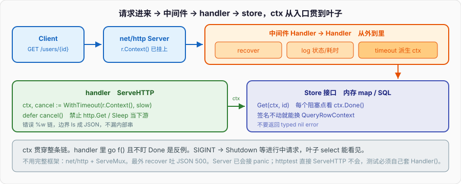

# HTTP服务

C++ 选手用 Go 写第一个 JSON API，最容易交出来的是这个：

```go
func handler(w http.ResponseWriter, r *http.Request) {
	go audit(r) // 开了就不管
	resp, err := http.Get("http://127.0.0.1:9000/user?id=" + r.URL.Query().Get("id"))
	if err != nil {
		http.Error(w, err.Error(), 500)
		return
	}
	defer resp.Body.Close()
	io.Copy(w, resp.Body)
}
```

客户端已经断开，下游还在跑。`audit` 抓着 `*http.Request`，handler 返回了请求可能被复用，那是 data race。错误是一段纯文本。进程被 `kill` 时正在写的响应直接切。Gin 脚手架把路由和绑定填满，这些合同一个都不替你签。

context 篇把取消树和 `%w` 钉过；接口篇把 `http.Handler` 的方法集点过。本篇把它们焊进一个**本地能跑的服务**：超时、可取消、错误是 JSON、中间件、优雅退出、`httptest`。不用完整框架。



---

## 一、目标与非目标

### 1、要解决什么

一个进程，听本机端口，对外三个 JSON 接口：

- `GET /users/{id}`：查用户。下游可能慢，必须能被超时和客户端断开取消。
- `POST /users`：建用户。校验失败 400，冲突 409，成功 201。
- `GET /healthz`：探活，不碰下游。

每条请求：入口拿到 `r.Context()`，自己再加一层超时，往 Store 传同一个 ctx。Store 的每个阻塞点看见 `ctx.Done()`。失败不 `http.Error` 一段字符串，而是 `{"code":"...","message":"..."}`。进程收 SIGINT / SIGTERM 时 `Shutdown`，把进行中的请求做完再走。

C++ 里这相当于：`asio` 的 `cancellation_slot` 从 acceptor 灌到 socket read，错误用一种 `error_code` 出边界，析构里停 io_context。Python 里相当于 `asyncio.wait_for` + `CancelledError` 沿 await 链走。Go 把这两件事写成第一个参数 `ctx` 和返回值 `error`。

### 2、明确不是什么

- **不是 Gin / Echo / chi 脚手架。** 不用它们的 engine、binding、validator 插件。`net/http`、`encoding/json`、`context`、`log/slog`、`errors`。路由用 1.22 的 `ServeMux` 方法+路径。中间件自己套 `http.Handler`。
- **不是微服务治理。** 没有服务发现、没有熔断器库、没有 OpenTelemetry 全家桶。trace id 用 `WithValue` 穿过日志就够，证明 ctx 能带元数据。
- **不是 ORM / 真实数据库。** Store 是内存 map + 可注入的慢点。教学要看见超时，不需要 Postgres 容器。换真实 SQL 时把 `Get` 改成 `QueryRowContext`，签名不动。
- **不是「开个 goroutine 做后台」。** handler 里 `go f()` 且不盯 ctx，是本篇对照的反例，不是功能。
- **不是把 ctx 塞进 Server 结构体。** Server 活过所有请求；ctx 属于这一次调用。context 篇那条合同这里执行一遍。

把「我用 Go 写了个 HTTP 服务」说成「我配了 Gin」，面试下一句就会问超时怎么灌到叶子。本篇到叶子停。

### 3、目录结构

教学项目按能粘贴来排。Go 1.22+，无第三方。

```
httpsvc/
  go.mod
  main.go                      # 听端口、信号、Shutdown
  internal/api/error.go        # AppError、writeJSON、writeError
  internal/api/middleware.go   # log / recover
  internal/api/handler.go      # Handler 接口装配、路由
  internal/store/store.go      # UserStore 接口 + 内存实现
  internal/api/handler_test.go # httptest：成功 / 超时 / panic
```

```
module example.com/httpsvc

go 1.22
```

`internal/` 挡包外导入。`api` 依赖 `store` 的**接口**，测试可以塞 fake。C++ 对应物是头文件里的纯虚 + 测试里的 mock；Python 是 Protocol。Go 不写 `implements`，方法集对上就算。

---

## 二、Handler 用接口

### 1、`http.Handler` 才是入口合同

```go
type Handler interface {
	ServeHTTP(ResponseWriter, *Request)
}
```

`HandleFunc` 把一个函数适配成这个接口。自己的类型直接实现它，中间件才能套：中间件吃 `Handler`，吐 `Handler`。不要把路由写成一串闭包再在闭包里复制超时逻辑——超时和 JSON 错误是边界，抽出来。

```go
package api

type Server struct {
	mux   *http.ServeMux
	store store.UserStore
	log   *slog.Logger
	slow  time.Duration // 单请求超时，测的时候可改
}

func NewServer(st store.UserStore, log *slog.Logger, slow time.Duration) *Server {
	s := &Server{mux: http.NewServeMux(), store: st, log: log, slow: slow}
	s.routes()
	return s
}

func (s *Server) ServeHTTP(w http.ResponseWriter, r *http.Request) {
	s.mux.ServeHTTP(w, r)
}

func (s *Server) routes() {
	s.mux.Handle("GET /healthz", http.HandlerFunc(s.healthz))
	s.mux.Handle("GET /users/{id}", s.withTimeout(http.HandlerFunc(s.getUser)))
	s.mux.Handle("POST /users", s.withTimeout(http.HandlerFunc(s.postUser)))
}
```

`Server` 自己就是 `http.Handler`。外面再套 log / recover，测试可以只打内层，也可以打整条链。`store.UserStore` 是接口字段，不是具体结构体——这是接口篇「小接口」在服务里的形状。

### 2、Store 是业务接口，不是结构体字段里的 map

```go
package store

type User struct {
	ID   int    `json:"id"`
	Name string `json:"name"`
}

type UserStore interface {
	Get(ctx context.Context, id int) (User, error)
	Create(ctx context.Context, name string) (User, error)
}
```

方法第一个参数是 `ctx`。实现里每个可能停下来的地方看它。内存版用一把 mutex 护 map——保护内存用锁，channel 篇那条。慢点用 `select` + `timer`，不要 `time.Sleep`：Sleep 不认 ctx。

```go
package store

type Mem struct {
	mu      sync.Mutex
	next    int
	users   map[int]User
	getDelay time.Duration // 测试用：Get 先等这么久
}

func NewMem(getDelay time.Duration) *Mem {
	return &Mem{next: 1, users: map[int]User{1: {ID: 1, Name: "ada"}}, getDelay: getDelay}
}

func (m *Mem) Get(ctx context.Context, id int) (User, error) {
	if m.getDelay > 0 {
		t := time.NewTimer(m.getDelay)
		defer t.Stop()
		select {
		case <-t.C:
		case <-ctx.Done():
			return User{}, fmt.Errorf("store get %d: %w", id, ctx.Err())
		}
	}
	m.mu.Lock()
	defer m.mu.Unlock()
	u, ok := m.users[id]
	if !ok {
		return User{}, fmt.Errorf("store get %d: %w", id, ErrNotFound)
	}
	return u, nil
}
```

`Create` 同样：先看 ctx，再锁 map。锁内不做 IO、不 `select` 别的 channel——持锁时阻塞是把临界区拉成死锁窗口。

```go
var ErrNotFound = errors.New("not found")
var ErrConflict = errors.New("conflict")

func (m *Mem) Create(ctx context.Context, name string) (User, error) {
	select {
	case <-ctx.Done():
		return User{}, fmt.Errorf("store create: %w", ctx.Err())
	default:
	}
	m.mu.Lock()
	defer m.mu.Unlock()
	for _, u := range m.users {
		if u.Name == name {
			return User{}, fmt.Errorf("store create %s: %w", name, ErrConflict)
		}
	}
	id := m.next
	m.next++
	u := User{ID: id, Name: name}
	m.users[id] = u
	return u, nil
}
```

测试里可以另写一个 `sticky` Store：`Get` 只等 `ctx.Done()`，用来证明超时不是靠 `getDelay` 碰巧结束。

### 3、JSON 进出在边界，中间层不碰 `ResponseWriter`

```go
func (s *Server) getUser(w http.ResponseWriter, r *http.Request) {
	id, err := strconv.Atoi(r.PathValue("id"))
	if err != nil || id <= 0 {
		writeError(w, 400, "bad_id", "id must be a positive integer")
		return
	}
	u, err := s.store.Get(r.Context(), id)
	if err != nil {
		writeStoreError(w, err)
		return
	}
	writeJSON(w, 200, u)
}
```

`r.PathValue` 是 1.22 mux 的。`store.Get` 只返回 `(User, error)`，不写 HTTP。状态码在 `writeStoreError` 用 `errors.Is` 认 sentinel。context 篇第八节那条线，这里落地。

```go
func (s *Server) postUser(w http.ResponseWriter, r *http.Request) {
	r.Body = http.MaxBytesReader(w, r.Body, 1<<20)
	var in struct {
		Name string `json:"name"`
	}
	if err := json.NewDecoder(r.Body).Decode(&in); err != nil {
		writeError(w, 400, "bad_json", "invalid json body")
		return
	}
	if in.Name == "" {
		writeError(w, 400, "bad_name", "name required")
		return
	}
	u, err := s.store.Create(r.Context(), in.Name)
	if err != nil {
		writeStoreError(w, err)
		return
	}
	writeJSON(w, 201, u)
}
```

`MaxBytesReader` 挡大 body。Decode 失败不要把 `err.Error()` 原样给客户端——内部路径会漏出来。C++ 里你也不会把 `what()` 直接写进 socket；Python 的 Flask 默认 traceback 只在 debug。

---

## 三、context 贯穿超时

### 1、`r.Context()` 是树根，不够还要再加一层

客户端断开、`Server.Shutdown`、http2 取消，server 会 cancel `r.Context()`。只靠这一层：下游如果自己要 30 秒，客户端 3 秒走了，handler 仍能在下一次阻塞点回来。还不够：客户端一直挂着，你也要有自己的上限。

```go
func (s *Server) withTimeout(next http.Handler) http.Handler {
	return http.HandlerFunc(func(w http.ResponseWriter, r *http.Request) {
		ctx, cancel := context.WithTimeout(r.Context(), s.slow)
		defer cancel()
		next.ServeHTTP(w, r.WithContext(ctx))
	})
}
```

`WithTimeout` 从父 ctx 派生，子 deadline 不能晚于父。父先取消，子立刻 Done。`defer cancel()` 立刻释放 timer，别等超时自己响。context 篇：每次 `WithTimeout` / `WithCancel` 都配对 cancel。

`r.WithContext` 换的是这份请求上的 ctx，不改原 `*Request` 的其它字段。后面 `s.store.Get(r.Context(), id)` 拿到的就是带超时的那份。

### 2、叶子必须看见 Done，Sleep 看不见

```go
// 错：超时灌不进来
time.Sleep(m.getDelay)
u, ok := m.users[id]

// 对：timer + select
select {
case <-t.C:
case <-ctx.Done():
	return User{}, fmt.Errorf("store get %d: %w", id, ctx.Err())
}
```

真实下游换 `http.NewRequestWithContext` / `QueryRowContext`。`http.Get` 内部 `Background()`，树在这里断。本项目 Store 是内存，用 `select` 模拟同一条合同。

`ctx.Err()` 是 `Canceled` 或 `DeadlineExceeded`。wrap 时 `%w`，上面 `errors.Is` 能穿过。不要 `err.Error() == "context deadline exceeded"`。

### 3、不要把这次请求的 ctx 存进 Server

```go
type Server struct {
	ctx context.Context // 不要
}
```

`Server` 构造一次，服务整个进程。塞 `Background` 等于没有取消；塞某个请求的 ctx，下一个请求会被上一个的 deadline 误杀。字段放 `store`、`log`、`slow`。ctx 只出现在 `ServeHTTP` 链和 Store 方法参数。

后台审计如果一定要在 handler 返回后继续：

```go
bg, cancel := context.WithTimeout(context.WithoutCancel(r.Context()), 3*time.Second)
go func() {
	defer cancel()
	audit(bg, id)
}()
```

`WithoutCancel` 留 Value（trace id），丢掉取消。`cancel` 必须在 goroutine 里 defer，不能在 handler 里——handler 马上返回，一 defer 就把后台切了。这是「开了就不管」的唯一合法变体：断树、自己的超时、自己的 cancel。

---

## 四、中间件：log / recover

### 1、中间件是 `Handler -> Handler`

```go
func Chain(h http.Handler, mw ...func(http.Handler) http.Handler) http.Handler {
	for i := len(mw) - 1; i >= 0; i-- {
		h = mw[i](h)
	}
	return h
}
```

先 recover 再 log，还是先 log 再 recover，决定 panic 能不能被日志看见。常用：最外 recover，里层 log，再里层 timeout，最里业务。panic 被 recover 住，log 仍能打出这次请求的方法、路径、状态、耗时。

```go
func (s *Server) Handler() http.Handler {
	return Chain(s, recoverMW(s.log), logMW(s.log))
}
```

`main` 把 `s.Handler()` 交给 `http.Server`。测试可以绕过中间件直接 `s.ServeHTTP`，也可以打完整链。

### 2、log：状态、耗时、trace，不打 body

```go
type statusWriter struct {
	http.ResponseWriter
	code int
}

func (w *statusWriter) WriteHeader(c int) {
	w.code = c
	w.ResponseWriter.WriteHeader(c)
}

func logMW(log *slog.Logger) func(http.Handler) http.Handler {
	return func(next http.Handler) http.Handler {
		return http.HandlerFunc(func(w http.ResponseWriter, r *http.Request) {
			sw := &statusWriter{ResponseWriter: w, code: 200}
			start := time.Now()
			next.ServeHTTP(sw, r)
			log.Info("http",
				"method", r.Method,
				"path", r.URL.Path,
				"status", sw.code,
				"dur", time.Since(start),
				"trace", TraceID(r.Context()),
			)
		})
	}
}
```

`WriteHeader` 不调时默认 200，所以 `code` 初值 200。不要 `log.Info(r)` 把 header 里的 cookie 打进磁盘。body 可能是密码。C++ 里你也不会 `<< req` 整包；Python 的 access log 同样只打行。

trace id 从入口塞：

```go
type traceKey struct{}

func withTrace(next http.Handler) http.Handler {
	return http.HandlerFunc(func(w http.ResponseWriter, r *http.Request) {
		id := r.Header.Get("X-Request-Id")
		if id == "" {
			id = strconv.FormatInt(time.Now().UnixNano(), 16)
		}
		ctx := context.WithValue(r.Context(), traceKey{}, id)
		next.ServeHTTP(w, r.WithContext(ctx))
	})
}

func TraceID(ctx context.Context) string {
	id, _ := ctx.Value(traceKey{}).(string)
	return id
}
```

键用未导出类型。值是请求级元数据。不要把 `id int` 藏进 ctx 当业务参数。

### 3、recover：panic 变 JSON 500，不把进程打死

`net/http` 的 Server **已经**会 recover 单次请求的 panic，打日志，关掉连接。自己再套一层是为了：响应仍是 JSON、有 trace、业务日志格式统一。不要以为没有 recover 中间件进程就会挂——默认已经接了。自己接是合同，不是续命。

```go
func recoverMW(log *slog.Logger) func(http.Handler) http.Handler {
	return func(next http.Handler) http.Handler {
		return http.HandlerFunc(func(w http.ResponseWriter, r *http.Request) {
			defer func() {
				v := recover()
				if v == nil {
					return
				}
				log.Error("panic", "err", v, "trace", TraceID(r.Context()))
				writeError(w, 500, "internal", "internal error")
			}()
			next.ServeHTTP(w, r)
		})
	}
}
```

`recover` 必须写在 `defer` 的函数里，套一层普通函数再调 `recover` 是 nop。函数篇那条。业务失败不要 panic；这里接的是真 bug（空指针、下标）。`http.ErrAbortHandler` 是 Server 用来静默中止的哨兵，若你要兼容默认行为，碰上它再 `panic(http.ErrAbortHandler)` 抛回去。教学项目里可以不管。

---

## 五、错误变成 JSON

### 1、边界认 sentinel，中间只 wrap

```go
package api

type errBody struct {
	Code    string `json:"code"`
	Message string `json:"message"`
}

func writeJSON(w http.ResponseWriter, status int, v any) {
	w.Header().Set("Content-Type", "application/json")
	w.WriteHeader(status)
	_ = json.NewEncoder(w).Encode(v)
}

func writeError(w http.ResponseWriter, status int, code, msg string) {
	writeJSON(w, status, errBody{Code: code, Message: msg})
}

func writeStoreError(w http.ResponseWriter, err error) {
	switch {
	case errors.Is(err, store.ErrNotFound):
		writeError(w, 404, "not_found", "user not found")
	case errors.Is(err, store.ErrConflict):
		writeError(w, 409, "conflict", "user already exists")
	case errors.Is(err, context.Canceled):
		// 客户端走了，写不写都可能 already hijacked；给个 499 风格
		writeError(w, 499, "canceled", "request canceled")
	case errors.Is(err, context.DeadlineExceeded):
		writeError(w, 504, "timeout", "upstream timeout")
	default:
		writeError(w, 500, "internal", "internal error")
	}
}
```

`Canceled` 常常不是故障：客户端刷新、网关砍连接。打 500 会把成功率算崩。`DeadlineExceeded` 是你自己的超时或父 deadline，504。未知错误对外一句 `internal`，对内 `slog.Error` 打完整 `err`（带 wrap 链）。

```go
if err != nil {
	s.log.Error("store", "err", err, "trace", TraceID(r.Context()))
	writeStoreError(w, err)
	return
}
```

`%w` 包过的 `store get 7: context deadline exceeded`，`Is` 仍真。`fmt.Errorf("... %v", err)` 包完链断了，边界只能 500。

### 2、不要把 `error` 接口的 typed nil 带过边界

Store 不要 `var e *MyError; return e`。接口篇：tab 非空、data 是 nil，`err == nil` 为 false，handler 当失败，再 `e.Error()` 可能 panic。返回 `nil` 或一个真错误值。`writeStoreError` 入口也可以 `if err == nil { return }`，防的是调用方写错，不是 Store 的 typed nil——typed nil 在 `== nil` 处已经不是 nil。

---

## 六、优雅退出

### 1、`Shutdown` 等进行中的请求，`Close` 不等

```go
package main

func main() {
	log := slog.New(slog.NewTextHandler(os.Stdout, nil))
	st := store.NewMem(0)
	apiSrv := api.NewServer(st, log, 2*time.Second)

	hs := &http.Server{
		Addr:              "127.0.0.1:8080",
		Handler:           api.Chain(apiSrv.Handler(), api.WithTrace),
		ReadHeaderTimeout: 5 * time.Second,
	}

	ctx, stop := signal.NotifyContext(context.Background(), os.Interrupt, syscall.SIGTERM)
	defer stop()

	errCh := make(chan error, 1)
	go func() {
		log.Info("listen", "addr", hs.Addr)
		errCh <- hs.ListenAndServe()
	}()

	select {
	case err := <-errCh:
		if err != nil && !errors.Is(err, http.ErrServerClosed) {
			log.Error("serve", "err", err)
			os.Exit(1)
		}
	case <-ctx.Done():
		shut, cancel := context.WithTimeout(context.Background(), 5*time.Second)
		defer cancel()
		if err := hs.Shutdown(shut); err != nil {
			log.Error("shutdown", "err", err)
			_ = hs.Close()
		}
	}
}
```

`ListenAndServe` 会阻塞，所以放 goroutine。信号来了，`Shutdown`：停 acceptor，等已有请求的 handler 返回，或等到自己的 5 秒 ctx。进行中的请求带着 `r.Context()` 被 cancel——你的 Store `select` 能看见，尽快退。5 秒还没退完，`Close` 硬拆连接。

`ReadHeaderTimeout` 必设。不设，慢loris 一条连接卡在读头，占一个 G。C++ 里你也会给 acceptor 和 socket 设 deadline；Python 的 uvicorn 有 timeout keep-alive。Go 默认几乎没有超时，字段要自己填。

### 2、和 `kill -9`、和「开了 goroutine 就不管」

`kill -9` 不给 Shutdown 机会，进行中的写半截。优雅退出要的是 SIGTERM。K8s preStop / `terminationGracePeriodSeconds` 必须大于 Shutdown 的超时。

handler 里若 `go audit(r.Context())` 且 audit 不盯 Done，Shutdown 等的是 handler 返回，不是 audit 结束。handler 已经 return，Server 以为请求完了，进程退出，audit 被杀掉，或者更糟：audit 还握着已回收的 Request。后台工作要么在 handler 返回前 `WaitGroup` 等完，要么断树并接受「进程退出就丢」，要么单独的 worker 生命周期挂在进程上、Shutdown 时一起停。

```go
var bg sync.WaitGroup

// handler 里
bg.Add(1)
go func() {
	defer bg.Done()
	audit(context.WithoutCancel(r.Context()), id)
}()

// Shutdown 前
bg.Wait() // 或带超时的 wait
```

教学项目默认：**handler 里不 `go`。** 所有工作在请求树内。要演示泄漏，测试里写反例，见第七节。

---

## 七、和「开个 goroutine 就不管」对比

### 1、反例：下游还在跑，handler 已经 200

```go
func leakHandler(store store.UserStore) http.HandlerFunc {
	return func(w http.ResponseWriter, r *http.Request) {
		id, _ := strconv.Atoi(r.PathValue("id"))
		go func() {
			_, _ = store.Get(context.Background(), id) // 不认请求 ctx
		}()
		writeJSON(w, 200, map[string]string{"ok": "accepted"})
	}
}
```

请求 1ms 结束。Store 若 `getDelay=5s`，这个 G 还要睡满 5 秒。`NumGoroutine` 随 QPS 涨。客户端取消、Shutdown、超时，全都管不到它。C++ 里 `detach` 一个还在用 request 栈对象的线程，是 UAF；Go 的 Request 在 handler 返回后内容不保证可用，`go` 里再用 `r` 是 data race。这里连 `r` 都没带，只是泄漏 G。

### 2、正例：同一条下游，取消能灌进去

```go
func (s *Server) getUser(w http.ResponseWriter, r *http.Request) {
	id, err := strconv.Atoi(r.PathValue("id"))
	if err != nil || id <= 0 {
		writeError(w, 400, "bad_id", "id must be a positive integer")
		return
	}
	u, err := s.store.Get(r.Context(), id) // 树没断
	if err != nil {
		writeStoreError(w, err)
		return
	}
	writeJSON(w, 200, u)
}
```

`withTimeout` 2 秒，Store delay 5 秒：handler 在 ~2 秒返回 504，Store 的 `select` 走 `ctx.Done()`，G 结束。`httptest` 里用 `context.WithTimeout` 打客户端，或直接把 `slow` 设短。对照数字：泄漏版 `NumGoroutine` 不回；正例每次请求结束后回到基线。

### 3、`go` 不是禁令，是合同

允许的 `go`：

- `ListenAndServe` 自己一条，main 等信号；
- `Shutdown` 之后不再接新请求；
- 必须异步的审计：`WithoutCancel` + 自己的 timeout + `WaitGroup` 进退出路径。

禁止的 `go`：

- 闭包抓 `w`、`r`、栈上的 slice 头，handler 返回后还写；
- 用 `Background()` 调下游，当「防火」——那是断树，不是防火；
- 无缓冲往 channel 发、没有人收、没有 `select` Done。channel 篇的 G 泄漏，HTTP 里一样发生。

GMP 篇：G 便宜，不是免费。十万个等在 netpoll 上的连接 G 是设计；十万个忘了取消的 `Get` 是事故。

---

## 八、测试 httptest

### 1、不听端口，打 `ServeHTTP`

```go
package api

func TestGetUserOK(t *testing.T) {
	st := store.NewMem(0)
	s := NewServer(st, slog.Default(), time.Second)
	rr := httptest.NewRecorder()
	req := httptest.NewRequest(http.MethodGet, "/users/1", nil)
	s.Handler().ServeHTTP(rr, req)

	if rr.Code != 200 {
		t.Fatalf("code=%d body=%s", rr.Code, rr.Body.Bytes())
	}
	var u store.User
	if err := json.Unmarshal(rr.Body.Bytes(), &u); err != nil {
		t.Fatal(err)
	}
	if u.ID != 1 || u.Name != "ada" {
		t.Fatalf("got %+v", u)
	}
}
```

`httptest.NewRequest` 的 ctx 是 `Background()`。不测超时这条够。`Handler()` 带 log/recover，状态码和 JSON 仍稳定。`rr.Body` 是 bytes，测 JSON 字段，不要 `strings.Contains` 整段 HTML。

### 2、超时：Store 慢，server 的 `slow` 更短

```go
func TestGetUserTimeout(t *testing.T) {
	st := store.NewMem(200 * time.Millisecond)
	s := NewServer(st, slog.Default(), 20*time.Millisecond)
	rr := httptest.NewRecorder()
	req := httptest.NewRequest(http.MethodGet, "/users/1", nil)
	s.Handler().ServeHTTP(rr, req)

	if rr.Code != 504 {
		t.Fatalf("code=%d body=%s", rr.Code, rr.Body.Bytes())
	}
	var e errBody
	_ = json.Unmarshal(rr.Body.Bytes(), &e)
	if e.Code != "timeout" {
		t.Fatalf("body=%+v", e)
	}
}
```

20ms 对 200ms，稳定 504。不要用 1ms 对 2ms 那种容易抖的数。`errors.Is` 在 `writeStoreError` 里已经认过 `DeadlineExceeded`；测试认 HTTP 边界，不认内部 sentinel——分层就是这样测。

客户端取消：

```go
func TestGetUserCanceled(t *testing.T) {
	st := store.NewMem(time.Second)
	s := NewServer(st, slog.Default(), 2*time.Second)
	ctx, cancel := context.WithCancel(context.Background())
	req := httptest.NewRequest(http.MethodGet, "/users/1", nil).WithContext(ctx)
	cancel() // 进 handler 之前就取消
	rr := httptest.NewRecorder()
	s.Handler().ServeHTTP(rr, req)
	if rr.Code != 499 && rr.Code != 504 {
		t.Fatalf("code=%d", rr.Code)
	}
}
```

真实网络里取消发生在 handler 中途。`httptest` 不走 TCP，cancel 是你自己调。要测 Server 因客户端断开而 cancel，得 `httptest.NewServer` + `http.Client` 带 ctx，`Do` 之后 cancel。教学这条 `WithCancel` 已经证明 Store 看 `ctx.Err()`。

### 3、panic 变 JSON，进程还在

```go
func TestRecoverJSON(t *testing.T) {
	s := NewServer(store.NewMem(0), slog.Default(), time.Second)
	s.mux.Handle("GET /panic", http.HandlerFunc(func(http.ResponseWriter, *http.Request) {
		panic("boom")
	}))
	rr := httptest.NewRecorder()
	req := httptest.NewRequest(http.MethodGet, "/panic", nil)
	s.Handler().ServeHTTP(rr, req)
	if rr.Code != 500 {
		t.Fatalf("code=%d", rr.Code)
	}
	var e errBody
	_ = json.Unmarshal(rr.Body.Bytes(), &e)
	if e.Code != "internal" {
		t.Fatalf("%+v", e)
	}
}
```

没有 recover，`net/http` 的 `Server` 仍会接 panic，但 `httptest` 直接 `ServeHTTP` **不会**走 Server 那层——所以单测中间件必须自己套 `Handler()`。这是用 `httptest` 而不用真端口的差别，写进测试注释里。

### 4、对照泄漏：`go` 不管，计数不回

```go
func TestLeakGoroutine(t *testing.T) {
	st := store.NewMem(300 * time.Millisecond)
	base := runtime.NumGoroutine()
	h := leakHandler(st)
	rr := httptest.NewRecorder()
	h.ServeHTTP(rr, httptest.NewRequest(http.MethodGet, "/users/1", nil))
	if rr.Code != 200 {
		t.Fatalf("code=%d", rr.Code)
	}
	time.Sleep(50 * time.Millisecond)
	if runtime.NumGoroutine() <= base {
		t.Fatal("expected leaked goroutine")
	}
}
```

正例 `TestGetUserTimeout` 返回后 `NumGoroutine` 回到基线附近（log 的 goroutine 忽略抖动，比基线 +5 内）。泄漏测试是给面试看的，不要放进生产 handler。

跑：`go test ./internal/api/ -count=1 -v`。再 `go test -race ./...`。map 的 mutex 护住了；泄漏测试里不要并发写同一块没锁的内存。

---

## 九、可粘贴的其余文件

### 1、`internal/api/error.go` 补 `healthz`

```go
func (s *Server) healthz(w http.ResponseWriter, r *http.Request) {
	writeJSON(w, 200, map[string]string{"status": "ok"})
}
```

探活不碰 Store，不套 `withTimeout`。K8s liveness 打这条；readiness 若以后有 DB，再另开 `/readyz` 查 ctx 下的 ping。

`WithTrace` 导出给 `main`：

```go
func WithTrace(next http.Handler) http.Handler { return withTrace(next) }
```

### 2、`main.go` 的 `go.mod` 旁跑起来

```
cd httpsvc
go mod init example.com/httpsvc
# 粘贴上述文件
go test ./...
go run .
```

另一个终端：

```
curl -s localhost:8080/healthz
curl -s localhost:8080/users/1
curl -s -D- localhost:8080/users/9
curl -s -D- -H 'Content-Type: application/json' -d '{"name":"ada"}' localhost:8080/users
```

`users/9` 404 JSON。重名 409。Ctrl-C，`Shutdown` 日志出现后再退出。把 `NewMem(3*time.Second)`、`slow` 仍 2s，`curl` `/users/1` 应 504。

### 3、从 C++ / Python 接到这里

C++ 用 Boost.Beast / 自写 epoll：取消是 `stop_source` 或关 socket；错误是 `error_code` 出边界转 HTTP。析构停 io_context 接近 `Shutdown`，但进行中的 handler 不会自动看见 stop——你得每个 async op 绑 slot。Go 的 `r.Context()` 已经绑上了，叶子漏看才是你的锅。

Python FastAPI：`async def` + 依赖注入，取消是 `CancelledError`。同步 `time.sleep` / `requests.get` 照样把事件循环卡住，和这里 `time.Sleep` 不认 ctx 同一类事故。`BackgroundTasks` 接近「开了就不管」，进程退出不等它们，文档写明了。Go 把这个陷阱留在语言里：`go` 太容易。

Gin 把 `*gin.Context` 既当请求袋又当 ResponseWriter 包装。本篇的 `context.Context` 只负责取消和 Value；写响应是 `http.ResponseWriter`。两套东西不要焊成一个神对象——这是不用完整框架的原因之一：先看见合同，再决定框架替你藏了哪一层。

---

检查清单：不用完整框架，`net/http` + 标准库；`http.Handler` 是接口，Store 是接口，测试塞内存实现；`r.Context()` 派生 `WithTimeout`，叶子 `select` Done 或 `*Context` API，禁止 `http.Get` / `Sleep` 当下游；中间件 `Handler -> Handler`，log 打状态耗时，recover 吐 JSON 500；错误 `%w` 链，边界 `Is` 成 JSON，对外不漏内部字符串；`Shutdown` 等进行中请求，handler 默认不 `go`；`httptest` 认状态码和 JSON 字段，超时用短 `slow` 对长 `getDelay`。context 篇把树钉在签名上；本篇把树钉进一个能 `curl` 的进程。开个 goroutine 就不管，对照测试里 `NumGoroutine` 会作证。
