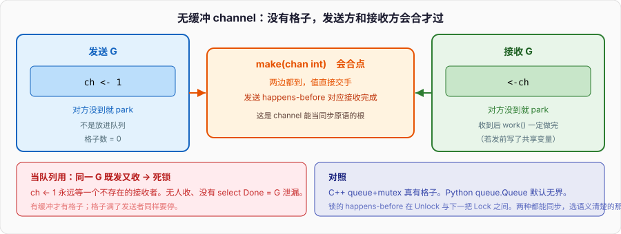

# Channel与并发

```go
func main() {
	ch := make(chan int) // 无缓冲
	go func() {
		ch <- 1
	}()
	fmt.Println(<-ch)
}
```

无缓冲 channel 没有格子。`ch <- 1` 的那一方必须等到另一边 `<-ch` 也到了，两个 G 才能一起过。它是同步点，是会合（rendezvous），不是队列。

把无缓冲当队列用，典型死锁长这样：

```go
func deadlock() {
	ch := make(chan int)
	ch <- 1     // main G 在这里永远等一个不存在的接收者
	<-ch
}
```

只有一个 G，既要送又要收，无缓冲做不到。C++ 的 `std::queue` 加一把锁是真有格子的；Python 的 `queue.Queue` 默认无界。Go 的无缓冲 channel 格子数为 0。缓冲 channel 才有格子，格子满了发送者同样要停。

下面把缓冲/非缓冲、close 规则、select、nil channel、mutex vs channel、data race、`-race`、happens-before 钉完。GMP 篇讲了 G 怎么被调度；本篇讲两个 G 碰到同一块数据时，什么东西提供 happens-before。



---

## 一、无缓冲是会合，有缓冲才是格子

### 1、无缓冲：两边都到才过

```go
done := make(chan struct{})
go func() {
	work()
	done <- struct{}{}
}()
<-done
```

`<-done` 发生之后，`work()` 一定已经执行完。发送和接收在语言内存模型里同步：发送 happens-before 对应接收的完成。这是 channel 能当同步原语用的根。

```go
var a string

func f() {
	a = "hello"
	done <- struct{}{}
}

func main() {
	go f()
	<-done
	fmt.Println(a) // 一定是 hello，不是 data race
}
```

没有 channel、没有其它同步，main 读 `a` 就是 race。有了这次发送-接收，写 `a` happens-before 读 `a`。

C++ 对应：`std::mutex` 解锁 happens-before 下一次加锁；`std::thread::join` happens-before join 返回后的读。Python 的 `queue.Queue.put/get` 也同步。Go 把「同步」做成了类型的一部分：channel 的收发自带，裸共享变量不带。

### 2、有缓冲：格子数是容量

```go
ch := make(chan int, 2)
ch <- 1
ch <- 2
// ch <- 3 // 会阻塞，直到有人收走一个
fmt.Println(<-ch, <-ch)
```

容量 2 表示最多两个已经发送、尚未接收的值。发送在「有空格」时不阻塞，接收在「有值」时不阻塞。满了发送者停，空了接收者停。

缓冲 **不取消** happens-before：第 n 次发送 happens-before 第 n 次接收完成。容量 2 时，第一次发送和第 3 次接收之间，不能靠「这是同一个 channel」直接下结论——中间隔了格子。具体规则：

- 无缓冲：每次发送和对应接收同步；
- 有缓冲：第 k 次发送 happens-before 第 k 次接收完成；第 k 次接收 happens-before 第 k+C 次发送完成（C 是容量），这条保证「格子空出来了发送者才能继续」的顺序。

```go
ch := make(chan int, 1)
go func() {
	a = "hello"
	ch <- 1
}()
<-ch
fmt.Println(a) // 仍然安全：第一次发送 happens-before 第一次接收
```

容量不是「异步就可以不管同步」。它只是允许发送者在格子空着时先走。值本身的可见性仍然靠这次收发配对。

### 3、长度、容量、零值

```go
var ch chan int          // nil channel，后面单独钉
ch2 := make(chan int)    // 无缓冲，cap=0
ch3 := make(chan int, 8) // 缓冲 8
fmt.Println(len(ch3), cap(ch3)) // 0 8；len 是当前格子里的元素个数
```

`len(ch)` 对无缓冲总是 0。对有缓冲是当前未接收的元素数。这个数拿来做逻辑会 race：你读到 len==0，下一纳秒别人就塞进来了。`len` 只适合观测和测试，不适合当条件。

channel 是引用类型。赋值拷的是指向 hchan 的指针，不是拷队列。

```go
a := make(chan int, 1)
b := a
b <- 7
fmt.Println(<-a) // 7，同一条 channel
```

和切片头一样：盒子里是指针。和切片不一样：没有「扩容换底层数组」，容量在 `make` 时钉死。

### 4、方向：只发、只收

```go
func produce(out chan<- int) {
	out <- 1
	close(out)
}

func consume(in <-chan int) {
	for v := range in {
		fmt.Println(v)
	}
}

func main() {
	ch := make(chan int, 1)
	go produce(ch)
	consume(ch)
}
```

`chan<-` 只能发，`<-chan` 只能收。双向 channel 能赋给单向，反向不行。这是类型系统帮你把「谁负责 close」画出来：通常发送方 close，所以发送方拿到双向或 `chan<-`，接收方只拿 `<-chan`。接收方 close 是设计错误。

---

## 二、close：谁关、关了之后发生什么

### 1、规则

- 只 close 一次。第二次 panic。
- 只由发送方 close。接收方关，发送方下一次发送 panic。
- 向已关闭的 channel 发送 panic。
- 从已关闭的 channel 接收：立刻返回剩余值，耗尽后返回零值，不阻塞。
- close(nil channel) panic。
- 关闭无缓冲且没有接收者等待，只是把状态标上；已经等在接收的 G 会被唤醒，拿到零值。

```go
ch := make(chan int, 2)
ch <- 1
ch <- 2
close(ch)
fmt.Println(<-ch) // 1
fmt.Println(<-ch) // 2
v, ok := <-ch
fmt.Println(v, ok) // 0 false
```

`ok == false` 表示「关了且空了」，不是「关了」。关了但格子里还有值时 `ok` 仍是 true。

### 2、range 直到关闭

```go
for v := range ch {
	fmt.Println(v)
}
```

等价于一直收，直到 close 且空。channel 不关，range 永远不结束。这是死锁的第二常见写法：生产者忘了 close，消费者 `range` 卡死，`WaitGroup` 再怎么等也过不去——或者反过来，main 已经返回了。

```go
func leak() {
	ch := make(chan int)
	go func() {
		for i := 0; i < 3; i++ {
			ch <- i
		}
		// 忘了 close(ch)
	}()
	for v := range ch { // 收到 0 1 2 之后永远阻塞
		fmt.Println(v)
	}
}
```

多个接收者 `range` 同一条 channel：关闭后大家都结束，值不会重复，每个值只被一个接收者拿走。多个发送者：谁来 close？不能每个人关一次。要么再加一条信号，要么让唯一的协调者关，要么不用 close、改用 `WaitGroup` 等发送方结束。

### 3、不要用 close 传「值」

close 的语义是「不会再有新值」。用 close 当广播「开始」可以：

```go
start := make(chan struct{})
for i := 0; i < 10; i++ {
	go func() {
		<-start // 所有人等关闭
		work()
	}()
}
close(start) // 广播：开始
```

无缓冲或缓冲都可以。关闭会唤醒所有接收者。这是 fan-out 信号，不是数据通道。数据通道关了再关一次就是 panic，别把 close 当普通 API 调。

### 4、comma-ok 和零值陷阱

```go
ch := make(chan *User, 1)
close(ch)
u := <-ch
u.Name // panic：u 是 nil，因为零值
```

关了之后收到的是元素类型的零值。指针、切片、接口的零值是 nil。必须用 `v, ok := <-ch`，`ok` 为 false 时不要碰 `v` 当有效数据。`error` 当元素类型时零值是 nil，看起来像「成功」，更阴。

---

## 三、select：同时等几件事

### 1、随机挑就绪的那条

```go
select {
case v := <-a:
	fmt.Println("a", v)
case v := <-b:
	fmt.Println("b", v)
case a <- 1:
	fmt.Println("sent a")
default:
	fmt.Println("none ready")
}
```

所有 case 在进入 select 时一起判断。多个都就绪，**均匀随机**挑一个，不是从上到下。依赖 case 书写顺序是 bug。没有 default 且都没就绪，G 阻塞，直到某一条就绪。有 default，立刻走 default。

```go
select {
case <-time.After(time.Second):
	fmt.Println("timeout")
case v := <-ch:
	fmt.Println(v)
}
```

这是超时接收。`time.After` 每次调用创建一个 timer，select 结束后 timer 若没被选中会在到点时仍向那个 channel 发——1.23 之前这是泄漏 timer 的常见点。循环里 `select` + `time.After` 会制造大量 timer。用 `time.NewTimer` 并 `Stop`，或 1.23+ 的改进（未触发的 `After` 会被 GC 回收得更干净，但仍不该在热循环里乱造）。

### 2、空 select 和只有阻塞 case

```go
select {} // 永远阻塞这个 G
```

`main` 里写 `select{}` 等于把主 G 停住，进程不退出，其它 G 继续。没有 case 的 select 就是死等。nil channel 的收发永远不就绪，见第四节。

### 3、select 里 close 和零值

从已关闭 channel 收，永远就绪，立刻返回零值。select 会反复选中这一支，看起来像热循环。

```go
ch := make(chan int)
close(ch)
for i := 0; i < 3; i++ {
	select {
	case v := <-ch:
		fmt.Println(v) // 0 0 0，每次都就绪
	case <-time.After(time.Second):
		fmt.Println("timeout")
	}
}
```

所以关了的 channel 要让循环退出，不要继续 select 它，除非用 comma-ok 判断。

```go
for {
	select {
	case v, ok := <-ch:
		if !ok {
			return
		}
		use(v)
	case <-ctx.Done():
		return
	}
}
```

### 4、尝试发送 / 尝试接收

```go
select {
case ch <- v:
	// 送进去了
default:
	// 满了或没人收，放弃
}

select {
case v := <-ch:
	_ = v
default:
	// 空了
}
```

这是非阻塞一次。不要用它写忙等：

```go
for {
	select {
	case v := <-ch:
		use(v)
	default:
		// 空转烧 CPU
	}
}
```

空转会把一个 P 打满。该阻塞就阻塞，让调度器去跑别人。非阻塞只用于「现在能推就推，不能就丢」的明确策略，比如 metrics、日志的丢失可接受路径。

---

## 四、nil channel：永远阻塞的那一支

### 1、收、发、close

```go
var ch chan int // nil
// <-ch      // 永远阻塞
// ch <- 1   // 永远阻塞
// close(ch) // panic
```

nil channel 的收发在 select 里 **永远不就绪**，等于把那条 case 关掉。这是有用的，不是陷阱本身。陷阱是你不知道它是 nil。

### 2、用 nil 关掉 select 的一支

```go
func merge(a, b <-chan int) <-chan int {
	out := make(chan int)
	go func() {
		defer close(out)
		for a != nil || b != nil {
			select {
			case v, ok := <-a:
				if !ok {
					a = nil
					continue
				}
				out <- v
			case v, ok := <-b:
				if !ok {
					b = nil
					continue
				}
				out <- v
			}
		}
	}()
	return out
}
```

`a` 关了之后若还留在 select 里，它会一直就绪并吐零值。赋成 nil，这一支从 select 消失，只留 `b`。两条都 nil 时循环结束。这是 fan-in 的标准写法。

### 3、函数返回的 channel 别是 nil

```go
func maybe(ok bool) <-chan int {
	if !ok {
		return nil // 调用方 range 或收，永远阻塞
	}
	ch := make(chan int, 1)
	ch <- 1
	close(ch)
	return ch
}
```

失败就返回 nil channel，调用方很难区分「还没数据」和「根本没有这条通道」。失败用 error 返回；channel 要么有，要么关。需要「禁用某一支」时，在 select 内部把变量设成 nil，不要把 nil 当 API 返回值。

---

## 五、mutex 还是 channel

### 1、保护内存，用 mutex

```go
type counter struct {
	mu sync.Mutex
	n  int
}

func (c *counter) Inc() {
	c.mu.Lock()
	c.n++
	c.mu.Unlock()
}

func (c *counter) Get() int {
	c.mu.Lock()
	defer c.mu.Unlock()
	return c.n
}
```

一块内存被多个 G 读写，锁的是这块内存的访问权。channel 也能凑：把计数器放到一个 G 里，别人发「+1」消息。那是把锁换成了串行化的 G，多一次拷贝、一次调度。计数器、map、缓存条目，mutex / `sync.RWMutex` 更直接。

Go 的 map 不是并发安全的，并发读写会 panic（不是静默坏数据那么温和）。

```go
func mapPanic() {
	m := map[int]int{}
	go func() {
		for {
			m[1] = 1
		}
	}()
	for {
		_ = m[1]
	}
}
```

保护 map：mutex，或 `sync.Map`（特定场景：键稳定、写少读多、键两两不相交）。不要为了「看起来并发」给每个请求拷一份再合——那是另一回事。

### 2、传递所有权、等待事件，用 channel

```go
results := make(chan Result, n)
for _, job := range jobs {
	job := job
	go func() {
		results <- do(job)
	}()
}
for i := 0; i < n; i++ {
	r := <-results
	use(r)
}
```

数据从哪个 G 交到哪个 G，channel 把所有权移过去。发送之后发送方不再碰这块数据，接收方独占——这是「不要共享内存，通过通信来共享」的原句。适合流水线、超时、取消、fan-in/fan-out。

不适合：每个 `n++` 都走 channel；已经在同一个结构体上的一堆字段，本该一把锁罩住，拆成好几条 channel 只会把时序打散。

### 3、两种混用时的死锁

```go
var mu sync.Mutex
ch := make(chan int)

func bad() {
	mu.Lock()
	ch <- 1     // 阻塞时锁还握着
	mu.Unlock()
}

func other() {
	<-ch
	mu.Lock() // 可能永远拿不到
	mu.Unlock()
}
```

持锁时做可能阻塞的 channel 操作，是死锁经典配方。持锁时调用户回调、持锁时 `Wait` 另一个要同一把锁的 G，同类。规则：锁的临界区短，只碰内存；跨 G 等待用 channel / `cond`，此时不要握着 mutex。

```go
func better() {
	mu.Lock()
	v := takeLocked()
	mu.Unlock()
	ch <- v
}
```

### 4、`sync.WaitGroup`、`Once`、`Cond`

```go
var wg sync.WaitGroup
wg.Add(2)
go func() { defer wg.Done(); f() }()
go func() { defer wg.Done(); g() }()
wg.Wait()
```

`Add` 必须在 `Wait` 之前、且不能在已经 `Wait` 等着的时候把计数从 0 往上加出乱子。`Add(1)` 放在 `go func` **里面** 是 race：可能 `Wait` 先看到 0 就返回。

```go
var once sync.Once
once.Do(initAll) // 并发调用也只跑一次；panic 会让 Once 认为没完成，会再试
```

`sync.Cond` 几乎总是能用 channel 换掉。要用就记住：`Wait` 必须在锁里，必须循环检查谓词，和 C++ `condition_variable` 同一条。新代码优先 channel 或 `WaitGroup`。

---

## 六、data race 和 happens-before

### 1、什么是 race

同一变量，至少一次写，两次访问来自不同 G，中间没有 happens-before，就是 data race。Go 的 race **不是** C++ 那种整程序 UB——规范说实现可以允许程序继续跑，结果不对。但编译器同样可以按「没有 race」来优化。当 bug 修，不当「偶发错数」。

```go
var x int

func race() {
	go func() { x = 1 }()
	fmt.Println(x) // 读和写无同步
}
```

切片头、接口值、字符串内部指针、map，都是变量。拷贝切片头是读头里的三个字；另一边 `append` 可能写同一个头——也是 race。

```go
func sliceRace() {
	s := []int{1, 2, 3}
	go func() {
		s = append(s, 4) // 写 s 这个变量
	}()
	_ = s[0] // 读 s
}
```

即便底层数组碰巧没 realloc，对 `s` 这个 header 的并发读写仍是 race。保护 header，或约定「只有一个 G 碰这条切片变量，元素所有权用 channel 交出去」。

### 2、happens-before 从哪来

Go 内存模型（1.19 起写得更接近硬件，但用户该用的同步原语没变）里，程序顺序之外，这些建立同步：

- 无缓冲发送 happens-before 对应接收完成；
- 有缓冲第 k 次发送 happens-before 第 k 次接收完成；
- `close` happens-before 接收到零值那次；
- `mutex.Unlock` happens-before 另一次 `Lock` 返回；
- `Once.Do` 里的 f 完成 happens-before `Do` 返回；
- `WaitGroup.Done` 把计数减到 0 happens-before `Wait` 返回；
- `go f()` 的启动 happens-before `f` 开始执行；
- 初始化包级变量的完成 happens-before `main` 或任何 `go`。

没有：普通变量的读写、`time.Sleep`（睡完不保证看见别人没同步的写）、读 `len(ch)`。

```go
var a, b int

func f() {
	a = 1
	b = 2
}

func g() {
	fmt.Println(b, a) // 无同步：可能看到 0 0、2 1、2 0……
}

func main() {
	go f()
	g()
}
```

要看见 `a==1 && b==2`，在 `f` 末尾发 channel / unlock，在 `g` 开头收 / lock。

### 3、`sync/atomic`

```go
var n atomic.Int64 // 1.19+

func bump() { n.Add(1) }
func get() int64 { return n.Load() }
```

原子操作自己和自己排好序。`Add` / `Load` / `Store` / `CompareAndSwap`。保护的就是这一个变量，旁边字段不管。发布协议（先写 payload 再 `Store` flag，对面 `Load` 再读 payload）：1.19+ 内存模型下这对 `Store`/`Load` 同步，`data` 可见。`atomic.Int64` 比裸 `int64` + `atomic.AddInt64` 更难被误拷贝。

能用 mutex 说清楚的地方不要上 atomic。计数器、关停标志、状态机 CAS，才是它的地盘。

### 4、`-race`

```
go test -race ./...
go run -race .
go build -race -o app
```

race detector 基于类似 ThreadSanitizer 的影子内存。慢几倍，多吃内存。CI 上跑测试必须带。生产二进制一般不带，太贵。它抓的是 **这次执行实际发生的冲突访问**。没报不等于没有：路径没走到、窗口太窄。报了就是有，修。

`counter` 内部无锁时，带 `-race` 的测试会点名 `Inc` 里的 `n++`。有锁或改 `atomic.Int64` 该干净。detector 认 channel、mutex、WaitGroup、Once、atomic。自己用 `unsafe` 拼的「肯定没事」它不认，会报。听它的。

---

## 七、常见死锁和泄漏

开篇那条：无缓冲当队列，同一 G 既发又收。修复是加缓冲、或先起接收者。

runtime 的 deadlock 检测只在 **没有一个 G 能跑** 时开火。泄漏一个永远阻塞的 G，但 main 还在服务，检测器沉默。`runtime.NumGoroutine` 单调涨才是信号。

发送者往无缓冲发、接收者已经走：发送者卡死，G 泄漏。带 `ctx.Done()` 的 select 是常规出口：

```go
select {
case ch <- 1:
case <-ctx.Done():
	return ctx.Err()
}
```

缓冲只能吸收抖动。`make(chan int, 8)` 塞第 9 个开始阻塞；唯一的消费者已经 return，就是死锁或泄漏。生命周期用 context 取消树管（下一篇）。

---

## 八、流水线、fan-in、fan-out

每个阶段关闭自己的 out，下游 `range` 自然结束。取消从 ctx 进来，发送必须 `select` 盯 `Done`，否则上游堵在无人接收的 out 上，取消救不了。

```go
func sq(ctx context.Context, in <-chan int) <-chan int {
	out := make(chan int)
	go func() {
		defer close(out)
		for n := range in {
			select {
			case out <- n * n:
			case <-ctx.Done():
				return
			}
		}
	}()
	return out
}
```

fan-out：多个 worker `range` 同一条 in。fan-in：各自的 out 再合。close 只有一个协调者做——`WaitGroup.Wait` 完所有 recv 再 `close(out)`。worker 不要每人 close 一次。

```go
func fanIn(ctx context.Context, cs ...<-chan int) <-chan int {
	var wg sync.WaitGroup
	out := make(chan int)
	wg.Add(len(cs))
	for _, c := range cs {
		c := c
		go func() {
			defer wg.Done()
			for v := range c {
				select {
				case out <- v:
				case <-ctx.Done():
					return
				}
			}
		}()
	}
	go func() { wg.Wait(); close(out) }()
	return out
}
```

---

## 九、和 C++ / Python 对照

### 1、C++

C++ 没有 channel。`std::mutex` + `std::condition_variable` + `std::queue` 是手搓的有缓冲 channel。无缓冲会合要用两把锁或 `std::promise`/`future`，或 `std::latch`。data race 是 UB，TSan 抓。Go 的 race 不是 UB 但照样是 bug；`-race` 对应 TSan。

C++ 内存序有 relaxed / acquire / release / seq_cst。Go 不把这些暴露给普通代码：mutex 和 channel 提供的是「够强的同步」，atomic 包是显式的。不要在 Go 里用 C++ 的 relaxed 直觉去读普通变量。

### 2、Python

`threading.Lock` 类似 mutex。`queue.Queue` 类似有缓冲 channel（默认无界，这点不同：Go 必须说容量）。`asyncio.Queue` 在同一条事件循环上，不是多线程会合。GIL 让很多「看起来没锁的 int += 1」碰巧过关，换 C 扩展或 `multiprocessing` 立刻暴露。Go 没有 GIL，两个 G 的 `x++` 就是 race，`-race` 会打。

Python 没有语言级 happens-before 文档给普通对象；Go 有 [The Go Memory Model](https://go.dev/ref/mem)。写共享变量之前先问：这一对读写之间，哪一条同步事件？

---

## 十、一段可跑的对照

```go
package main

import (
	"fmt"
	"sync"
	"sync/atomic"
)

func main() {
	var a string
	done := make(chan struct{})
	go func() {
		a = "hello"
		done <- struct{}{}
	}()
	<-done
	fmt.Println("rendezvous", a)

	ch := make(chan int, 2)
	ch <- 1
	ch <- 2
	close(ch)
	for v := range ch {
		fmt.Println("buf", v)
	}

	var nilCh chan int
	ready := make(chan int, 1)
	ready <- 7
	select {
	case <-nilCh:
		fmt.Println("nil")
	case v := <-ready:
		fmt.Println("nilCase", v)
	}

	try := make(chan int, 1)
	select {
	case try <- 1:
		fmt.Println("try1", true)
	default:
		fmt.Println("try1", false)
	}
	select {
	case try <- 2:
		fmt.Println("try2", true)
	default:
		fmt.Println("try2", false)
	}
	fmt.Println("recv", <-try)

	x, y := make(chan int, 2), make(chan int, 2)
	x <- 1
	x <- 3
	close(x)
	y <- 2
	close(y)
	for x != nil || y != nil {
		select {
		case v, ok := <-x:
			if !ok {
				x = nil
				continue
			}
			fmt.Println("merge", v)
		case v, ok := <-y:
			if !ok {
				y = nil
				continue
			}
			fmt.Println("merge", v)
		}
	}

	var mu sync.Mutex
	n := 0
	var wg sync.WaitGroup
	wg.Add(50)
	for i := 0; i < 50; i++ {
		go func() {
			defer wg.Done()
			mu.Lock()
			n++
			mu.Unlock()
		}()
	}
	wg.Wait()
	fmt.Println("counter", n)

	var hits atomic.Int64
	wg.Add(50)
	for i := 0; i < 50; i++ {
		go func() {
			defer wg.Done()
			hits.Add(1)
		}()
	}
	wg.Wait()
	fmt.Println("atomic", hits.Load())

	sig := make(chan struct{})
	go close(sig)
	<-sig
	fmt.Println("closed-broadcast")
}
```

跑完对照：会合后一定看到 `hello`；缓冲 1、2 关了 `range` 结束；nil 那支没被选中，拿到 7；第二次 trySend 走 default；merge 把两条关了的 channel 收干净；50 个 G 加锁计数是 50，atomic 也是 50；close 当广播立刻返回。把 `mu` 拿掉跑 `go run -race`，detector 点名 `n++`。把开篇 `ch := make(chan int); ch <- 1` 放进 `main`，fatal deadlock。

---

## 十一、清单

无缓冲 channel 是会合点，不是队列；当成队列会在同一个 G 上锁死。有缓冲才有格子，满了照样停；第 k 次发送 happens-before 第 k 次接收。发送方 close，只关一次；关了再发 panic；收关闭的 channel 得零值，`ok==false` 才是尽了。`range` 等到 close。select 多就绪随机挑，default 非阻塞，空 select 永远停。nil channel 收发永不就绪，用来从 select 里摘掉一支。保护内存用 mutex，移交所有权、等待事件用 channel；持锁时不要做会阻塞的收发。两个 G 碰同一变量必须有 happens-before：channel、mutex、WaitGroup、Once、atomic、`go` 启动。没有 GIL。`go test -race` 当常规。G 泄漏的典型是发送没人收、`range` 没人关、select 没盯 ctx。

下一篇：没有 `free`，RSS 仍能被切片底层数组钉死。GC 的三色、混合写屏障、pacer、栈与堆、`sync.Pool`。
