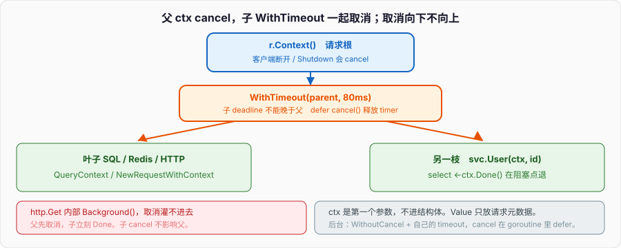

# Context与错误处理

```go
func handler(w http.ResponseWriter, r *http.Request) {
	resp, err := http.Get("https://downstream/api") // 没用 r.Context()
	if err != nil {
		http.Error(w, err.Error(), 502)
		return
	}
	defer resp.Body.Close()
	io.Copy(w, resp.Body)
}
```

客户端已经断开，网关超时，这个 handler 还在等下游。下游如果再调更下游，整条链都在空转：goroutine、连接、下游的 CPU。父请求的寿命和子调用的寿命没接上。

`http.Request` 自带 `Context()`。客户端走了，server 取消这个 ctx。下游调用必须带着它走，超时和取消才能从入口灌到叶子。ctx 是第一个参数，不是结构体字段。错误往回走时带上链：`fmt.Errorf("downstream: %w", err)`，上面用 `errors.Is` / `As` 认，不要 `err.Error() == "timeout"` 这种字符串。

基础入门篇把 `error` 当值讲过，接口篇点过 `%w` 和 `Is`。本篇把取消树和错误链钉完：什么时候 `WithTimeout`，什么时候 `WithCancel`，为什么 ctx 不能塞进结构体，wrap 之后 sentinel 还在不在。

---

## 一、下游超时了，父请求还在等

### 1、请求的寿命是一棵树

一个 HTTP 进来，handler 调服务 A，A 调 B 和 C，B 再调 Redis。这棵调用树的根是入口请求。根死了（超时、客户端断开、server shutdown），所有还没做完的枝都该停。停不是礼貌，是资源：每个还在等的 `Read` 是一个 G，可能还占着一条下游连接。



```go
func handler(w http.ResponseWriter, r *http.Request) {
	ctx := r.Context()
	user, err := svc.User(ctx, id)
	if err != nil {
		http.Error(w, err.Error(), statusOf(err))
		return
	}
	_ = user
}
```

`svc.User` 必须收 `ctx`，里面的 SQL、HTTP、Redis 都把同一个 ctx 往下传。入口取消，`QueryContext`、`NewRequestWithContext` 能在下一次阻塞点返回。

### 2、`http.Get` 不认这棵树

```go
resp, err := http.Get(url) // 内部用 context.Background()
```

`http.Get` / `http.Post` 没有 ctx 参数，取消灌不进去。要用：

```go
req, err := http.NewRequestWithContext(ctx, http.MethodGet, url, nil)
if err != nil {
	return err
}
resp, err := client.Do(req)
```

`DefaultClient` 没有超时。生产里自己构造 `http.Client{Timeout: ...}`，同时仍把 ctx 传进 Request：Client.Timeout 是整次交换的上限，ctx 是请求树的上限，两者都要。

```go
var client = &http.Client{Timeout: 5 * time.Second}

func fetch(ctx context.Context, url string) error {
	req, err := http.NewRequestWithContext(ctx, http.MethodGet, url, nil)
	if err != nil {
		return err
	}
	resp, err := client.Do(req)
	if err != nil {
		return fmt.Errorf("get %s: %w", url, err)
	}
	defer resp.Body.Close()
	_, err = io.Copy(io.Discard, resp.Body)
	return err
}
```

父 ctx 1 秒到期，`Do` 返回 `context.DeadlineExceeded`（包在 url 错误里）。Client.Timeout 5 秒那条不会先到。只设 Client.Timeout、ctx 用 `Background`，父请求取消了下游仍跑满 5 秒。

### 3、数据库同样

```go
row := db.QueryRowContext(ctx, "SELECT name FROM users WHERE id=$1", id)
```

`QueryRow` 没有 Context 的那个，取消不管。连接从池里借出来，查询卡在锁等待，父请求已经 502 了，这条连接还占着。所有 `database/sql` 的 `*Context` 方法才是和请求树对接的 API。Redis、gRPC、自己的 RPC 客户端同一条：函数签名第一个参数是 `ctx`。

---

## 二、context 包：树、值、取消

### 1、四种构造

```go
ctx := context.Background()                          // 根，永不取消
ctx = context.TODO()                                 // 还不知道传什么，占位
ctx, cancel := context.WithCancel(parent)
ctx, cancel := context.WithTimeout(parent, 3*time.Second)
ctx, cancel := context.WithDeadline(parent, time.Now().Add(3*time.Second))
ctx = context.WithValue(parent, key, val)
```

`Background` 是 `main`、`init`、测试顶层、以及确实没有请求树的后台任务的根。`TODO` 是「这里该有 ctx，我暂时没接到」——过完就该换成真的。不要用 `TODO` 当生产根。

`WithCancel` / `WithTimeout` / `WithDeadline` 都返回 `cancel`。**调用 cancel**，否则 timer、子节点登记泄漏到父 ctx 结束为止。`WithTimeout` 内部就是 `WithDeadline(now+d)`。

```go
ctx, cancel := context.WithTimeout(r.Context(), 3*time.Second)
defer cancel()
```

`defer cancel()` 每次都写。超时自己会取消，提前返回时 defer 把 timer 停掉。漏掉 cancel，在循环里造 timeout ctx，就是 timer 泄漏。

### 2、取消沿树向下，不向上

```go
parent, stop := context.WithCancel(context.Background())
defer stop()
child, stop2 := context.WithTimeout(parent, time.Second)
defer stop2()
```

`stop()` 取消 parent，child 跟着取消。`stop2()` 只取消 child，parent 还活着。这是树：父死子死，子死父不管。一个 handler 里某次下游调用该 200ms 超时，用 child timeout，不要改入口 ctx 的 deadline——否则旁边那次该跑 2 秒的调用也被切掉。

```go
func (s *Svc) Page(ctx context.Context, id int) (Page, error) {
	uctx, cancel := context.WithTimeout(ctx, 200*time.Millisecond)
	defer cancel()
	u, err := s.user.Get(uctx, id)
	if err != nil {
		return Page{}, fmt.Errorf("user: %w", err)
	}
	pctx, cancel2 := context.WithTimeout(ctx, 2*time.Second)
	defer cancel2()
	posts, err := s.posts.List(pctx, id)
	if err != nil {
		return Page{}, fmt.Errorf("posts: %w", err)
	}
	return Page{User: u, Posts: posts}, nil
}
```

入口 ctx 仍是请求寿命。user 和 posts 各自加更紧的上限。入口 1 秒到期，两个 child 无论自己设了 2 秒都会停——父的 deadline 取更早的那个。

### 3、`Done`、`Err`、`Deadline`

```go
select {
case <-ctx.Done():
	return ctx.Err() // Canceled 或 DeadlineExceeded
case v := <-ch:
	return use(v)
}
```

`Done()` 返回的 channel 在取消或到期时关闭。关闭是广播，多少个 G 在 select 都能醒来。`Err()` 在 `Done` 关闭后返回原因：`context.Canceled` 或 `context.DeadlineExceeded`，没关时返回 nil。`Deadline()` 返回绝对时间和「有没有 deadline」。

```go
if dl, ok := ctx.Deadline(); ok {
	if time.Until(dl) < 10*time.Millisecond {
		return context.DeadlineExceeded // 来不及做了，别再打一次下游
	}
}
```

阻塞在 channel、锁、syscall 时，必须把 `ctx.Done()` 放进 select 或用带 Context 的 API。自己写的 `for { recv }` 不看 ctx，取消树在你这里断掉。

### 4、派生之后 parent 仍然可以更早到期

```go
parent, cancel := context.WithTimeout(context.Background(), 100*time.Millisecond)
defer cancel()
child, cancel2 := context.WithTimeout(parent, 5*time.Second)
defer cancel2()
<-child.Done()
fmt.Println(child.Err()) // 约 100ms 后 DeadlineExceeded，不是 5s
```

child 的有效 deadline 是 parent 和自己之间更早的。文档原句：派生 ctx 不能把 deadline 往 **更晚** 推。想要独立寿命，不要从请求 ctx 派生，另起 `Background`——那是故意断树，后台任务才这么干，并且要自己的超时。

---

## 三、ctx 必须是第一个参数

### 1、签名合同

```go
func GetUser(ctx context.Context, id int) (User, error)
```

第一个参数，名字就叫 `ctx`。这是整条生态的约定：`net/http`、`database/sql`、gRPC、几乎所有 SDK。中间件看到 `ctx context.Context` 在第一位，才知道把请求 ctx 传进去。

不要：

```go
func GetUser(id int, ctx context.Context) // 破例
func GetUser(id int) (User, error)        // 树在这里断
```

旧代码没有 ctx，加参数会改所有调用点。加。不要用全局 `context.Background()` 在叶子里「补一个」——那是假装接上，取消灌不下来。

### 2、不要把 ctx 塞进结构体

```go
type Client struct {
	ctx context.Context // 不要
	url string
}

func NewClient(ctx context.Context, url string) *Client {
	return &Client{ctx: ctx, url: url}
}

func (c *Client) Get(id int) error {
	return c.do(c.ctx, id) // 哪个请求的 ctx？构造时那个
}
```

`Client` 活过很多个请求。构造时塞进去的 ctx 要么是 `Background`（取消无意义），要么是某个请求的 ctx（这个 Client 被下一个请求复用时，上一个请求的取消会误杀下一个，或者 deadline 早就过了）。方法自己收 `ctx`：

```go
type Client struct {
	url    string
	client *http.Client
}

func (c *Client) Get(ctx context.Context, id int) error {
	return c.do(ctx, id)
}
```

结构体可以存 logger、http.Client、连接池。寿命和请求无关的放字段；寿命等于这次调用的放参数。ctx 属于后者。

例外（很少）：工作队列里一条 job 结构带着这次 job 的 ctx，job 不跨请求复用，做完就扔。即便如此，跑 job 的函数仍应把 `job.ctx` 作为第一参数传给下游，而不是让下游去读字段。字段当运输，函数边界仍是参数。

### 3、`WithValue` 只放请求级元数据

```go
type ctxKey struct{}

func WithTraceID(ctx context.Context, id string) context.Context {
	return context.WithValue(ctx, ctxKey{}, id)
}

func TraceID(ctx context.Context) string {
	id, _ := ctx.Value(ctxKey{}).(string)
	return id
}
```

键用未导出类型，避免和别人的 string 键撞。值：trace id、登录用户、请求级 bag。不要放：可选参数、整棵依赖树、logger 配置、本该是函数参数的 `id int`。`WithValue` 每次包一层，查找是沿父链线性扫。热路径塞十层大对象，既慢又把那些对象钉到 ctx 活着的整段时间——GC 篇的可达图。

```go
// 错：把业务参数藏进 ctx
ctx = context.WithValue(ctx, "userID", 7)
u, err := GetUser(ctx)

// 对
u, err := GetUser(ctx, 7)
```

可选参数用结构体，不用 ctx。Python 的隐式 `contextvars`、C++ 的 TLS，都有人拿来藏「当前用户」。Go 把诱惑做成了 `WithValue`，然后文档写：仅传输跨 API 的请求元数据，不是可选参数列表。

### 4、启动 goroutine 时 ctx 怎么传

```go
func (s *Svc) Handle(ctx context.Context, req Req) error {
	go s.audit(ctx, req) // 危险：Handle 返回后入口可能 cancel，audit 被切
	return s.do(ctx, req)
}
```

请求结束会取消 ctx。后台审计还想跑完，不能用请求 ctx。断树：

```go
func (s *Svc) Handle(ctx context.Context, req Req) error {
	bg := context.WithoutCancel(ctx) // 1.21+：拷贝值，去掉取消
	go s.audit(bg, req)
	return s.do(ctx, req)
}
```

`WithoutCancel` 保留 Value，丢掉取消和 deadline。后台任务自己加超时：

```go
bg, cancel := context.WithTimeout(context.WithoutCancel(ctx), 5*time.Second)
defer cancel() // 在 audit 里 defer，不是在 Handle 里——Handle 马上返回
go func() {
	defer cancel()
	s.audit(bg, req)
}()
```

1.21 之前没有 `WithoutCancel`，用 `context.Background()` 再把需要的 value 自己拷过去，或自己写一层只转发 Value 的 ctx。不要 `go f(ctx)` 完事还以为请求取消和后台无关。

---

## 四、阻塞点必须看见 ctx

### 1、select 是手写 API 的标准形状

```go
func send(ctx context.Context, ch chan<- Msg, m Msg) error {
	select {
	case ch <- m:
		return nil
	case <-ctx.Done():
		return ctx.Err()
	}
}

func recv(ctx context.Context, ch <-chan Msg) (Msg, error) {
	select {
	case m, ok := <-ch:
		if !ok {
			return Msg{}, fmt.Errorf("chan closed")
		}
		return m, nil
	case <-ctx.Done():
		return Msg{}, ctx.Err()
	}
}
```

无缓冲或缓冲满，发送会停。没有 `Done` 这一支，取消到不了这个 G。channel 篇的泄漏发送者，出口就是这个 select。

### 2、`time.After` 在循环里

```go
for {
	select {
	case <-ctx.Done():
		return ctx.Err()
	case <-time.After(time.Second):
		tick()
	}
}
```

每次 `After` 一个 timer。ctx 很快取消时，未触发的 timer 仍占着。改成：

```go
t := time.NewTimer(time.Second)
defer t.Stop()
for {
	select {
	case <-ctx.Done():
		return ctx.Err()
	case <-t.C:
		tick()
		if !t.Stop() {
			select {
			case <-t.C:
			default:
			}
		}
		t.Reset(time.Second)
	}
}
```

或 `time.NewTicker`。1.23 对未引用的 `After` timer 更友好，热循环仍不该每次造。

### 3、`sync.Mutex` 没有 Context

锁没有 `LockContext`。持锁时再等 ctx，或等 ctx 时握着锁，死锁配方见 channel 篇。长等待用 channel / 带 ctx 的 API；锁只罩内存。需要「抢锁也响应取消」：

```go
func lock(ctx context.Context, mu *sync.Mutex) error {
	done := make(chan struct{})
	go func() {
		mu.Lock()
		close(done)
	}()
	select {
	case <-done:
		return nil
	case <-ctx.Done():
		go func() {
			<-done
			mu.Unlock() // 晚到的锁立刻放掉
		}()
		return ctx.Err()
	}
}
```

这段有代价：取消后那个 G 仍可能卡在 `Lock` 上直到锁真的轮到。能不用就不用。设计上避免「必须取消正在抢的 mutex」。

### 4、`errgroup` 把取消和 Wait 焊在一起

```go
g, ctx := errgroup.WithContext(parent)
g.Go(func() error { return fetch(ctx, a) })
g.Go(func() error { return fetch(ctx, b) })
if err := g.Wait(); err != nil {
	return err
}
```

任一个返回错误，派生的 ctx 取消，其它函数在阻塞点退出。`Wait` 收第一个错误。1.20+ `g.SetLimit(n)` 限制并发。这是「同一层扇出几次下游」的默认写法，比手写 `WaitGroup` + 自己 cancel 少漏。

```go
g, ctx := errgroup.WithContext(r.Context())
g.SetLimit(8)
for _, id := range ids {
	id := id
	g.Go(func() error {
		return s.one(ctx, id)
	})
}
return g.Wait()
```

`id := id` 在 1.21 模块仍需要（闭包捕获循环变量，基础函数篇）。1.22+ 每次迭代新 `id`。`g.Go` 的函数必须看 ctx，否则取消只停还没 `Go` 进去的，已经在跑的算完才停。

---

## 五、error 是值，链用 %w

### 1、sentinel 和自定义类型

```go
var ErrNotFound = errors.New("not found")

type timeoutErr struct{ d time.Duration }

func (e timeoutErr) Error() string { return "timeout " + e.d.String() }
func (e timeoutErr) Timeout() bool { return true }
```

sentinel：包级 `var ErrX = errors.New(...)`，比较用 `errors.Is`。自定义类型：要带字段、要让 `As` 取出。接口篇写过 typed nil；这里强调 **返回错误用 error 接口，比较不要 `==` 包一层之后的值**。

```go
err := fmt.Errorf("user %d: %w", id, ErrNotFound)
if err == ErrNotFound { // false，包过了
}
if errors.Is(err, ErrNotFound) { // true
}
```

### 2、`%w` 是包一层，`%v` 不是

```go
err := do()
return fmt.Errorf("load config: %w", err) // wrap，Is/As 能穿过
return fmt.Errorf("load config: %v", err) // 只拼字符串，链断了
return errors.New("load config: " + err.Error()) // 同样断
```

`%w` 要求 `err` 实现 `error`，生成的 error 实现 `Unwrap() error`。多层：

```go
e1 := ErrNotFound
e2 := fmt.Errorf("user: %w", e1)
e3 := fmt.Errorf("api: %w", e2)
errors.Is(e3, ErrNotFound) // true
```

1.20 起 `fmt.Errorf("%w %w", e1, e2)` 多 wrap，`Unwrap() []error`，`Is` 会搜每一支。多个失败合成一个时用 `errors.Join`：

```go
err := errors.Join(errA, errB)
errors.Is(err, errA) // true
```

`Join` 里的 nil 会被丢掉。全 nil 时 `Join` 返回 nil。

### 3、`errors.Is` / `As`

```go
if errors.Is(err, context.Canceled) {
	return err // 父已走，别再记一条 error 日志当故障
}
if errors.Is(err, context.DeadlineExceeded) {
	return fmt.Errorf("timeout: %w", err)
}

var nerr net.Error
if errors.As(err, &nerr) && nerr.Timeout() {
	return fmt.Errorf("net timeout: %w", err)
}

var te timeoutErr
if errors.As(err, &te) {
	fmt.Println("waited", te.d)
}
```

`Is` 沿链找 **相等**（或自己实现了 `Is(error) bool`）。`As` 沿链找 **能赋给目标类型** 的那个，写进指针。目标必须是指针：`&nerr`、`&te`。`As(err, nil)` panic。

```go
if errors.Is(err, sql.ErrNoRows) {
	return fmt.Errorf("user %d: %w", id, ErrNotFound) // 换成自己的 sentinel
}
```

边界上把驱动错误译成自己包的 sentinel，里面仍 `%w` 挂上原错误，日志能看到驱动原文，调用方只认 `ErrNotFound`。

### 4、不要用字符串认错误

```go
if err != nil && strings.Contains(err.Error(), "timeout") {
	// 文案一改就废；本地化、包一层都废
}
```

`Error()` 给人类看。程序认类型和 sentinel。第三方库若只给字符串，在边界 wrap 成自己的类型，内部消化字符串，不要把 `Contains` 散到业务里。

### 5、`panic` 不是业务失败

```go
if id < 0 {
	return fmt.Errorf("id %d: %w", id, ErrInvalid)
}
```

`panic` 留给真正的程序错误：下标越界、不可恢复的不变式、初始化失败。跨 G 的 panic 默认杀进程（没 recover）。库代码禁止 panic 当返回。HTTP handler 顶上 recover 是防崩溃，不是业务通道。基础函数篇写过 recover 必须在 defer 里；这里补一句：recover 到之后返回 500，把 panic 值记日志，不要把 `error(panicValue)` 假装是普通错误链——类型不是你的 sentinel。

---

## 六、超时、取消、错误怎么叠

### 1、超时是 DeadlineExceeded

```go
ctx, cancel := context.WithTimeout(parent, 200*time.Millisecond)
defer cancel()
err := call(ctx)
if errors.Is(err, context.DeadlineExceeded) {
	// 200ms 到了，或 parent 更早的 deadline
}
```

`http.Client` 超时可能是 `url.Error` 包着 `context.DeadlineExceeded` 或自己的 `timeout` 类型。`errors.Is(err, context.DeadlineExceeded)` 能穿过 `%w` 和部分 `Unwrap`。穿过不了的，用 `errors.As` 找 `net.Error` 再看 `Timeout()`。

### 2、取消是 Canceled，常常不是故障

客户端断开：server 侧 `r.Context()` 取消，handler 一路返回 `Canceled`。日志级别不该是 Error。gRPC 的 `codes.Canceled` 同类。

```go
if err := svc.Do(ctx); err != nil {
	if errors.Is(err, context.Canceled) {
		return
	}
	log.Error("do", err)
	http.Error(w, "unavailable", 503)
}
```

自己 `cancel()` 当「停」用，下游看到的也是 `Canceled`。不要用取消表达「没找到」——那是 `ErrNotFound`。取消是寿命结束，不是业务结果。

### 3、wrap 时把关键上下文写进字符串

```go
return fmt.Errorf("get user %d from %s: %w", id, addr, err)
```

链上每一层加 **这一层才知道** 的东西：id、addr、SQL 不是、请求路径。顶层日志打一次 `err`，整条链都在 `Error()` 里。不要每层再 `log.Error` 一次，同一错误刷五行。

```go
func (s *Svc) User(ctx context.Context, id int) (User, error) {
	u, err := s.repo.Get(ctx, id)
	if err != nil {
		return User{}, fmt.Errorf("user %d: %w", id, err)
	}
	return u, nil
}
```

repo 层 wrap `sql.ErrNoRows` 成 `ErrNotFound`。svc 再挂 id。handler 认 `ErrNotFound` → 404，认 `DeadlineExceeded` → 504，认其它 → 500。

### 4、`defer cancel` 和返回错误的顺序

```go
func f() error {
	ctx, cancel := context.WithTimeout(context.Background(), time.Second)
	defer cancel()
	if err := work(ctx); err != nil {
		return err
	}
	return finish(ctx)
}
```

`defer cancel()` 在函数返回前跑。`work` 失败返回时 cancel 已经调过，没问题。不要：

```go
ctx, cancel := context.WithTimeout(...)
err := work(ctx)
cancel()
return err
```

`work` panic 就漏 cancel。`defer` 是为了这条。多个派生：每个 `cancel` 都 defer，先派生的后 cancel（LIFO），一般没问题；子先于父取消更干净，和 defer 顺序一致。

---

## 七、和 C++ / Python 对照

### 1、C++

没有标准「请求取消树」。`std::stop_token`（C++20）是近亲：`stop_source` 发停，`stop_token` 往下传，回调登记。没有 deadline 一等公民，没有 `WithValue`。超时是自己设 timer 再 `request_stop`。错误是异常或 `std::error_code` / `std::expected`。异常会栈展开调析构（RAII 还资源）；Go 的取消靠每个阻塞点看 `Done`，不看的地方资源就挂着——所以 API 必须收 ctx。

C++ 析构确定；Go 取消不确定到达没写 select 的 G。这是为什么 ctx 必须贯穿，而不是靠「函数返回了局部对象会析构」。

### 2、Python

`asyncio.CancelledError` 是抛进协程。`asyncio.wait_for` 超时取消任务。调用链是 await 链，取消沿 Task 走。同步 `requests.get` 默认不管；`httpx` 的 timeout 是客户端自己的。没有语言强制「第一个参数是 context」。`contextvars` 是隐式的，请求 id 可以不出现在签名里——这正是 Go 拒绝的：隐式让你不知道取消从哪来。Go 把 ctx 写在第一个参数，看得见。

Python 异常是控制流，`except TimeoutError`。Go 的 `error` 是值，必须返回、必须认。`raise` 对应的是 `return err`，不是 `panic`。

---

## 八、HTTP 入口到叶子的一条线

```go
func (h *Handler) ServeHTTP(w http.ResponseWriter, r *http.Request) {
	ctx := r.Context()
	id, err := strconv.Atoi(r.URL.Query().Get("id"))
	if err != nil {
		http.Error(w, "bad id", 400)
		return
	}
	u, err := h.svc.User(ctx, id)
	if err != nil {
		writeErr(w, err)
		return
	}
	json.NewEncoder(w).Encode(u)
}

func writeErr(w http.ResponseWriter, err error) {
	switch {
	case errors.Is(err, ErrNotFound):
		http.Error(w, "not found", 404)
	case errors.Is(err, context.Canceled):
		return
	case errors.Is(err, context.DeadlineExceeded):
		http.Error(w, "timeout", 504)
	default:
		http.Error(w, "internal", 500)
	}
}
```

`writeErr` 是边界。中间层只 wrap，不写 HTTP 状态。测试中间层认 sentinel；测试 handler 认状态码。

---

## 九、一段可跑的对照

```go
package main

import (
	"context"
	"errors"
	"fmt"
	"net"
	"net/http"
	"time"
)

var ErrNotFound = errors.New("not found")

func downstream(ctx context.Context, d time.Duration, fail error) error {
	t := time.NewTimer(d)
	defer t.Stop()
	select {
	case <-t.C:
		if fail != nil {
			return fail
		}
		return nil
	case <-ctx.Done():
		return fmt.Errorf("downstream: %w", ctx.Err())
	}
}

func svcUser(ctx context.Context, id int) error {
	cctx, cancel := context.WithTimeout(ctx, 80*time.Millisecond)
	defer cancel()
	if id == 0 {
		return fmt.Errorf("user %d: %w", id, ErrNotFound)
	}
	if err := downstream(cctx, 200*time.Millisecond, nil); err != nil {
		return fmt.Errorf("user %d: %w", id, err)
	}
	return nil
}

func childDoesNotCancelParent() {
	parent, cancel := context.WithCancel(context.Background())
	defer cancel()
	child, c2 := context.WithCancel(parent)
	c2()
	select {
	case <-parent.Done():
		fmt.Println("parent dead")
	default:
		fmt.Println("parent alive after child cancel")
	}
	_ = child
}

func valueCarry() {
	type key struct{}
	ctx := context.WithValue(context.Background(), key{}, "trace-1")
	bg := context.WithoutCancel(ctx)
	fmt.Println("value", bg.Value(key{}))
}

func joinIs() {
	err := errors.Join(
		fmt.Errorf("a: %w", ErrNotFound),
		context.Canceled,
	)
	fmt.Println("join is not found", errors.Is(err, ErrNotFound))
	fmt.Println("join is canceled", errors.Is(err, context.Canceled))
}

func httpCancel() {
	ln, err := net.Listen("tcp", "127.0.0.1:0")
	if err != nil {
		panic(err)
	}
	defer ln.Close()
	started := make(chan struct{})
	mux := http.NewServeMux()
	mux.HandleFunc("/", func(w http.ResponseWriter, r *http.Request) {
		close(started)
		<-r.Context().Done()
		w.WriteHeader(499)
	})
	go http.Serve(ln, mux)

	ctx, cancel := context.WithTimeout(context.Background(), 30*time.Millisecond)
	defer cancel()
	req, _ := http.NewRequestWithContext(ctx, http.MethodGet, "http://"+ln.Addr().String()+"/", nil)
	_, err = http.DefaultClient.Do(req)
	fmt.Println("client err is deadline", errors.Is(err, context.DeadlineExceeded))
	<-started
}

func main() {
	ctx, cancel := context.WithTimeout(context.Background(), 50*time.Millisecond)
	defer cancel()
	err := svcUser(ctx, 7)
	fmt.Println("timeout chain:", err)
	fmt.Println("is deadline", errors.Is(err, context.DeadlineExceeded))

	err = svcUser(context.Background(), 0)
	fmt.Println("not found chain:", err)
	fmt.Println("is not found", errors.Is(err, ErrNotFound))

	childDoesNotCancelParent()
	valueCarry()
	joinIs()
	httpCancel()

	p, stop := context.WithCancel(context.Background())
	c, stop2 := context.WithTimeout(p, time.Second)
	stop()
	<-c.Done()
	fmt.Println("parent cancel child", c.Err())
	stop2()
}
```

跑完对照：`svcUser` 自己的 80ms 上限比下游 200ms 紧，错误链上有 `user 7` 也有 `DeadlineExceeded`，`Is` 能穿过；`id==0` 是 `ErrNotFound`，`Is` 认；子 cancel 父还活；`WithoutCancel` 留着 trace 值；`Join` 两支 `Is` 都真；HTTP 客户端 ctx 到期，`Do` 的错误是 deadline。把 `svcUser` 里的 `cctx` 换成无视 ctx 的 `time.Sleep(200ms)`，父的 50ms 救不了它——树在叶子断了。

---

## 十、清单

下游调用必须带父 ctx，`http.Get` 和没有 `*Context` 的 SQL 会把树掐断。`WithTimeout` / `WithCancel` 每次 `defer cancel()`。取消向下传，子死父不死；子 deadline 不能晚于父。ctx 是函数第一个参数，不进可复用结构体。`WithValue` 只放请求元数据，键用未导出类型。后台任务用 `WithoutCancel` 再自己加超时。每个阻塞点 `select` `Done` 或带 ctx 的 API。`errgroup.WithContext` 扇出。错误 `%w` 包链，`Is` / `As` 认，不认字符串。`Canceled` 常是客户端走了，不是 500。`panic` 不是业务错误。C++ 靠析构收资源，Go 靠每个阻塞点看 ctx；Python 取消是异常，Go 取消是 `Done` 关闭。

下一篇：循环里 `fmt.Sprintf` 把对象打到堆上，pprof 里全是 alloc。逃逸规则、`-gcflags=-m`、接口装箱、切片预分配。
