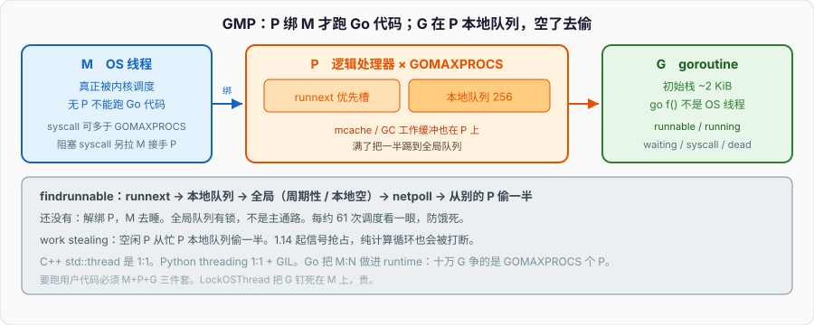

# GMP调度

```go
package main

import (
	"sync"
	"time"
)

func main() {
	const n = 100_000
	var wg sync.WaitGroup
	wg.Add(n)
	for i := 0; i < n; i++ {
		go func() {
			defer wg.Done()
			time.Sleep(time.Second)
		}()
	}
	wg.Wait()
}
```

十万个 goroutine 各自睡一秒，笔记本上能跑完。把 `go func` 换成 C++ 的 `std::thread` 或 `pthread_create` 开十万条 OS 线程：默认栈 1–8 MiB，光栈就要几百 GB，再加算子、futex、TLB，机器先被自己打穿。创建失败或 OOM 发生在业务跑起来之前。

Python 的 `threading.Thread` 同样是 1:1 OS 线程，GIL 还把 CPU 密集段拧成单核。`asyncio` 能堆很多协程，那些协程不在多核上并行算。Go 的 goroutine 是用户态执行体，真正占 CPU 的是少量 M（OS 线程），中间夹一层 P。十万 G 争的是 `GOMAXPROCS` 个 P，不是十万个内核线程。

下面按这个模型把 G/M/P、本地/全局队列、work stealing、1.14 之后的信号抢占、网络轮询、syscall 把 M 带下去钉完。1.0 那种「只在函数调用处协作让出」不是现状。



---

## 一、G、M、P 各是什么

### 1、G：goroutine，不是线程

`go f()` 创建一个 G。G 里是这段函数的栈、指令指针、状态字。初始栈大约 2 KiB，不够就拷到更大的连续栈，用完再缩。OS 线程栈是固定大块，申请的时候内核就扣下那份虚拟内存；G 的栈是用户态自己管的，所以能开十万个。

G 的状态在 runtime 里转：`_Grunnable` 等着跑，`_Grunning` 正在某颗 M 上跑，`_Gwaiting` 阻塞在 channel / select / 锁 / 网络，`_Gsyscall` 进了系统调用，`_Gdead` 跑完进自由列表复用。你看不到这些名字，但每个 `go`、每次 channel 收发、每次 `Read` 都在改它们。

```go
func f() {
	x := 1          // 在这个 G 的栈上
	go g(x)         // 另起一个 G，把 x 的值拷进新 G 的参数槽
}

func g(n int) { _ = n }
```

`go g(x)` 不会新开 OS 线程。它分配（或复用）一个 G，把 `g` 和参数写进去，把这个 G 扔进当前 P 的本地队列或 `runnext`。什么时候真正在 CPU 上跑，由调度器决定。C++ 的 `std::thread t(g, x)` 构造完成时内核线程已经在跑，或者至少已经是一条可调度的内核实体。

### 2、M：真正的 OS 线程

M 是 `Machine`，对应一条 OS 线程。Go 程序里真正被内核调度的是 M。M 要执行用户 G，必须握着一个 P。没有 P 的 M 不能跑 Go 代码，只能卡在 syscall、cgo、或者睡在线程停车场里。

M 的数量不是 `GOMAXPROCS`。`GOMAXPROCS` 限制的是 **同时跑 Go 代码的 P 的个数**。M 可以更多：一个 M 带着 G 掉进阻塞 syscall 之后，调度器会另拉一条 M 来接手那个被摘下来的 P。于是同一时刻可以有：`GOMAXPROCS` 个 M 在跑 Go 代码，外加若干 M 卡在内核里。

```go
import "runtime"

func main() {
	fmt.Println(runtime.GOMAXPROCS(0)) // 默认 = 逻辑 CPU 数
	fmt.Println(runtime.NumGoroutine())
}
```

`runtime.NumCgoCall`、`runtime.LockOSThread` 碰到的都是 M 这一层。`LockOSThread` 把当前 G 钉死在当前 M 上，用在必须和某条 OS 线程绑死的场景（thread-local、某些图形/驱动 API）。钉住之后这条 M 不能再拿去跑别的 G，属于贵操作。

### 3、P：逻辑处理器，GOMAXPROCS 把数量钉死

P 是 `Processor`。它不是 CPU 核，是调度器的逻辑资源：本地运行队列、内存分配器的 mcache、GC 工作缓冲区。要跑用户 G，必须是 `M + P + G` 三件套。P 的个数默认等于 `runtime.NumCPU()`，`GOMAXPROCS` 改的就是它。

```go
runtime.GOMAXPROCS(4) // 最多 4 个 P 同时跑 Go 代码
```

4 个 P 意味着最多 4 条 M 在用户态执行 Go。第 5 个准备好的 G 只能排队。把 `GOMAXPROCS` 调到 1，所有 Go 代码串行交错，channel 通信仍能工作，数据竞争窗口变小但不是消失——单 P 仍会在抢占点切换 G。

P 的本地队列是环形数组，容量 **256**。放不下的 G 一半踢到全局队列。每个 P 还有一个 `runnext` 槽：刚 `go` 出来的 G 常被放这里，下一次调度优先跑它，给「创建者-被创建者」一点时间局部性，像函数调用的延续，而不是扔到队列尾巴。

### 4、对照 C++ 线程和 Python GIL

C++：`std::thread` = 一条内核线程。你要 M:N 就自己写线程池，任务队列、work stealing、阻塞 syscall 时要不要扩线程，全是你的。没有运行时帮你把十万个任务映射到 8 条线程上还顺便处理栈增长。

Python：`threading` 是 1:1 线程 + GIL。多个线程能并发等 I/O（释放 GIL），CPU 密集字节码同一时刻只有一个线程在解释。`multiprocessing` 换进程，避开 GIL，付出的是内存和 IPC。`asyncio` 是单线程协作，一个卡住的 `time.sleep` 就能冻整条事件循环，必须用 `await asyncio.sleep`。

Go 把 M:N 做进 runtime。G 是任务，P 是「允许并行的额度」，M 是工人。I/O 和 syscall 的处理方式跟 Python 的 GIL 释放、C++ 线程池里「阻塞就再雇一个人」都不一样，后面单独钉。

```go
// C++ 对应：std::thread t(f); t.join();
// Python 对应：threading.Thread(target=f).start()
// Go：
go f() // 不是上面两者的轻量版，是另一套调度
```

---

## 二、本地队列、全局队列、G 放哪

### 1、本地队列：无锁的 256 槽

每个 P 一个本地队列。当前 G 执行 `go f()` 时，新 G 优先进当前 P 的本地队列或 `runnext`。同 P 上的入队/出队不需要全局锁，多核时这是可扩展性的根。

队列满了（256）就把 **一半** 搬到全局队列，一次搬一截，避免全局锁打得太碎。本地队列是单生产者（持有这个 P 的 M）多消费者（偷的人），实现上用原子操作保护头尾。

```go
func producer() {
	for i := 0; i < 1000; i++ {
		go worker(i) // 大多数进当前 P 本地队列
	}
}

func worker(id int) { _ = id }
```

`producer` 如果一直占着同一个 P，1000 个 `worker` 会先填满本地 256，再一批批溢到全局。别的 P 空了会来偷，或从全局拿。

### 2、全局队列：有锁，兜底

全局队列是所有 P 共享的链表，操作要加锁。它不是主通路。调度循环里每隔一段时间（实现上大约每 61 次调度）强制去全局队列看一眼，防止全局里的 G 饿死——本地队列一直有活，全局的 G 永远排不上的那种。

新建的 G 在这些情况下会进全局：

- 当前 P 的本地队列满了，一半被踢出去的那些；
- 没有 P 的 M 上创建的（少见，比如某些 syscall 返回路径）；
- `runtime.Gosched()` 主动让出时，当前 G 会被放到全局，不是塞回自己本地尾巴。

```go
func hog() {
	for {
		// 纯计算。1.14 之后仍会被抢占，见第四节。
		runtime.Gosched() // 主动让出：自己进全局队列，换下一个
	}
}
```

生产代码几乎不该手写 `Gosched`。它存在是因为你要在已知的协作点把 CPU 让出去；把调度正确性寄托在它上面，说明设计已经歪了。

### 3、findrunnable 的顺序

一个 M 握着 P，当前 G 跑完、阻塞或被抢占之后，要找下一个 G。顺序大致是：

1. 本 P 的 `runnext`
2. 本 P 的本地队列
3. 全局队列（周期性，或本地空时）
4. 网络轮询器里就绪的 G（`netpoll`）
5. 从别的 P **偷** 一半
6. 还没有：解除 P 绑定，M 去睡；P 进空闲列表

```go
// 伪代码，不是公开 API
func findrunnable() *g {
	if gp := p.runnext; gp != nil {
		return gp
	}
	if gp := p.localQueue.pop(); gp != nil {
		return gp
	}
	if gp := globalQueue.pop(); gp != nil {
		return gp
	}
	if gp := netpoll(); gp != nil {
		return gp
	}
	if gp := stealFromOtherP(); gp != nil {
		return gp
	}
	return nil
}
```

「先本地后全局再偷」是为了缓存局部性：刚 `go` 出来的 G 和创建者状态还热。全局队列是平衡和防饿。偷是负载均衡。netpoll 夹在中间，是因为网络就绪的 G 已经等了很久，不该再排到偷完才看。

### 4、work stealing：偷一半，不是偷一个

P 空了，随机挑一个别的 P，从它本地队列 **尾部** 拿走大约一半。一次偷一串，摊掉偷的开销，也让空闲 P 迅速有活干。被偷的 P 仍从自己的队列头取，两边对头尾，冲突少。

```go
func unbalanced() {
	// 一个 goroutine 疯狂 go 出任务，其它 P 靠偷
	go func() {
		for i := 0; i < 10_000; i++ {
			go compute(i)
		}
	}()
}

func compute(i int) {
	s := 0
	for k := 0; k < 1_000; k++ {
		s += k * i
	}
	_ = s
}
```

不要假设「谁 `go` 的就在谁那个核上跑完」。创建在 P0，执行可能在 P3。线程局部存储、CPU 亲和、false sharing，跨 P 之后全部要重新算。Go 没有把 G 钉在某个核上的稳定承诺（`LockOSThread` 钉的是 G↔M，也不是 G↔核）。

偷不到、全局也空、netpoll 也空，M 就把 P 还回去，自己睡在 `sched.pidle` / 线程停车场。新 G 出现时会唤醒空闲 M，或必要时 `clone` 一条新 M。

---

## 三、syscall 把 M 带下去

### 1、进入 syscall 时 P 被摘走

G 调用会阻塞的 syscall（文件 `Read` 打到磁盘、没有走 netpoll 的那种、`time.Sleep` 底层、cgo 里一长段 C）时，runtime 走 `entersyscall`：

- G 状态变成 `_Gsyscall`
- M 仍然绑着这个 G，这条 OS 线程真的进内核
- P 从这组 M+G 上摘下来，标成 syscall 态，准备给别人用

P 是稀缺资源（只有 `GOMAXPROCS` 个）。如果 P 跟着 M 一起卡在内核，所有能跑 Go 代码的工人就少一个。摘走是为了让别的 M 捡起这个 P，继续跑本地队列里的 G。

```go
func blockingFile() {
	f, err := os.Open("/dev/zero")
	if err != nil {
		return
	}
	defer f.Close()
	buf := make([]byte, 4096)
	for {
		_, err := f.Read(buf) // 可能走 syscall，M 下去
		if err != nil {
			return
		}
	}
}
```

网络 socket 的 `Read` **不是**这条路径的典型：见第六节 netpoll。文件、管道、cgo、部分 DNS 解析，才容易把 M 带下去。

### 2、sysmon 盯着超时的 syscall

有一条不需要 P 的监控线程 `sysmon`，循环休眠 20µs 到 10ms。它做几件和调度相关的事：

- 把卡在 syscall 里太久的 P **抢走**（retake），让空闲 M 或新 M 拿着这个 P 去跑其它 G；
- 向跑太久的 G 发抢占信号（第四节）；
- 催 netpoll、催 GC、催死锁检测。

syscall 刚进去那一小段，P 还留在这个 M 旁边，方便 syscall 很快返回时原地接回去，免一次调度。超过阈值（大约 20µs 量级，实现细节随版本），`sysmon` 认为这条 M 要在内核里待一阵了，把 P 拿走。

```go
func manyBlocking() {
	var wg sync.WaitGroup
	for i := 0; i < 1000; i++ {
		wg.Add(1)
		go func() {
			defer wg.Done()
			time.Sleep(10 * time.Millisecond) // 阻塞；G 等待，不占 P
		}()
	}
	wg.Wait()
}
```

`time.Sleep` 实际上把 G 放到定时器堆里，M 和 P 去跑别人。真正「M 被带下去」的是那些 **内核阻塞且 runtime 不知道何时返回** 的调用。两者别混：G 阻塞 ≠ M 阻塞。channel 收、`Sleep`、netpoll 上的 `Read`，都是 G 阻塞、M+P 继续干活。`Read` 一个慢磁盘、cgo 里 `sleep(10)`，才是 M 阻塞。

### 3、syscall 返回之后不一定还能拿回 P

M 从内核回来，想接着跑这个 G，必须再拿到一个 P。原 P 可能已经被 `sysmon` 抢走、正在别的 M 上跑。拿不到 P 的话，这个 G 变成 runnable 进全局队列，M 去停车场睡觉。

于是一个「看起来只是一次 `read(2)`」的调用，回来之后可能：换了一条 OS 线程继续（没换 G），或者这条 M 继续但换了 P。`LockOSThread` 的意义在这里：禁止调度器把这个 G 挪到别的 M。

```go
func pinned() {
	runtime.LockOSThread()
	defer runtime.UnlockOSThread()
	// 从这里到 Unlock，这个 G 不会换 M
	C.someThreadLocalAPI()
}
```

滥用 `LockOSThread` 会制造大量被钉死的 M，线程数涨，和「轻量 goroutine」的初衷对着干。

### 4、cgo 是特殊的 syscall

cgo 调用 C 函数，对调度器来说类似进入 syscall：P 可被拿走，M 在 C 栈上跑，Go 的抢占管不到 C 代码。C 里死循环，这条 M 就没了，直到 C 返回。C 里再回调 Go（`extern` 出去的 Go 函数），runtime 要重新拿到 P 才能跑 Go。

```go
/*
#include <unistd.h>
void slow() { sleep(2); }
*/
import "C"

func callC() {
	C.slow() // M 在 C 里睡 2 秒；P 会被摘走
}
```

大量并发 cgo 会把 M 的数量抬上去。`runtime/debug.SetMaxThreads` 默认 10000，超了直接 `crash`。看到进程线程数狂涨，先查 cgo 和阻塞 syscall，别先怪 GMP「泄漏了线程」。

---

## 四、抢占：1.14 起是信号，不是协作现状

### 1、1.0 到 1.13：函数调用处查栈

早期调度是协作的：G 跑到函数调用（更精确：带栈增长检查的那些调用）才有机会被换下去。一个 G 写了紧密循环、循环体里没有函数调用，就能占死这个 P。

```go
func tight() {
	for {
		// 1.13 及更早：这个循环可以永不让出
	}
}
```

当时的文档、面试题、博客大量拿这个当「Go 调度特点」。那是旧实现。Go 1.2 起编译器在调用点插入抢占检查，1.5 起更完整，但 **没有调用的热循环** 仍然能饿死同 P 上的其它 G，也饿死 GC 的 STW（GC 需要所有 G 停在安全点）。

### 2、1.14：SIGURG 异步抢占

1.14 引入基于信号的异步抢占。`sysmon` 发现某个 G 在一个 P 上跑了大约 10ms，就对那条 M 发 `SIGURG`。信号处理函数里，若当前栈可以安全抢占，就插入一个异步抢占点，G 被放到队列里，P 去跑别人。

选 `SIGURG` 是因为它几乎不被用户程序用，也不像 `SIGPROF` 那样已经有 profiler 占用。你不应该自己注册 `SIGURG` 处理器去和 runtime 抢。

```go
func tightNow() {
	n := 0
	for {
		n++ // 1.14+：即使用户代码没有函数调用，也会被信号打断
		if n < 0 {
			break
		}
	}
}

func main() {
	go tightNow()
	time.Sleep(50 * time.Millisecond)
	fmt.Println("scheduler still alive") // 能打印，说明没被占死
}
```

这不是「每隔 10ms 像操作系统时间片那样精确切换」。它是防饿和让 GC 进得去。短任务仍然会在 channel、syscall、函数调用这些点自然切换。不要写「Go 是时间片轮转」这种操作系统教科书句子套上来。

### 3、哪些地方仍然抢不到

runtime 自己的关键段、没有栈扫描信息的窗口、部分汇编、正在持有某些内部锁、cgo 在 C 那边，信号来了也不能随便切。所以：

- 用户 Go 代码里的死循环，1.14+ **应当**能被抢占；
- C 代码里的死循环，不能；
- 极短的非抢占窗口仍然存在，只是不再是「整个 tight loop」。

GC STW 依赖抢占把所有 G 赶到安全点。1.14 之前 tight loop 能让 GC 暂停时间炸掉；1.14 之后这类事故少了很多。生产环境请当 1.14+ 是底线。本系列默认 1.21+，抢占按信号模型讲。

### 4、不要把协作调度当现状

面试里还在说「Go 是协作式，没有函数调用就不会切换」的，答的是 2014 年的题。现在正确的分层是：

- **用户态 M:N**：G 不是 OS 线程，切换不进内核（普通情况）；
- **协作点仍然在**：channel、mutex、syscall、函数调用，都会让出；
- **异步抢占补上了 tight loop 和 GC 安全点**；
- **不是内核 CFS 那种公平时间片**，也不是 1.0 那种纯协作。

```go
func loopWithCall() {
	for {
		foo() // 调用点本来就能被检查；1.14 之后即使删掉 foo 也能被抢
	}
}

func foo() {}
```

写代码时仍然假设「别的 G 会在任意安全点插进来」。不加同步的共享变量，tight loop 里写、另一个 G 读，1.14 前后都是 data race。抢占改变的是 **进展**，不改变 **内存模型**。

---

## 五、网络轮询：阻塞的是 G，不是 M

### 1、netpoller 挂在 runtime 上

Go 的 `net` 包不给每个连接配一条线程。底层是 `epoll`（Linux）、`kqueue`（BSD/macOS）、`iocp`（Windows）。runtime 里有 netpoller：把未就绪的 fd 登记进去，G 自己 `gopark`，M+P 去跑别人。fd 就绪时 netpoller 把 G 变回 runnable，丢进某个队列。

```go
func handle(conn net.Conn) {
	defer conn.Close()
	buf := make([]byte, 4096)
	for {
		n, err := conn.Read(buf) // 未就绪：G 睡，M 不睡
		if err != nil {
			return
		}
		_, _ = conn.Write(buf[:n])
	}
}

func serve() {
	ln, err := net.Listen("tcp", ":8080")
	if err != nil {
		log.Fatal(err)
	}
	for {
		c, err := ln.Accept()
		if err != nil {
			return
		}
		go handle(c) // 一个连接一个 G，不是一个连接一条线程
	}
}
```

一万个空闲连接 = 一万个等在 netpoll 上的 G，栈小，不占 M。C++ 用线程 per connection 会先把线程表打爆；用 `epoll` + 线程池则要自己写状态机。Python `asyncio` 也是一个轮询器，但它默认单线程，回调/协程都在一条线程上串行推进。Go 的 netpoll 就绪后，G 可以在任意 P 上被偷走执行，多核能真正并行处理请求。

### 2、Read 的两条路

`conn.Read` 内部：

1. 试着 `read(2)`；
2. 返回 `EAGAIN`：把 fd 挂进 poller，G 状态 `_Gwaiting`，`findrunnable` 找下一个；
3. poller 被 `epoll_wait` 唤醒（调度循环里顺便 poll，或 sysmon 催）：就绪 G 入队。

所以「阻塞 Read」是 G 的阻塞。`netstat` 里连接还在，`ps` 里线程数没涨。这就是十万 goroutine 能活着等网络的原因：它们大多数不在跑，在 poller 的等待队列里。

文件 fd 不都走这条路。`os.File` 在 Linux 上对普通文件的 `Read` 往往直接 syscall，因为普通文件对 `epoll` 的就绪语义和 socket 不同。于是磁盘 `Read` 可能把 M 带下去，网络 `Read` 不会。不要把「Go 的 I/O 都不占线程」说死。

### 3、deadline 和超时

```go
conn.SetReadDeadline(time.Now().Add(3 * time.Second))
n, err := conn.Read(buf)
```

deadline 由 runtime 的定时器堆实现。到点仍未就绪，G 被唤醒，`Read` 返回超时错误。这不是内核 `SO_RCVTIMEO` 一条路径能概括的。context 取消下游 HTTP，走的是另一套（`Context` 篇），但底层同样是：让等待中的 G 变成 runnable，带着错误往回走。

---

## 六、栈、创建成本、为什么十万能跑

### 1、连续栈，不是分段栈

1.3 之前用分段栈，调用跨段有 hot split 问题。现在是连续栈：不够用就申请一块更大的，把旧栈拷过去，改指针。函数入口有栈大小检查；抢占和 GC 也依赖栈上指针是可扫描的。

```go
func deep(n int) int {
	if n == 0 {
		return 0
	}
	var buf [256]byte // 压栈
	_ = buf
	return deep(n-1) + 1
}
```

递归深了栈会涨。涨到运行时上限（默认 1 GB 量级）才会 overflow panic。这和 C++ 线程默认 8 MiB 就炸不同。涨栈有拷贝成本，热路径上别搞无界递归。

### 2、创建 G 的成本

`go f()` 快，是因为：

- G 结构体复用（dead G 进 `gFree` 列表）；
- 初始栈小；
- 不向内核注册新的调度实体；
- 入队是用户态原子操作或短锁。

它不是免费。每个 G 仍有 g 结构、栈、可能的堆对象。十万个 G 每个栈 2 KiB 起，光栈 200 MiB，再加每个 G 自己分配的对象。能跑 ≠ 该无脑开。请求来一个开一个 G 可以；在热循环里每条消息 `go` 一次、不做限制，能把调度器和 GC 先打满。

```go
func unbounded(jobs <-chan Job) {
	for j := range jobs {
		go handle(j) // jobs 无限快时 G 数量无界
	}
}

func bounded(jobs <-chan Job, n int) {
	for i := 0; i < n; i++ {
		go func() {
			for j := range jobs {
				handle(j)
			}
		}()
	}
}
```

工作池把 G 的数量钉在 `n`，多余的工作留在 channel 里。这是生产里比「来一个 go 一个」更常见的形状。GMP 让你 **能** 开十万，没有让你 **必须** 开十万。

### 3、主 G 退出，整个进程结束

```go
func main() {
	go func() { time.Sleep(time.Hour) }()
	// main 返回：进程退出，那个 G 直接没了
}
```

`main` 所在的 G 结束，runtime 拆掉整个进程，不等其它 G。C++ `main` 返回时若还有 `std::thread` 没 join 且没 detach，是 `std::terminate`；detach 的线程会继续，直到进程真的 `_exit`。Go 没有 detach 语义：你要么自己用 `WaitGroup` / channel 等，要么承认进程要退出了。Python 默认非 daemon 线程会拦住进程退出；Go 更像「主 G 说了算」。

---

## 七、GOMAXPROCS、观测、误区

### 1、默认值与容器

1.5 起默认 `GOMAXPROCS = NumCPU()`。容器里若 cgroup CPU 限额是 2 核、机器有 64 核，旧版本会看到 64，P 过多、GC 和调度空转。1.25 之前生产环境常要自己按 cgroup 设 `GOMAXPROCS`（或用 `automaxprocs` 这类库）。写代码时把「P 的个数 = 你被允许用的核数」当作前提。

```go
func main() {
	fmt.Println("cpu", runtime.NumCPU())
	fmt.Println("gomaxprocs", runtime.GOMAXPROCS(0))
	fmt.Println("goroutines", runtime.NumGoroutine())
}
```

`GOMAXPROCS` 调太大：P 多、本地队列多、偷的范围大，超过真实核数之后是上下文切换和 cache 乱跳。调成 1：方便复现并发 bug 吗？不一定，单 P 仍抢占；`-race` 比调 1 有用。

### 2、schedtrace

```
GODEBUG=schedtrace=1000 ./app
```

每隔 1 秒打一行调度摘要：G 的数量、P 的状态、有多少在 syscall。`scheddetail=1` 更啰嗦。这是看「是不是大量 G 卡在 runnable」「M 是不是在 syscall 里堆起来」的第一刀，比先上 pprof 轻。

```
gomaxprocs=8 idleprocs=2 threads=12 spinningthreads=0
```

`idleprocs` 高说明 CPU 没吃满；`threads` 远大于 `gomaxprocs` 说明 M 被 syscall/cgo 拖下去了。对着这一行调，比猜「是不是 GMP 的 bug」快。

### 3、常见误区

- **「goroutine 是更轻的线程」**：轻的是创建和栈，不是「语义上的线程」。没有线程本地存储的稳定承诺，没有和内核调度器一对一的优先级。
- **「GOMAXPROCS 是线程数」**：是 P 的数，M 可以更多。
- **「channel 操作切换一定进内核」**：用户态。
- **「死循环会占死调度器」**：1.14 之后用户 Go 代码不会。C / 汇编 / 旧故事会。
- **「网络 Read 占着一条 OS 线程」**：G 睡在 poller 上。
- **「文件 Read 也一样」**：不一定，可能把 M 带下去。
- **「Python 的协程和 goroutine 一样」**：asyncio 默认单线程协作；goroutine 可在多 P 上并行。
- **「C++ 二十条线程的线程池等价于 GOMAXPROCS=20」**：池里的线程既跑计算也跑阻塞 I/O 的话，阻塞时你的并行度就掉了。Go 把「跑 Go 代码的额度」和「卡在内核的 M」拆开了。

```go
func demoMisconception() {
	go func() {
		for i := 0; ; i++ {
			_ = i // 1.21 下不会占死其它 G
		}
	}()
	go func() {
		buf := make([]byte, 1)
		os.Stdin.Read(buf) // 可能把这条 M 带进内核；P 会被拿走
	}()
	time.Sleep(20 * time.Millisecond)
	fmt.Println("ok", runtime.NumGoroutine())
}
```

---

## 八、和 C++ / Python 并排看同一段活

### 1、同一件「睡一秒的十万任务」

C++：要么 10 万条 `std::thread` 直接爆，要么手写固定大小线程池 + 任务队列。池的大小你得猜：太小，任务排队；太大，又回到线程爆炸。阻塞 I/O 占着池里的线程时，计算任务要额外策略（再开一个池，或异步 IO）。

Python：`ThreadPoolExecutor(max_workers=100000)` 会试图造线程，同样爆。`asyncio.gather` 十万个 `asyncio.sleep(1)` 可以，因为那是一个事件循环上的定时器。换 `time.sleep(1)` 的线程版本不行。CPU 密集的十万份计算，asyncio 帮不上，GIL 也帮不上。

Go：十万个 `go func(){ time.Sleep(1s) }` 就是十万个等在定时器堆上的 G，几个 P 空转找活，sysmon 醒人。换 `go compute()` 十万份纯计算，真正并行的仍只有 `GOMAXPROCS` 份，其余在本地/全局队列里等。这一句是 GMP 的中心： **并发（G 的数量）和并行（P 的数量）不是同一个旋钮**。

```go
func cpuBound() {
	n := runtime.GOMAXPROCS(0)
	var wg sync.WaitGroup
	wg.Add(n)
	for i := 0; i < n; i++ {
		go func() {
			defer wg.Done()
			x := 0
			for k := 0; k < 1e8; k++ {
				x += k
			}
			_ = x
		}()
	}
	wg.Wait()
}
```

CPU 密集任务开 G 的个数超过 P，多出来的是切换成本。I/O 密集任务开很多 G 是正道，因为它们大部分时间不占 P。

### 2、切换成本在哪一层

C++ 线程切换：内核、保存完整寄存器、换地址空间可能不换（同进程）但换内核栈、cache 冷。微秒级。

Go 的 G 切换（同一 M 上换 G）：用户态保存很少的寄存器、换 g 指针、换栈指针。几十到上百纳秒量级，视实现和是否跨 P。跨 M 的「切换」其实是这个 G 被另一个 M 拿到，那是另一条 OS 线程的事。

Python 线程切换还要过 GIL 的争用。asyncio 协程切换是用户态，但所有协程抢同一条线程，没有「P 个并行工作者」这层。

---

## 九、把调度路径串成一段可跑的代码

```go
package main

import (
	"fmt"
	"net"
	"runtime"
	"sync"
	"sync/atomic"
	"time"
)

func tight(stop *atomic.Bool, spins *atomic.Uint64) {
	for !stop.Load() {
		spins.Add(1)
	}
}

func sleeper(wg *sync.WaitGroup) {
	defer wg.Done()
	time.Sleep(50 * time.Millisecond)
}

func stealTarget(n int, sink *atomic.Int64) {
	s := int64(0)
	for i := 0; i < n; i++ {
		s += int64(i)
	}
	sink.Add(s)
}

func netWait(addr string, wg *sync.WaitGroup) {
	defer wg.Done()
	c, err := net.Dial("tcp", addr)
	if err != nil {
		return
	}
	defer c.Close()
	buf := make([]byte, 1)
	c.SetReadDeadline(time.Now().Add(200 * time.Millisecond))
	_, _ = c.Read(buf) // G 阻塞在 poller / deadline，不占死 M
}

func main() {
	fmt.Println("gomaxprocs", runtime.GOMAXPROCS(0))
	fmt.Println("cpu", runtime.NumCPU())

	var stop atomic.Bool
	var spins atomic.Uint64
	go tight(&stop, &spins) // 1.14+ 可被抢占，后面的代码能继续

	var wg sync.WaitGroup
	const sleepers = 1000
	wg.Add(sleepers)
	for i := 0; i < sleepers; i++ {
		go sleeper(&wg)
	}

	var sink atomic.Int64
	for i := 0; i < 64; i++ {
		go stealTarget(10000, &sink)
	}

	ln, err := net.Listen("tcp", "127.0.0.1:0")
	if err != nil {
		panic(err)
	}
	defer ln.Close()
	go func() {
		c, err := ln.Accept()
		if err != nil {
			return
		}
		defer c.Close()
		time.Sleep(150 * time.Millisecond)
	}()
	wg.Add(1)
	go netWait(ln.Addr().String(), &wg)

	time.Sleep(20 * time.Millisecond)
	fmt.Println("goroutines while running", runtime.NumGoroutine())
	fmt.Println("tight spins", spins.Load())

	wg.Wait()
	stop.Store(true)
	time.Sleep(5 * time.Millisecond)
	fmt.Println("sink", sink.Load())
	fmt.Println("gomaxprocs still", runtime.GOMAXPROCS(0))
}
```

跑完对照：`tight` 没拦住 `sleeper` 和 `netWait`；一千个 sleep 的 G 不会把 `NumCPU` 变成一千条线程；`stealTarget` 的 64 个 G 在几个 P 上被偷来偷去，`sink` 是确定的和；网络那端的 `Read` 等到 deadline 或对端，过程中 `gomaxprocs` 不变。把 `go tight` 的想象换成 1.0 协作模型，这段程序在「无函数调用的循环」里会卡死——那不是你现在用的 Go。

---

## 十、清单

G 是用户态执行体，栈从 2 KiB 长；M 是 OS 线程；P 是跑 Go 代码的额度，个数由 `GOMAXPROCS` 钉死。跑用户代码必须 M+P+G。本地队列 256，满了吐一半到全局；空了先 `runnext`、再本地、再全局、再 netpoll、再从别人 P 偷一半。`sysmon` 抢超时 syscall 上的 P，并向长跑 G 发 `SIGURG`。1.14 起 tight loop 可被异步抢占，不要把 1.0 协作当现状。网络未就绪时 G 睡 poller，M 不睡；阻塞 syscall 和 cgo 才把 M 带下去，P 被摘走。`main` 返回进程直接结束。C++ 线程是 1:1 内核实体；Python 线程有 GIL，asyncio 是单线程协作。Go 把并发数量和并行数量拆成两个旋钮：G 可以十万，P 通常等于核数。

下一篇从无缓冲 channel 下手：它不是队列，是两个 G 的会合点。当成队列用，会锁死。
