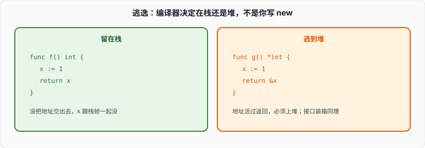

# 逃逸分析与性能

```go
func hot(ids []int) []string {
	out := make([]string, 0)
	for _, id := range ids {
		out = append(out, fmt.Sprintf("id=%d", id))
	}
	return out
}
```

`fmt.Sprintf` 的参数是 `...any`。`id` 是 `int`，塞进接口就装箱：编译器在堆上给这个 `int` 找个盒子，接口 data 指过去。循环一万次，一万个小对象。pprof 的 `allocs` 里全是 `convT2E` 和 `Sprintf`。逻辑正确，GC 被自己喂饱。

上一篇 GC 说堆上的才进三色图。本篇钉：什么东西被编译器判成「必须上堆」，怎么用 `go build -gcflags=-m` 看见，怎么用 pprof 对准那一行，怎么避开接口装箱，怎么给切片一次 `make` 够 cap。Go 1.21+，逃逸分析结果随版本变，规则当经验，以编译器输出为准。



---

## 一、循环里 Sprintf 就是堆

### 1、`any` 参数是装箱入口

```go
func Sprintf(format string, a ...any) string
```

`...any` 等于 `[]any`。每个实参赋进接口值。基础接口篇：值赋进接口，编译器通常不敢留栈上。热循环里这是分配器第一客户。

```go
func cold(id int) string {
	return strconv.Itoa(id) // 仍可能分配 string 的底层字节，但没有 int 装箱
}

func colder(id int, buf []byte) []byte {
	return strconv.AppendInt(buf[:0], int64(id), 10) // 写进你给的 buf
}
```

`Itoa` 仍然 `make` 一段 `[]byte` 再转 `string`，有分配，但比 `Sprintf` 少一层格式解析和接口。已有缓冲时 `AppendInt` 把分配从「每次」变成「buf 不够才」。拼 `"id="` 用 `append` 自己写，不要为了一个整数请整台 `fmt` 机器。

```go
func label(id int) string {
	b := make([]byte, 0, 16)
	b = append(b, "id="...)
	b = strconv.AppendInt(b, int64(id), 10)
	return string(b)
}
```

`string(b)` 拷字节到不可变 string。要再省，调用方给 buf，返回切片。API 形状决定你能不能省下这一次。

### 2、`fmt` 全家

`fmt.Printf`、`Errorf`、`Fprintf`、`Sprint` 都是 `...any`。日志每条 `Infow("id", id)` 若底层仍装箱，QPS 十万就是十万次小分配。`strconv`、`fmt.Appendf`（1.19+，写进 `[]byte`）、结构化日志里只传已经是 string 的字段，是同一方向的修法。

```go
buf := make([]byte, 0, 64)
buf = fmt.Appendf(buf, "id=%d", id) // 仍装箱 id；省的是 string 中间对象和 Writer 接口
```

`Appendf` 不是零分配。整数那条边要零装箱，还是 `AppendInt`。

### 3、先看编译器怎么说

```
go build -gcflags="-m -m" .
```

输出里会有：

```
./a.go:4: leaking param: ids
./a.go:6: id escapes to heap
./a.go:6: ... argument does not escape
./a.go:5: make([]string, 0) escapes to heap
```

`escapes to heap` 就是上堆。`does not escape` 留栈。`-m` 一次给结论，两次给原因。不要对着感觉改，对着这一行改。

```go
func f() *int {
	x := 1
	return &x
}
```

`-m`：`&x escapes to heap`。和 GC 篇的 `onHeap` 同一件事，现在从编译器嘴里说出来。

---

## 二、逃逸规则当经验

### 1、返回局部变量的指针、切片、闭包引用

```go
func p() *int {
	x := 7
	return &x // x 逃逸
}

func s() []int {
	a := []int{1, 2, 3} // 字面量底层数组逃逸
	return a
}

func c() func() int {
	x := 1
	return func() int { x++; return x } // x 逃逸，闭包在堆上
}
```

编译器必须保证返回之后指针仍有效，只能把对象放到堆。C++ 返回局部地址是悬空；Go 合法，代价是堆分配。Python 对象本来就在堆。

切片字面量 `[]int{...}` 若返回或赋给逃逸的头，底层数组上堆。`make([]T, n)` 同理：头逃逸则数组逃逸。头不逃逸、`n` 编译期常量且不大，数组可能在栈上。

```go
func stackSlice() int {
	s := make([]int, 8) // 常不逃逸
	s[0] = 1
	return s[0]
}
```

`n` 太大或不是常量，编译器不敢在栈上开无界（或过大）数组，上堆。栈空间有上限，热函数里 `make([]byte, 1<<20)` 即使「看起来局部」也常在堆。

### 2、进接口

```go
func f(x any) {}

func g() {
	n := 1
	f(n) // n 逃逸（典型）
}
```

接口可能被 `f` 存起来，编译器看不到 `f` 的全部实现时必须假设逃逸。`f` 在同一包且简单，有时能证明不逃——**有时**。`fmt.Sprintf` 在别的包，`id` 一定逃。

```go
func asError() error {
	e := os.ErrNotExist
	return e // 接口值，动态值的寿命跟着返回值
}
```

小整数装箱：runtime 对部分小整型有缓存，不保证。当「会分配」写，profile 说没有再另说。

### 3、`go`、`defer` 的闭包

```go
func start(x int) {
	go func() { fmt.Println(x) }() // x 逃逸到闭包
}

func def(x int) {
	defer func() { fmt.Println(x) }() // 闭包可能让 x 逃逸
}
```

`defer` 在 1.17+ 对部分简单 defer 降低了开销，复杂闭包仍分配。循环里 `defer`：每次登记，循环结束才跑（基础函数篇），既是语义坑也是分配坑。热循环不要 `defer`。

### 4、取地址交给别人

```go
var sink *int

func f() {
	x := 1
	sink = &x // 逃逸到全局
}

func g(p *int) { *p = 2 }

func h() {
	x := 1
	g(&x) // 若 g 不把 p 存起来，x 可能不逃逸
}
```

同一包内、`g` 简单，内联之后 `&x` 可能留栈。跨包、接口方法、函数值调用，编译器保守，上堆。`-gcflags=-m` 看 `x escapes` 还是 `&x does not escape`。

### 5、方法值和接口方法

```go
type T struct{ n int }

func (t *T) Inc() { t.n++ }

func methodVal() {
	var t T
	f := t.Inc // 方法值，t 的地址藏进 f，t 逃逸
	f()
}
```

基础函数篇：方法值让接收者逃逸。热路径别把方法塞进 `[]func()`。接口调用的接收者已经在接口里，本来就在堆上（或指针指着堆/栈——指针本身在接口 data 里）。

### 6、经验不是规范

逃逸分析每个版本都在变。1.22、1.23 能留栈的，1.21 可能上堆。写「根据经验这些会逃逸」，用 `-m` 在你的模块语言版本下验证。优化记录里贴编译器输出，不贴博客规则。

```
go build -gcflags="-m" -o /dev/null .
```

`-o /dev/null` 只为看诊断。加 `-l` 关内联，逃逸会变差（内联后才看得见「没存指针」）；平时看带内联的结果，那才是真编译。

---

## 三、`-gcflags=-m` 怎么读

### 1、常见句子

- `moved to heap: x`：变量 x 上堆。
- `escapes to heap`：这个表达式的结果上堆。
- `does not escape`：留栈。
- `leaking param: b`：参数 b 的内容（或指针）被函数存到外面。调用方的实参因此可能逃逸。
- `leaking param: b to result ~r0`：参数流进返回值。
- `func literal escapes to heap`：闭包结构体上堆。
- `too large for stack`：栈上放不下，上堆。

```go
func leak(p *int) *int {
	return p // leaking param to result
}
```

调用 `leak(&x)` 的 `x` 跟着逃。

### 2、内联和逃逸缠在一起

```go
func add(a, b int) int { return a + b }

func h() int {
	x := 1
	return add(x, 2)
}
```

`add` 内联后没有调用，`x` 就是个 SSA 值。`-m` 还会打 `can inline add`、`inlining call to add`。内联失败（太大、闭包、`go`、部分 `recover`）会留下调用，参数逃逸判定更保守。

```
go build -gcflags="-m -l"  # 关内联看「函数作为 API 时」的逃逸
```

库作者关心 `-l`：你的函数被别人跨包调用时不会内联进来（或很大），参数逃逸按泄漏写进文档。业务热路径关心默认内联后的结果。

### 3、不要满地 `//go:noescape`

```go
//go:noescape
func cgoCall(p unsafe.Pointer)
```

这是给 runtime / 汇编 / cgo 边界用的编译器指令：承诺指针不逃逸。标错就是悬空，GC 扫不到或扫到已释放。用户 Go 代码不要写。想不逃逸就改代码形状让分析器自己看懂。

### 4、和 `-gcflags=-d=ssa/insert_resched_checks/lower`

调试调度插入、SSA 用别的 flag。性能这条线常用：

```
go test -bench=. -benchmem
go test -cpuprofile=cpu.pprof -bench=.
go test -memprofile=mem.pprof -bench=.
go build -gcflags="-m=2"
```

先 bench 证明慢或分配多，再 `-m` 看为什么上堆，再改，再 bench。不要反过来先改一堆「可能逃逸」。

---

## 四、pprof

### 1、三种图

- **cpu**：采样程序计数器，看 CPU 时间在哪。GC、`runtime.mallocgc`、业务函数。
- **heap / inuse**：此刻活着的对象，按分配栈聚合。RSS 钉死看这个（GC 篇）。
- **allocs**：进程启动以来的分配累计。短命风暴看这个。循环 `Sprintf` 在这里炸。

```go
import _ "net/http/pprof"

func main() {
	go http.ListenAndServe("localhost:6060", nil)
	app()
}
```

```
go tool pprof http://localhost:6060/debug/pprof/allocs
go tool pprof http://localhost:6060/debug/pprof/heap
go tool pprof http://localhost:6060/debug/pprof/profile?seconds=30
```

交互里 `top`、`list hot`、`web`。看 `flat` 是这一帧自己，`cum` 含子调用。allocs 的单位默认字节，`top -cum` 找到 `fmt.Sprintf` 再 `list`。

### 2、测试里采

```go
func BenchmarkHot(b *testing.B) {
	ids := make([]int, 128)
	b.ReportAllocs()
	b.ResetTimer()
	for i := 0; i < b.N; i++ {
		_ = hot(ids)
	}
}
```

```
go test -bench=BenchmarkHot -benchmem -count=5
```

输出 `Xs ns/op  Ys B/op  Z allocs/op`。改完 `Sprintf` 变 `AppendInt`，`allocs/op` 该掉。`-count=5` 防一次抖动。`benchstat old.txt new.txt` 比眼睛看。

```
go test -bench=BenchmarkHot -memprofile=mem.out
go tool pprof -alloc_objects mem.out
```

`-alloc_objects` 按次数，`-alloc_space` 按字节。小对象风暴次数难看，大切片字节难看。两个都看。

### 3、`runtime/pprof` 自己写

```go
f, err := os.Create("cpu.pprof")
if err != nil {
	panic(err)
}
pprof.StartCPUProfile(f)
defer pprof.StopCPUProfile()
```

内存：

```go
f, err := os.Create("mem.pprof")
if err != nil {
	panic(err)
}
defer f.Close()
runtime.GC()
pprof.WriteHeapProfile(f)
```

写完 `go tool pprof mem.pprof`。CI 里对微基准的 `allocs/op` 设上限，比「感觉慢了再查」早。

### 4、别被 runtime 帧骗

allocs 顶上常是 `runtime.mallocgc`、`convT2E`、`growslice`。这些是症状。`list` 进 **你的函数**，看哪一行触发 malloc。`convT2E` 就是「具体类型转空接口」。`growslice` 是 `append` 扩容。对着这两类符号改代码：少装箱、预分配。

```
(pprof) traces convT2E
```

能看到从 `fmt.Sprintf` 进来的栈。

---

## 五、避开 convT2E

### 1、热路径具体类型

```go
func sum(xs []int) int {
	n := 0
	for _, x := range xs {
		n += x
	}
	return n
}
```

不要：

```go
func sumAny(xs []any) int {
	n := 0
	for _, x := range xs {
		n += x.(int) // 每个元素曾经装箱进来
	}
	return n
}
```

接口切片 `[]any` 是 N 次装箱。泛型：

```go
func sumT[T ~int](xs []T) T {
	var n T
	for _, x := range xs {
		n += x
	}
	return n
}
```

1.18+ 泛型在这里是为了 **不装箱**，不是为了少写几个重载。`any` 约束的泛型方法调用仍可能装箱/字典，热路径用具体或 `~int` 这类近似类型。

### 2、`error` 也是接口

```go
if err != nil {
	return err // 不分配，传接口值
}
return fmt.Errorf("load: %w", err) // 分配 wrap 结构
```

成功路径别 wrap。错误路径分配一次通常可接受。热循环里每次成功还 `fmt.Errorf` 预备着，那是自己找抽。sentinel 直接返回，不要包。

```go
if n == 0 {
	return ErrEmpty // 不分配
}
```

### 3、时间、数字、bool 不要先 Sprintf 再拼

```go
s := fmt.Sprintf("%s %d %v", name, n, ok)
```

改：

```go
b := make([]byte, 0, len(name)+16)
b = append(b, name...)
b = append(b, ' ')
b = strconv.AppendInt(b, int64(n), 10)
b = append(b, ' ')
if ok {
	b = append(b, "true"...)
} else {
	b = append(b, "false"...)
}
s := string(b)
```

丑，快。日志库、`strings.Builder` 封装这层丑。`strings.Builder` 的 `Grow` 先定 cap，`WriteString` / `WriteByte`，最后 `String()`。1.22 起 `Builder.String` 和 builder 的 buf 共享内存直到 builder 再写——别把 Builder 放进 Pool 还不重置。

```go
var b strings.Builder
b.Grow(64)
b.WriteString(name)
b.WriteByte(' ')
fmt.Fprintf(&b, "%d", n) // Fprintf 仍装箱；数字继续 AppendInt
```

`fmt.Fprintf(&b, ...)` 对 builder 少一次 `string` 中间值，整数装箱还在。

### 4、json、反射

`encoding/json` 对未知结构走反射，每次字段装箱、`[]byte` 缓冲。热路径：

- 定长结构用手写 `Append` 或 `encoding/json` 的 `Encoder` 复用；
- `json.Marshal` 每次 `make` 输出切片，自己 `Encoder` 往 `bytes.Buffer` 或 Pool 的 buf 写；
- 第三方 `easyjson` / `sonic` 一类是明确的权衡，先 pprof 证明 json 是大头再上。

```go
var buf bytes.Buffer
enc := json.NewEncoder(&buf)
if err := enc.Encode(v); err != nil {
	return err
}
```

`buf.Reset()` 后复用。`Encode` 自带换行。反射本身触发的逃逸：`reflect.ValueOf(x)` 把 x 放进接口。热路径不要 `reflect`。

---

## 六、切片预分配、growslice

### 1、`append` 从 0 长

```go
var out []int
for i := 0; i < n; i++ {
	out = append(out, i)
}
```

`n=1e6` 时扩容一串：0→1→2→4… 中间数组全是垃圾。GC 篇写过。一次：

```go
out := make([]int, 0, n)
for i := 0; i < n; i++ {
	out = append(out, i)
}
```

或：

```go
out := make([]int, n)
for i := 0; i < n; i++ {
	out[i] = i
}
```

第二种没有 `append` 的 len 检查，略快，语义是「长度已知」。未知上限但知道大概：`make([]T, 0, estimate)`。估错了只是偶尔一次 grow，仍比从 0 开始好。

### 2、`append` 的分配在 `growslice`

pprof 里 `runtime.growslice` 指向你哪一行 `append`。两片拼接：

```go
out = append(out, extra...)
```

`out` 的 cap 不够就新数组 + 拷贝。循环里反复拼：预留 `len(out)+len(extra)`。

```go
b := make([]byte, 0, len(prefix)+len(body)+len(suffix))
b = append(b, prefix...)
b = append(b, body...)
b = append(b, suffix...)
```

`bytes.Join`、`strings.Join` 内部就是先算总长再一次分配。自己写循环 join 时抄这个。

### 3、`copy` 代替「切一段再 append 到别处」当拷贝用

```go
dst := make([]byte, len(src))
copy(dst, src)
```

不要：

```go
dst := append([]byte(nil), src...)
```

后者也能工作，可读性差，且 `nil` append 的路径更绕。需要「在已有 dst 后面接」才 `append`。

### 4、字符串拼接

```go
s := ""
for _, p := range parts {
	s += p // 每次新 string，旧字节垃圾
}
```

`+=` 字符串每次分配 `len(s)+len(p)`。`strings.Builder` 或 `strings.Join(parts, "")`。

```go
var b strings.Builder
b.Grow(n)
for _, p := range parts {
	b.WriteString(p)
}
s := b.String()
```

`+` 连接 **编译期常量** 或少数几个已知片段，编译器会优化成一次分配。循环里的 `+` 不会。

```go
s := "id=" + strconv.Itoa(id) // 两次分配：Itoa 一次，拼接一次
```

`AppendInt` 进一个 buf 再 `string` 一次，通常更少。

---

## 七、其它热分配

### 1、map 预估

```go
m := make(map[int]int, n)
for i := 0; i < n; i++ {
	m[i] = i
}
```

`make(map[K]V, hint)` 的 hint 是大概元素数，减少扩容时的桶搬迁。搬迁是分配 + 拷贝 + 旧桶变垃圾。不知道 n 就别写 0 然后插入一百万。

### 2、`time.Now`、`time.Format`

```go
time.Now().Format(time.RFC3339Nano) // 分配 string
```

日志每条当前时间，用日志库的钩子或 `AppendFormat` 写进 buf。

```go
var buf []byte
buf = time.Now().AppendFormat(buf[:0], time.RFC3339Nano)
```

### 3、`regexp` 在函数里编译

```go
func bad(s string) bool {
	re := regexp.MustCompile(`^\d+$`) // 每次编译，分配自动机
	return re.MatchString(s)
}

var digit = regexp.MustCompile(`^\d+$`)

func good(s string) bool {
	return digit.MatchString(s)
}
```

编译一次，包级变量。`MatchString` 仍可能分配，热到极致用 `[]byte` 和 `Match`。简单前缀判断不要上正则：`len` + 循环看字节。

### 4、`defer` 在小函数

```go
func add(mu *sync.Mutex, n *int) {
	mu.Lock()
	defer mu.Unlock()
	*n++
}
```

1.17+ 这种 defer 开销小。循环里：

```go
for i := 0; i < n; i++ {
	mu.Lock()
	s += a[i]
	mu.Unlock() // 不要 defer 在循环体
}
```

### 5、多余的 `[]byte(string)` 和 `string([]byte)`

```go
h.Write([]byte(s)) // 拷一次
```

`hash.Hash` 有 `io.Writer`，`WriteString` 若实现了 `io.StringWriter` 可免拷。`strings.Builder`、`bytes.Buffer` 注意别来回转。函数签名能收 `string` 就别先转 `[]byte` 再转回去。

```go
func f(b []byte) {
	g(string(b)) // 拷
}
```

调用方已经是 string，让 `f` 收 string，或 `g` 收 `[]byte`。

---

## 八、CPU 侧：逃逸之外

逃逸优化的是分配和 GC。`O(n^2)` 改成不逃逸还是 `O(n^2)`。cpu profile 指向双重循环，先改算法。分配下去之后 cpu 图上常见 `mallocgc` / `GC` 下降。

`for _, v := range a` 比手写 `a[i]` 更容易让编译器拿掉边界检查。多数业务到不了看 SSA 那一层，先 `-benchmem`。多个 G 写相邻 `int64` 是 false sharing；G 不钉核，计数器不要假设「这个 G 一直在这个核」。进 cgo 对调度器和逃逸都差，热路径纯 Go，不得不 cgo 就批量调。

---

## 九、改写对照：同一条 hot

```go
func hotSlow(ids []int) []string {
	out := make([]string, 0)
	for _, id := range ids {
		out = append(out, fmt.Sprintf("id=%d", id))
	}
	return out
}

func hotFast(ids []int) []string {
	out := make([]string, 0, len(ids))
	buf := make([]byte, 0, 32)
	for _, id := range ids {
		buf = append(buf[:0], "id="...)
		buf = strconv.AppendInt(buf, int64(id), 10)
		out = append(out, string(buf))
	}
	return out
}
```

`hotFast` 仍为每个 string 分配底层字节——这是 API 要 `[]string` 的代价。`allocs/op` 大约从「每次 Sprintf 若干」降到「每个结果一次 string」。若调用方能收 `[]byte` 或写进 `io.Writer`，连这次也能省。

```go
func hotWrite(w io.Writer, ids []int) error {
	var buf [32]byte
	for _, id := range ids {
		b := append(buf[:0], "id="...)
		b = strconv.AppendInt(b, int64(id), 10)
		b = append(b, '\n')
		if _, err := w.Write(b); err != nil {
			return err
		}
	}
	return nil
}
```

`buf` 是栈上数组（小、局部、不取地址逃出），`append` 到 cap=32 内不换堆数组。`Write` 同步用完 `b`，下一轮复用。这是「零额外堆」形状，前提是 Writer 不把切片存下来。`http.ResponseWriter` 通常立刻拷或写进内核，可以。自己的 buffer 若 `append` 进另一个切片，那是拷走字节，仍要保证本轮 `Write` 返回前对方用完——`io.Writer` 合同就是这样。

---

## 十、一段可跑的对照

```go
package main

import (
	"fmt"
	"runtime"
	"strconv"
	"strings"
)

func hotSlow(ids []int) []string {
	out := make([]string, 0)
	for _, id := range ids {
		out = append(out, fmt.Sprintf("id=%d", id))
	}
	return out
}

func hotFast(ids []int) []string {
	out := make([]string, 0, len(ids))
	buf := make([]byte, 0, 32)
	for _, id := range ids {
		buf = append(buf[:0], "id="...)
		buf = strconv.AppendInt(buf, int64(id), 10)
		out = append(out, string(buf))
	}
	return out
}

func allocs(f func()) uint64 {
	var m1, m2 runtime.MemStats
	runtime.GC()
	runtime.ReadMemStats(&m1)
	f()
	runtime.ReadMemStats(&m2)
	return m2.Mallocs - m1.Mallocs
}

func main() {
	ids := make([]int, 64)
	for i := range ids {
		ids[i] = i
	}
	fmt.Println("slow", allocs(func() { _ = hotSlow(ids) }))
	fmt.Println("fast", allocs(func() { _ = hotFast(ids) }))
	fmt.Println(hotSlow(ids[:3]), hotFast(ids[:3]))

	parts := make([]string, 100)
	for i := range parts {
		parts[i] = "x"
	}
	slowJoin := allocs(func() {
		s := ""
		for _, p := range parts {
			s += p
		}
		_ = s
	})
	fastJoin := allocs(func() {
		var b strings.Builder
		b.Grow(100)
		for _, p := range parts {
			b.WriteString(p)
		}
		_ = b.String()
	})
	fmt.Println("joinSlow", slowJoin, "joinFast", fastJoin)

	out := make([]int, 0, 8)
	for i := 0; i < 8; i++ {
		out = append(out, i)
	}
	fmt.Println("prealloc", out)
}
```

`go run` 看 malloc：`hotSlow` 明显高于 `hotFast`；`joinSlow` 明显高于 `joinFast`。再 `go build -gcflags="-m" -o /dev/null .`：`Sprintf` 那行 `id escapes to heap`；`hotFast` 的 `id` 走 `AppendInt`，不进接口。把 `make([]string, 0, len(ids))` 改回 0 cap，`growslice` 回到 allocs 图。微基准放 `_test.go`：`go test -bench=. -benchmem`。

---

## 十一、清单

热循环里 `fmt.Sprintf` / `...any` 把具体类型装箱上堆，`convT2E` 是 pprof 里的名字。逃逸经验：返回指针、闭包引用、进接口、`go`、取地址存走、方法值、太大的 `make`。经验要用 `go build -gcflags=-m` 在你的 Go 版本上核实。`leaking param` 会让调用方的实参跟着逃。先 `-benchmem` 再改。allocs profile 找短命风暴，heap profile 找钉住的 RSS。避开装箱：具体类型、泛型约束、`strconv.Append*`、sentinel error 不 wrap。切片 `make` 够 cap，字符串 `Builder`/`Join`，map 给 hint，正则编译一次，循环里不 `defer`。`[]string` API 注定每个元素一次分配；能写 `io.Writer` 就写 Writer。C++ 局部对象默认栈、`new` 才堆；Python 对象默认堆；Go 看起来是局部变量，位置由逃逸分析说了算。

进阶五篇到这里：G 不是线程，channel 不是队列，GC 不看 len，ctx 是第一个参数，堆是编译器判的。下一篇把它们放进一个能跑的 HTTP 服务。
